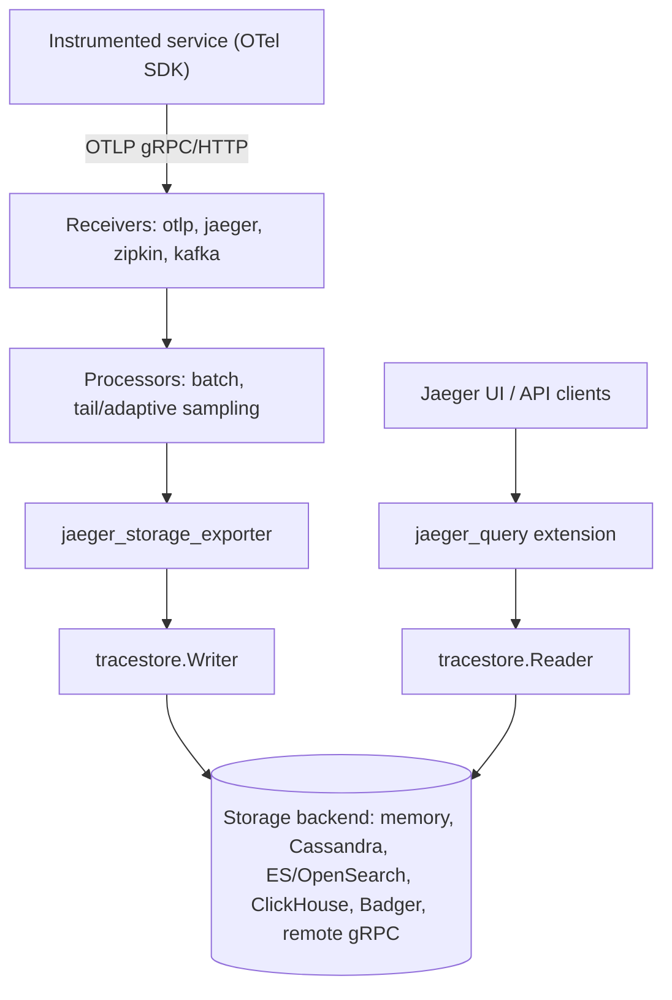

# Architecture

## Big picture

A Jaeger v2 process is an OpenTelemetry Collector with Jaeger components bolted on. The `main()` entry point (`cmd/jaeger/main.go:17`) builds a cobra command from `Command()` (`cmd/jaeger/internal/command.go:29`), which constructs `otelcol.CollectorSettings` with `Factories: Components` and hands it to `otelcol.NewCommand` (`cmd/jaeger/internal/command.go:51`). From there the Collector runtime owns the lifecycle: it parses the YAML config, builds the configured pipelines, and runs them.

## Components

### Collector core and component registry

The set of available components is assembled in `cmd/jaeger/internal/components.go`. A `builders` struct (`cmd/jaeger/internal/components.go:50`) groups factory maps, and `build()` (`cmd/jaeger/internal/components.go:68`) registers everything. `Components()` (`cmd/jaeger/internal/components.go:152`) is the function passed to the Collector. This is where Jaeger differs from a generic Collector: it adds Jaeger-specific extensions, receivers, and exporters alongside the standard ones.

### Receivers

Standard receivers `otlp` (`cmd/jaeger/internal/components.go:98`) and `nop`, plus add-ons `jaeger`, `kafka`, and `zipkin`. OTLP is the primary path. The `zipkin` and `jaeger` receivers let older clients keep sending, and `kafka` lets Jaeger consume spans from a Kafka buffer.

### Extensions

The Jaeger-specific server features live as extensions, not as the trace pipeline: `jaeger_query` serves the query API and UI (`cmd/jaeger/internal/components.go:84`), `jaeger_storage` holds the storage factories (`cmd/jaeger/internal/components.go:85`), `remote_sampling` serves sampling strategies, and `jaeger_mcp` exposes a Model Context Protocol server. Standard extensions such as `healthcheckv2`, `pprof`, `zpages`, and `expvar` are also registered.

### Exporters and storage

`jaeger_storage_exporter` is the exporter that writes spans into a Jaeger storage backend (`cmd/jaeger/internal/components.go:116`, commented in source as "generic exporter to Jaeger v1 spanstore.SpanWriter"). It resolves a `tracestore.Writer` (`internal/storage/v2/api/tracestore/writer.go:13`) from the `jaeger_storage` extension at startup. The matching read side is `tracestore.Reader` (`internal/storage/v2/api/tracestore/reader.go:16`), used by the `jaeger_query` extension.

## How a request flows

Tracing one span from ingestion to storage:

1. A service sends spans over OTLP. The `otlp` receiver decodes them into `ptrace.Traces` and feeds the `traces` pipeline.
2. Configured processors run; in the default config that is `batch`.
3. The pipeline delivers the batch to `jaeger_storage_exporter`. Its `pushTraces` calls the resolved writer (`cmd/jaeger/internal/exporters/storageexporter/exporter.go:52`).
4. The exporter sanitizes the data, then calls `WriteTraces` on the `tracestore.Writer` (`internal/storage/v2/api/tracestore/writer.go:18`), which the chosen backend implements.

On the read side, the Jaeger UI calls the `jaeger_query` extension, which uses `tracestore.Reader.GetTraces` or `FindTraces` (`internal/storage/v2/api/tracestore/reader.go:29`, `:50`). Both return a Go iterator (`iter.Seq2[[]ptrace.Traces, error]`) so results stream in chunks instead of buffering whole result sets.

## Key design decisions

The defining decision is building v2 as an OpenTelemetry Collector distribution rather than a standalone server, so OTLP is first-class and the Collector's receivers and processors are reused. A consequence shows up in `Command()`: the Collector has no hook for running with no config file, so Jaeger intercepts cobra's `RunE` and, when no `--config` flag is set, injects an embedded `all-in-one.yaml` as a `yaml:` config (`cmd/jaeger/internal/command.go:68`). That is what makes `docker run jaegertracing/jaeger` work with zero configuration.

The storage write path is intentionally simple and idempotent: a single `WriteTraces(ctx, ptrace.Traces)` method (`internal/storage/v2/api/tracestore/writer.go:14`). The exporter disables the Collector's per-call timeout (`WithTimeout{Timeout: 0}`) and instead relies on retry and queue settings (`cmd/jaeger/internal/exporters/storageexporter/factory.go:47`).

## Extension points

- **Storage backends**: implement `tracestore.Writer` and `tracestore.Reader` (`internal/storage/v2/api/tracestore/`). Built-in backends include memory, Cassandra, Elasticsearch, OpenSearch, ClickHouse, Badger, and a remote gRPC store.
- **Collector components**: any OpenTelemetry receiver, processor, connector, or exporter can be added through the same factory registration used in `cmd/jaeger/internal/components.go:68`.
- **Sampling**: file-based or adaptive strategies served through the `remote_sampling` extension.
