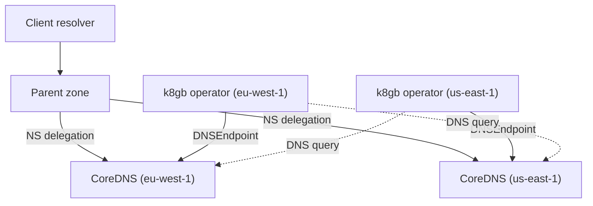

# Architecture

## Big picture

Nothing in k8gb is a global component. Every cluster runs the same three things, and they cooperate through the DNS system rather than through each other.

The parent zone, say `example.com`, delegates a subzone such as `cloud.example.com` to the CoreDNS instances running in each k8gb cluster. Each of those CoreDNS instances is therefore authoritative for the same zone. A resolver asking for `app.cloud.example.com` reaches one of them and gets that cluster's current view of which endpoints are healthy across the whole fleet.

The two dotted arrows are the whole cross-cluster story. Each operator asks the other cluster's CoreDNS for a `localtargets-` record, with an ordinary DNS query, described in [Internals](./internals).

## Components

### The operator

`main.go` plus `controllers/`. Built on `sigs.k8s.io/controller-runtime v0.24.1` (`go.mod`). It reconciles `Gslb` resources: reads what the application's health looks like locally, finds out what the other clusters are advertising, decides the final answer for each hostname, and writes it out as DNS records.

### CoreDNS with the `k8s_crd` plugin

Each cluster runs a k8gb-specific CoreDNS build, not the cluster's normal one. The Helm chart's default image is `registry.k8gb.io/k8gb-io/k8s_crd` (`chart/k8gb/values.yaml:119`). The plugin makes CoreDNS serve a zone directly from `DNSEndpoint` custom resources, so the operator's only output is a Kubernetes object and CoreDNS picks it up without a reload of a zone file.

`DNSEndpoint` is not a k8gb type. It comes from external-dns (`sigs.k8s.io/external-dns v0.21.0`, `go.mod`), which is how k8gb gets an existing, well-understood representation of "a DNS record that a controller manages".

### external-dns and the DNS provider

The records that live in the parent zone, the NS records that delegate the subzone to each cluster, are written by external-dns into whatever DNS the organisation actually runs. `controllers/providers/dns/factory.go:48` picks the backend: `DNSTypeExternal` covers everything external-dns supports (Route 53, Azure DNS, NS1, Cloudflare, RFC 2136, Windows DNS; each has a page under `docs/deploy_*.md`), and `DNSTypeInfoblox` uses a dedicated client (`controllers/providers/dns/infoblox-client.go`).

### The CRDs

`Gslb` is the one users write. Its `Strategy` (`api/v1beta1/gslb_types.go:31`) holds:

| Field | Meaning |
| --- | --- |
| `Type` | `roundRobin`, `geoip`, or `failover` |
| `PrimaryGeoTag` | Which cluster is primary, required by `failover` |
| `Weight` | A map of region to weight |
| `DNSTtlSeconds` | TTL on the records k8gb publishes |
| `SplitBrainThresholdSeconds` | How long to trust a view of the world that other clusters are no longer confirming |

`ZoneDelegation` represents a delegated zone. The legacy `Gslb` under the `k8gb.absa.oss` group also still exists, for the migration described in [History](./history).

## How a request flows

Two flows matter and they are easy to confuse. One is the client's DNS lookup at request time. The other is the operator's reconcile, which decides what that lookup will return.

The reconcile is `controllers/gslb_controller_reconciliation.go:77` (`Reconcile`):

1. `:83` Bail out early if the cluster has no exposed IPs yet. Without an address to advertise there is nothing to publish.
2. `:105` Resolve the strategy.
3. `:118-130` If the `Gslb` has no `resourceRef`, create an Ingress from the `Gslb` itself. This is the embedded mode; the alternative is pointing at an Ingress that already exists.
4. `:140` Get the servers (hostnames and backends) from the referenced resource, then `:146-151` drop any host that is not inside a delegated zone. Serving records for a zone nobody delegated to you would do nothing.
5. `:165` Resolve this cluster's externally reachable IPs.
6. `:181` Compute application health from the local endpoints.
7. `:190-217` Build the `DNSEndpoint` custom resource and save it. This is where the cross-cluster lookup happens and where the strategy is applied, both covered in [Internals](./internals).
8. `:220` Update `Gslb` status, then `:231` requeue.

Step 8 is the design in miniature. There is no watch on other clusters, because there is no connection to them. The loop simply runs again on a timer, and the code says so: "Everything went fine, requeue after some time to catch up with external Gslb status" (`:227-229`).

## Key design decisions

**No control plane, no cluster-to-cluster API.** Clusters never talk to each other's Kubernetes API servers. The only channel is DNS, which is already on the path. This removes the usual multi-cluster prerequisites, network connectivity, credentials, and a topology of trust, and it removes the usual failure mode where the coordination layer is down but the applications are fine. The cost is that a cluster's knowledge of its peers is only as fresh as its polling interval and only as correct as DNS.

**Each cluster decides independently.** Every operator computes its own answer for every hostname from its own view. There is no consensus, no leader, no shared state. Two clusters can disagree, and briefly they will. `SplitBrainThresholdSeconds` (`api/v1beta1/gslb_types.go:41`) exists because that is accepted rather than prevented.

**Pull on a timer, not push on an event.** The requeue at `:231` is the whole synchronisation mechanism, and the TODO next to it acknowledges that a smarter reaction to external events would be better.

**Reuse external-dns instead of writing a DNS layer.** `DNSEndpoint` as the internal representation means every provider external-dns already supports comes free, and the CoreDNS plugin reads the same objects.

**IPv4 only, deliberately.** Both the `localtargets-*` records and the final records are A records, and the configuration help text says IPv6 is rejected for that reason (`controllers/resolver/config.go:59`). The reconciler splits addresses by version and keeps only IPv4 (`gslb_controller_reconciliation.go:173`).

## Extension points

- **DNS providers**: `controllers/providers/dns/` has a `Provider` interface and a factory (`factory.go:48`). Infoblox is the one bespoke implementation; everything else goes through external-dns.
- **Geo tags**: each cluster is labelled with a geo tag, and `controllers/geotags/` supports deriving them dynamically (`docs/dynamic_geotags.md`) rather than hard-coding one per install.
- **Reference resolution**: a `Gslb` can point at an Ingress or a Service (`controllers/refresolver/`), so it layers on top of whatever exposure the application already uses.
- **Observability**: Prometheus metrics (`controllers/providers/metrics/`), Grafana dashboards in `grafana/`, and OpenTelemetry tracing (`controllers/tracing/`).
