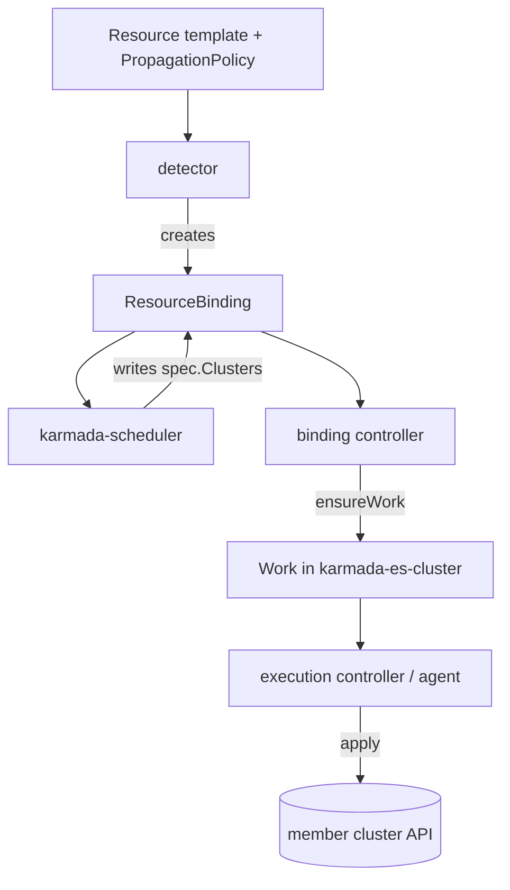

# Architecture

## Big picture

Karmada is a standalone control plane: a dedicated `karmada-apiserver` and etcd hold both plain Kubernetes resource templates and Karmada's CRDs. Member clusters register as `Cluster` objects. A set of controllers and a scheduler turn one template plus a `PropagationPolicy` into per-cluster `Work` objects, which are then applied to the member clusters either by the control plane (Push) or by an agent inside the member (Pull). Each component is a cobra application under `cmd/`, where `func main` calls an `app.NewXxxCommand`.

## Components

### karmada-controller-manager

The core process. It runs the resource detector and the controller set that build `ResourceBinding` objects and `Work` objects. Entry point `cmd/controller-manager/controller-manager.go:30`.

### karmada-scheduler

Assigns clusters to each `ResourceBinding`. It runs a filter/score/select/assign pipeline and writes the result back into the binding's `spec.Clusters`. Lives under `cmd/scheduler` and `pkg/scheduler`.

### karmada-agent

For Pull mode. It runs inside a member cluster, connects out to the control plane, and applies `Work` locally. Lives under `cmd/agent`.

### Supporting components

- `karmada-aggregated-apiserver` (`cmd/aggregated-apiserver`): aggregated APIs such as `cluster/proxy`.
- `karmada-search` (`cmd/karmada-search`): cross-cluster resource search and cache.
- `karmada-descheduler` and `karmada-scheduler-estimator` (`cmd/descheduler`, `cmd/scheduler-estimator`): rescheduling and real available-capacity estimation in member clusters.
- `karmada-metrics-adapter` (`cmd/metrics-adapter`): aggregates metrics across clusters for federated HPA.
- `karmada-webhook` (`cmd/webhook`): admission.
- `karmadactl` / `kubectl-karmada` (`cmd/karmadactl`, `cmd/kubectl-karmada`): the CLI; `init` bootstraps a control plane (`pkg/karmadactl/cmdinit/cmdinit.go:121`).
- `operator/`: manages Karmada instances declaratively through a `Karmada` CRD.

## How a request flows

Propagating a single `Deployment` to member clusters:

1. The detector picks up the template change in `pkg/detector/detector.go:231` (`Reconcile`), matches a `PropagationPolicy`, and applies it in `ApplyPolicy` (`detector.go:441`). `BuildResourceBinding` (`detector.go:822`) creates a `ResourceBinding` whose `spec.Resource` references the template and whose `spec.Placement` carries the policy's placement rules.
2. The scheduler reacts in `pkg/scheduler/scheduler.go:359` (`scheduleNext`), routes through `doScheduleBinding` (`scheduler.go:395`) to `scheduleResourceBinding` (`scheduler.go:571`), and for affinity-based placement to `scheduleResourceBindingWithClusterAffinity` (`scheduler.go:590`), which calls `s.Algorithm.Schedule(...)` (`scheduler.go:600`).
3. The scheduling algorithm in `pkg/scheduler/core/generic_scheduler.go:71` (`Schedule`) runs filter plugins (`findClustersThatFit`, `generic_scheduler.go:119`), score plugins (`prioritizeClusters`, `generic_scheduler.go:166`), `selectClusters` (`generic_scheduler.go:196`, via `SelectClusters` in `core/common.go:34`), and `assignReplicas` (`generic_scheduler.go:201`, via `AssignReplicas` in `core/common.go:51`). The scheduler patches the result into the binding's `spec.Clusters` (`patchScheduleResultForResourceBinding`, `scheduler.go:610`).
4. The binding controller in `pkg/controllers/binding/binding_controller.go:70` (`Reconcile`) calls `syncBinding` (`binding_controller.go:110`) and then `ensureWork` (`pkg/controllers/binding/common.go:53`). For each target cluster it deep-copies the workload, overwrites replicas with the scheduled value, applies override policies (`common.go:109`), and creates a `Work` in the per-cluster execution namespace `karmada-es-<cluster>`.
5. The execution controller in `pkg/controllers/execution/execution_controller.go:82` (`Reconcile`) calls `syncWork` (`execution_controller.go:151`) and `syncToClusters` (`execution_controller.go:266`), which applies each manifest to the member API via `ObjectWatcher.Create`/`Update` (`execution_controller.go:324`, `:332`) and marks the `Work` Applied on success (`execution_controller.go:302`).

Status controllers under `pkg/controllers/status` run the reverse path, aggregating each member's real state from `Work` back up into the `ResourceBinding` and the template.

## Key design decisions

- **Push vs Pull**: Push has the control plane call member APIs directly; Pull has `karmada-agent` connect outward, which works for clusters behind NAT or firewalls ([karmada.io](https://karmada.io/)).
- **Templates stay untouched, scheduling owns replicas**: `ensureWork` always overwrites the workload's replica count with the scheduling result rather than trusting the template, so a hand-edited template cannot bypass the scheduler's quota and queue accounting (`pkg/controllers/binding/common.go:80-96`).
- **Execution isolation per cluster**: each member cluster's `Work` lives in its own namespace `karmada-es-<cluster>` (`pkg/util/names/names.go:80,92`), keeping delivery state separated by destination.

## Extension points

- **PropagationPolicy / ClusterPropagationPolicy and OverridePolicy** CRDs to control placement and per-cluster customization (`pkg/apis/policy/v1alpha1/propagation_types.go:52`).
- **Resource Interpreter Framework**: an interface (`pkg/resourceinterpreter/interpreter.go:50`) plus a Lua-script implementation (`ResourceInterpreterCustomization` CRD) that teaches Karmada how to read replicas, revise them, and aggregate status for arbitrary CRDs.
- **Scheduler framework plugins**: filter and score plugins with scores bounded to 0..100 (`pkg/scheduler/framework/interface.go:39-42`).
- **Admission webhooks** (`cmd/webhook`).
