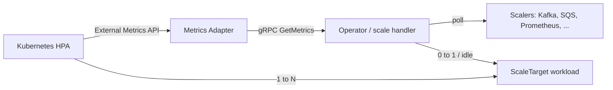

# Architecture

## Big picture

KEDA runs as three binaries built by `make build`: the operator (manager), the metrics adapter, and the admission webhooks ([2], `Makefile:211`). The operator owns reconciliation, scaler polling, and the 0-to-1 / idle scaling the HPA cannot do. The adapter implements the Kubernetes External Metrics API but computes nothing itself; it forwards every metric request to the operator over gRPC. The HPA, created and managed by KEDA, still decides 1-to-N scaling.

## Components

### Operator (controller manager)

Entry point `cmd/operator/main.go` (`func main` at `:69`). It reconciles `ScaledObject`, `ScaledJob`, and `TriggerAuthentication` resources, polls scalers, and performs activation/deactivation. In the same process it starts the gRPC Metrics Service server: `metricsservice.NewGrpcServer(&scaledHandler, ...)` ([2], `cmd/operator/main.go:355`).

### Metrics Adapter

Entry point `cmd/adapter/main.go` (`func main` at `:226`). It implements the External Metrics API on top of custom-metrics-apiserver and answers HPA queries. It holds no scaling state: it opens a gRPC client to the operator with `metricsservice.NewGrpcClient(...)` ([2], `cmd/adapter/main.go:115`) and wraps it in `kedaprovider.NewProvider(...)` ([2], `cmd/adapter/main.go:126`).

### Admission Webhooks

Entry point `cmd/webhooks/main.go`. It validates `ScaledObject` and `ScaledJob` resources before they are admitted.

## How a request flows

Tracing one metric query from HPA to value:

1. The HPA calls the External Metrics API, hitting `KedaProvider.GetExternalMetric` ([2], `pkg/provider/provider.go:75`). The provider extracts the owning ScaledObject name from the label selector via `selector.Get(kedav1alpha1.ScaledObjectOwnerAnnotation)` ([2], `pkg/provider/provider.go:99`).
2. The adapter does not compute the value. It forwards over gRPC: `p.grpcClient.GetMetrics(ctx, scaledObjectName, namespace, info.Metric)` ([2], `pkg/provider/provider.go:107`). If the connection is not yet ready it blocks on `WaitForConnectionReady` ([2], `pkg/provider/provider.go:87`).
3. On the operator side the gRPC handler calls `scaleHandler.GetScaledObjectMetrics` ([2], `pkg/scaling/scale_handler.go:585`). It looks up the scalers cache with `getScalersCacheForScaledObject` ([2], `pkg/scaling/scale_handler.go:590`) and fans out across triggers, adding a goroutine per scaler (`wg.Add(1)` inside the loop at `:635`/`:666`).
4. Each scaler implements the `Scaler` interface ([2], `pkg/scalers/scaler.go:44`). Concrete scalers come from the `buildScaler` switch keyed on the trigger type string ([2], `pkg/scaling/scalers_builder.go:123`).
5. The result returns as an `external_metrics.ExternalMetricValueList` back through the adapter to the HPA, which decides the 1-to-N scale.

Separately, the operator drives the 0-to-1 and idle path itself, because the HPA floor is one replica. The reconcile-driven scale loop calls `scaleExecutor.RequestScale` ([2], `pkg/scaling/executor/scale_scaledobjects.go:40`), which branches on activity to scale up from zero/idle or down to zero/idle ([2], `pkg/scaling/executor/scale_scaledobjects.go:73-117`).

The `ScaledObject` reconcile body is `reconcileScaledObject` ([2], `controllers/keda/scaledobject_controller.go:231`), reached from `Reconcile` ([2], `controllers/keda/scaledobject_controller.go:155`). It checks pause state (`:240`), confirms the target is scalable via `checkTargetResourceIsScalable` (`:280`), validates triggers (`:290`), ensures the HPA via `ensureHPAForScaledObjectExists` (`:301`), and on a generation change kicks the scale loop with `requestScaleLoop` (`:318`).

## Key design decisions

- **Operator and adapter split, with gRPC delegation.** The adapter advertises the External Metrics API but owns no values; it delegates every read to the operator with `GetMetrics` ([2], `pkg/provider/provider.go:107`). Scaling state stays centralised in the operator and the adapter stays stateless.
- **0-to-1 is the operator's job, not the HPA's.** The HPA cannot scale below one replica, so KEDA performs activation and deactivation in the `RequestScale` branches ([2], `pkg/scaling/executor/scale_scaledobjects.go:73-117`) and leaves 1-to-N to the HPA. This division of labour is the core of KEDA.

## Extension points

- **CRDs**: `ScaledObject`, `ScaledJob`, `TriggerAuthentication`, and `ClusterTriggerAuthentication`, defined in `apis/keda/v1alpha1/` ([2]).
- **Scaler interface**: third-party and built-in scalers implement `Scaler` ([2], `pkg/scalers/scaler.go:44`); a push variant `PushScaler` adds `Run(ctx, active chan<- bool)` ([2], `pkg/scalers/scaler.go:57`).
- **Authentication providers**: `TriggerAuthenticationSpec` resolves credentials from Pod Identity, Kubernetes secrets, HashiCorp Vault, Azure Key Vault, and others ([2], `apis/keda/v1alpha1/triggerauthentication_types.go:75`).
