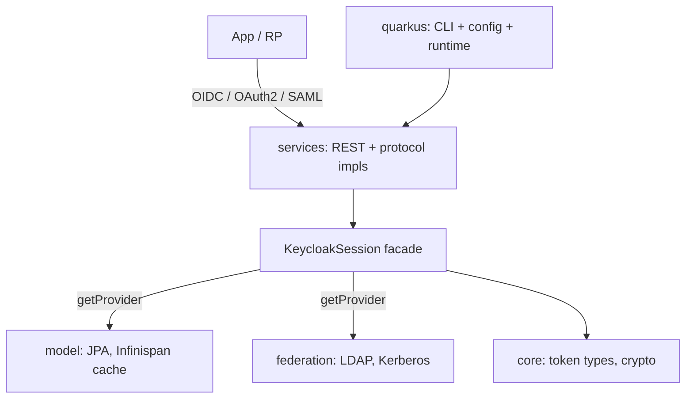

# Architecture

## Big picture

Keycloak is a Maven multi-module Java project that builds into a single Quarkus server distribution. The root `pom.xml` aggregates the modules and pins `maven.compiler.release` to 17 (`pom.xml:36`). The running server starts from a Quarkus entrypoint annotated `@QuarkusMain` (`quarkus/runtime/src/main/java/org/keycloak/quarkus/runtime/KeycloakMain.java:58-71`).

The design axis is the Service Provider Interface (SPI) plus ProviderFactory pattern: nearly every capability is an interface resolved at runtime, so storage backends, protocols, and authentication steps can be swapped without touching callers. The central facade is `KeycloakSession` (`server-spi/src/main/java/org/keycloak/models/KeycloakSession.java:35`).

## Components

### server-spi / server-spi-private

The extension-point interfaces. `KeycloakSession` is the facade through which all providers and context are reached (`server-spi/src/main/java/org/keycloak/models/KeycloakSession.java:35`). The domain model interfaces (`RealmModel`, `ClientModel`, `UserModel`, `UserSessionModel`) live under `server-spi/src/main/java/org/keycloak/models/`.

### services

The body of the server: REST endpoints and protocol implementations for OIDC, SAML, the admin REST API, and authentication flows. The OIDC token endpoint is here (`services/src/main/java/org/keycloak/protocol/oidc/endpoints/TokenEndpoint.java:121`).

### model

Persistence backend implementations: JPA for relational storage, Infinispan for caching and session state.

### core

Shared token representations such as `AccessToken` and `IDToken`, plus crypto primitives (`core/src/main/java/org/keycloak/representations/AccessToken.java:40`).

### quarkus

The actual runnable server distribution: the picocli CLI, Quarkus integration, and configuration mappers. Entrypoint at `quarkus/runtime/src/main/java/org/keycloak/quarkus/runtime/KeycloakMain.java:58-71`.

### crypto, saml-core, authz, federation, operator, js, themes, adapters

Supporting modules: cryptography, SAML core, Authorization Services / User-Managed Access (UMA) (`authz`), LDAP/Kerberos user federation (`federation`), the Kubernetes Operator (`operator`), the React Admin/Account consoles and adapters (`js`), and theming (`themes`).

## How a request flows

Trace an OIDC token exchange (`POST /realms/{realm}/protocol/openid-connect/token`):

1. `TokenEndpoint.processGrantRequest()` is the JAX-RS entry. It sets `Cache-Control: no-store` and `Pragma: no-cache` first, per RFC 6749 (`services/src/main/java/org/keycloak/protocol/oidc/endpoints/TokenEndpoint.java:121,133-134`).
2. It runs `checkSsl()`, `checkRealm()`, and `checkGrantType()` (`TokenEndpoint.java:136-138`).
3. The grant type is resolved as an SPI provider: `session.getProvider(OAuth2GrantType.class, grantType)`; an unknown grant yields `unsupported_grant_type` (`TokenEndpoint.java:220-223`).
4. Control passes to `grant.process(context)` (`TokenEndpoint.java:171`), which for the authorization_code flow is `AuthorizationCodeGrantType.process()` (`services/src/main/java/org/keycloak/protocol/oidc/grants/AuthorizationCodeGrantType.java:76`).
5. The grant builds the response through the shared base, `OAuth2GrantTypeBase.createTokenResponseBuilder()` (`services/src/main/java/org/keycloak/protocol/oidc/grants/OAuth2GrantTypeBase.java:114`).

## Key design decisions

Every feature is an SPI resolved by `KeycloakSession.getProvider(Class<T>, String id)` (`KeycloakSession.java:52,64`). Shortcuts like `session.users()`, `session.sessions()`, and `session.realms()` are wrappers over the same SPI resolution (`KeycloakSession.java:148,192,224`). One `KeycloakSession` lives per request and carries realm, client, and HTTP context.

The realm is the tenant boundary, a user session is the SSO session, and a client is the relying party. These appear as model interfaces in `server-spi/src/main/java/org/keycloak/models/`, so the persistence implementation is interchangeable.

## Extension points

The SPI surface is the extension model. Third parties implement provider interfaces (storage, authenticators, protocol mappers, grant types) and Keycloak resolves them by id. Grant types are themselves SPI providers: `authorization_code`, `refresh_token`, `client_credentials`, `password`, `token-exchange`, CIBA (Client-Initiated Backchannel Authentication), device, JWT bearer, UMA, and pre-authorized, implemented under `services/src/main/java/org/keycloak/protocol/oidc/grants/`.
