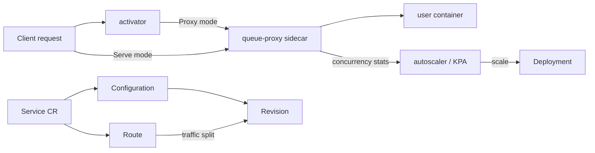

# Architecture

## Big picture

Knative Serving has a control plane and a data plane. The control plane is a set of reconcilers that watch custom resources and drive Kubernetes objects toward the desired state. The data plane carries actual request traffic and feeds load measurements back to the autoscaler. The control plane runs as a handful of separate processes under `cmd/`, each deployed as its own Pod.

## Components

### Control plane: cmd/controller

A single binary hosts several reconcilers. The set that always runs is registered in the `ctors` slice (`cmd/controller/main.go:56`): `configuration`, `labeler`, `revision`, `route`, `serverlessservice`, `service`, `gc`, `nscert`, and `domainmapping`. A `certificate` reconciler is appended at runtime when cert-manager CRDs are present (`cmd/controller/main.go:80`). `main()` wires all of them through `sharedmain.MainWithConfig` (`cmd/controller/main.go:92`).

### Control plane: autoscaler

`cmd/autoscaler` runs the Knative Pod Autoscaler (KPA), which computes the desired replica count from concurrency or RPS measurements. `cmd/autoscaler-hpa` bridges Revisions that opt into the HPA autoscaling class instead.

### Data plane: activator

`cmd/activator` is the component that makes scale to zero possible. When a Revision has zero replicas, requests are routed to the activator, which buffers them and holds the connection while it asks the autoscaler to scale the Revision up, then forwards once a Pod is ready.

### Data plane: queue-proxy

`cmd/queue` is injected as a sidecar into every user Pod. It sits in front of the user container, enforces the per-Revision concurrency limit, and reports live concurrency to the autoscaler. These reports are the autoscaler's primary input signal.

### Webhook

`cmd/webhook` serves the admission, defaulting, and conversion webhooks for the Serving CRDs. The Service spec restricts what may be expressed in its inlined Route fields through this webhook (`pkg/apis/serving/v1/service_types.go:71`).

## How a request flows

The most representative control-plane operation is applying a `Service` and watching it produce a Revision and a Route.

1. The `service` reconciler receives `ReconcileKind` (`pkg/reconciler/service/service.go:72`) and bounds the context with `pkgreconciler.DefaultTimeout` (`pkg/reconciler/service/service.go:73`).
2. It fetches or creates the child `Configuration` (`pkg/reconciler/service/service.go:78`). Creation calls `resources.MakeConfiguration` (`pkg/reconciler/service/service.go:203`).
3. If the Configuration's generation has not yet been observed in its status, the Service is held with `MarkConfigurationNotReconciled` (`pkg/reconciler/service/service.go:85`). With a BYO-Revision name this path returns to serialize reconciliation.
4. The separate `configuration` reconciler runs (`pkg/reconciler/configuration/configuration.go:59`), creating a new immutable Revision when one does not exist for the current template (`pkg/reconciler/configuration/configuration.go:69`).
5. Back in the Service reconciler, the `Route` is fetched or created via `route` (`pkg/reconciler/service/service.go:152`).
6. `checkRoutesNotReady` (`pkg/reconciler/service/service.go:175`) compares the Route's spec traffic against its status traffic and marks the Service not-ready when they differ.

Once a Revision becomes Ready, the `revision` and `serverlessservice` reconcilers stand up the Deployment and the ServerlessService, and the data plane comes online.

## Key design decisions

The Service, Configuration, Revision, and Route split exists so that each change produces an immutable Revision and the Route can shift traffic across Revisions by percentage. The `Service` object inlines an unrestricted `ConfigurationSpec` and a webhook-restricted `RouteSpec` (`pkg/apis/serving/v1/service_types.go:71`), which is why a Service can express a full Configuration but only a constrained Route.

Scale to zero is driven from the data plane, not a fixed schedule. The `ServerlessService` (SKS) chooses whether the activator stays in the request path (Proxy mode) or traffic goes straight to Pods (Serve mode). The two modes are defined in the vendored networking API (`vendor/knative.dev/networking/pkg/apis/networking/v1alpha1/serverlessservice_types.go:86`). The autoscaler flips this based on burst capacity, covered in [Internals](./internals).

## Extension points

- Custom resources: `Service`, `Configuration`, `Revision`, `Route`, and `DomainMapping` are the public API surface.
- Networking layer: Serving delegates ingress to a pluggable layer (Istio, Contour, Kourier, or a Gateway API implementation).
- Certificates: the optional `certificate` reconciler integrates cert-manager when its CRDs are installed (`cmd/controller/main.go:80`).
- Autoscaling class: a Revision can use the KPA or delegate to the Kubernetes HPA through `cmd/autoscaler-hpa`.
