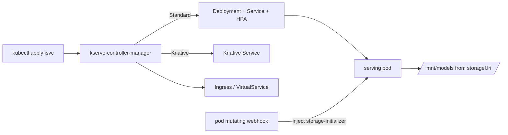

# Architecture

## Big picture

KServe has two planes. The control plane is the Go `kserve-controller-manager`, a controller-runtime binary that reconciles CRDs into ordinary Kubernetes objects. Its `main()` lives at `cmd/manager/main.go:99`, builds a Manager, registers the `InferenceServiceReconciler` and siblings, and serves the admission webhooks. It runs as a single leader-elected process (`LeaderLockName = "kserve-controller-manager-leader-lock"`, `cmd/manager/main.go:56`).

The data plane is the set of pods that actually serve inference: a Python KServe runtime or a third-party server such as Triton or TorchServe. Each serving pod gets a `storage-initializer` init container that pulls the model into a shared volume, plus optional agent, router, batcher, and logger sidecars.

## Components

### Control plane: kserve-controller-manager

Reconciles the core CRDs into runtime objects. The `InferenceServiceReconciler.Reconcile` loop is at `pkg/controller/v1beta1/inferenceservice/controller.go:121`. It owns deployment-mode resolution, finalizers, component reconcilers, ingress, model config, and status. Other binaries live under `cmd/`: `agent`, `router`, `llmisvc`, `localmodel`, and `localmodelnode`.

### Core CRDs

- `InferenceService` (`isvc`): the main API; `v1beta1` is the storage version (`pkg/apis/serving/v1beta1/inference_service.go:147`). `Predictor` is required; `Transformer` and `Explainer` are optional (`inference_service.go:24-35`).
- `ServingRuntime` / `ClusterServingRuntime` (`pkg/apis/serving/v1alpha1/servingruntime_types.go:222`, `:248`): pod templates per model format, with auto-selection.
- `InferenceGraph` (`pkg/apis/serving/v1alpha1/inference_graph.go:35`): routing and ensembles across models as a DAG.
- `LLMInferenceService` (`pkg/apis/serving/v1alpha1/llm_inference_service_types.go:60`): the generative-AI resource.

### Data plane: serving pods and sidecars

The Python servers under `python/kserve/kserve` speak the V1 and V2 (Open Inference Protocol) APIs. The `storage-initializer` init container, agent, router, batcher, and logger attach to the serving pod to handle model download, routing, micro-batching, and request logging.

## How a request flows

A `kubectl apply -f isvc.yaml` reconciles to a running model pod:

1. Entry. `InferenceServiceReconciler.Reconcile` fetches the `isvc`; a NotFound returns early for finalizer-driven GC (`controller.go:121`).
2. Config and mode. It reads the `inferenceservice-config` ConfigMap via `GetInferenceServiceConfigMap` (`controller.go:133`) and resolves the deployment mode with `GetDeploymentMode` (`controller.go:154`).
3. Finalizers. If `inferenceservice.finalizers` is absent it is added via a merge patch (`controller.go:176-187`); a `DeletionTimestamp` triggers cleanup then finalizer removal.
4. Components. For `Standard`/`Knative` it appends `components.NewPredictor` and, if present in the spec, Transformer and Explainer, then runs each reconciler (`controller.go:273`).
5. Predictor branch. `Predictor.Reconcile` (`pkg/controller/v1beta1/inferenceservice/components/predictor.go:85`) branches on mode: `Standard` calls `reconcileRawDeployment` then `raw.NewRawKubeReconciler` for Deployment + Service + HPA (`predictor.go:204`, `:771`); `Knative` calls `knative.NewKsvcReconciler` for a Knative Service (`predictor.go:836`).
6. Ingress. A factory builds a mode-specific ingress reconciler via `CreateIngressReconciler` (`controller.go:362`).
7. Status. `modelconfig.NewModelConfigReconciler(...).Reconcile` runs (`controller.go:394`), then `updateStatus` writes URL, conditions, and components (`controller.go:402`).

## Key design decisions

- Storage-initializer injection by webhook. The model is not baked into the server image; a mutating webhook adds an init container that downloads from `storageUri` into a shared `emptyDir` at `/mnt/models` (`pkg/webhook/admission/pod/storage_initializer_injector.go:441`, `:483`). One generic runtime image can serve any model.
- Runtime auto-selection. When an `isvc` names a model format, the `ServingRuntime` with `AutoSelect=true` and the highest `Priority` is chosen (`pkg/apis/serving/v1alpha1/servingruntime_types.go:31`). Users need not pin a runtime image.
- Default mode is `Standard`, plain Kubernetes (`pkg/constants/constants.go:554`). Knative is opt-in for scale-to-zero and canary, reversing the original Knative-required assumption.
- Status uses Knative's condition duck type. `InferenceServiceStatus` inlines `duckv1.Status` (`pkg/apis/serving/v1beta1/inference_service_status.go:42`), a legacy of KFServing's Knative roots; `PropagateCrossComponentStatus` aggregates readiness in Knative mode (`controller.go:339-340`).

## Extension points

- `ServingRuntime` / `ClusterServingRuntime` for new model formats and servers (`servingruntime_types.go:222`, `:248`).
- CRDs as the public API: `InferenceService`, `InferenceGraph`, `TrainedModel`, `LLMInferenceService`.
- Admission webhooks (mutating and validating) registered on the manager's webhook server.
- The data-plane V1/V2 protocol contract, which any server image can implement (`python/kserve/kserve`).
