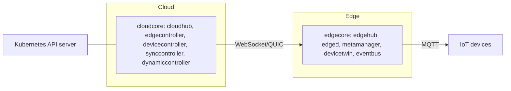

# Architecture

## Big picture

KubeEdge runs two processes that mirror each other. On the cloud side, `cloudcore` (`cloud/cmd/cloudcore`) terminates edge connections and projects Kubernetes objects toward the edge. On the edge side, `edgecore` (`edge/cmd/edgecore`) runs the workloads and the local device logic. Each process is a set of modules registered on Beehive, the in-tree message framework under `staging/src/github.com/kubeedge/beehive`. Modules never call each other directly; they send messages on a bus. The link between the two planes is a single WebSocket or QUIC connection: `cloudhub` on the cloud accepts it, `edgehub` on the edge dials it.

## Components

### cloudcore

Registered in `registerModules` at `cloud/cmd/cloudcore/app/server.go:165-178`. Key modules: `cloudhub` terminates the edge connection (`cloud/pkg/cloudhub`); `edgecontroller` pushes Pods, ConfigMaps, and Secrets down (`cloud/pkg/edgecontroller`); `devicecontroller` handles Device and DeviceModel CRDs (`cloud/pkg/devicecontroller`); `synccontroller` reconciles cloud and edge state for reliability (`cloud/pkg/synccontroller`); `dynamiccontroller` backs edge-side list/watch and is wired to authorization (`cloud/pkg/dynamiccontroller`). Authorization is computed once and passed into `dynamiccontroller.Register` (`cloud/cmd/cloudcore/app/server.go:166-177`). Other modules include `router`, `cloudstream`, `csidriver`, `policycontroller`, and `taskmanager`.

### edgecore

Registered in `registerModules` at `edge/cmd/edgecore/app/server.go:202-219`. Key modules: `edged`, a trimmed kubelet that manages the Pod lifecycle on the node (`edge/pkg/edged`); `edgehub`, the WebSocket client to `cloudhub` and the bridge between the cloud link and the local bus (`edge/pkg/edgehub`); `metamanager`, the local metadata store on SQLite via gorm (`edge/pkg/metamanager`); `devicetwin`, which holds device desired and reported state (`edge/pkg/devicetwin`); and `eventbus`, the MQTT broker connection for IoT devices (`edge/pkg/eventbus`). `servicebus`, `edgestream`, and `taskmanager` are also registered.

### Beehive

The framework both processes share, under `staging/src/github.com/kubeedge/beehive`. A `Module` is an interface with `Name`, `Group`, `Enable`, `Start`, and `RestartPolicy` (`staging/src/github.com/kubeedge/beehive/pkg/core/module.go:47-61`). `Register` drops a module into `disabledModules` when `Enable()` is false, so a disabled module never starts (`module.go:76-95`). `StartModules` starts one goroutine per module and supports both channel and Unix socket transports (`staging/src/github.com/kubeedge/beehive/pkg/core/core.go:17-55`).

## How a request flows

Trace a cloud-to-edge message that ends as a running Pod.

1. `edgehub.routeToEdge` reads one message off the WebSocket client; on a read error it signals `reconnectChan` and returns to trigger reconnection (`edge/pkg/edgehub/process.go:42-61`).
2. It hands the message to `dispatch`, which calls `msghandler.ProcessHandler` (`edge/pkg/edgehub/process.go:38-40`).
3. `ProcessHandler` walks the registered handlers and runs the first whose `Filter` returns true; if none match it returns an error (`edge/pkg/edgehub/messagehandler/handler.go:61-74`).
4. The handlers are registered in order meta, twin, bus, task by `RegisterHandlers` (`edge/pkg/edgehub/messagehandler/handler.go:51-58`). That order is the priority.
5. A meta-routed message reaches `metamanager`, which persists it through its DAO into SQLite; `edged` reads that desired state and starts the Pod.
6. The reverse path: `routeToCloud` pulls from the local bus with `beehiveContext.Receive`, passes it through a rate limiter (`tryThrottle`), and calls `sendToCloud` (`edge/pkg/edgehub/process.go:75-104`).
7. While the link is up, `keepalive` sends a ping every `Heartbeat` seconds (`edge/pkg/edgehub/process.go:106-128`).

## Key design decisions

Edge autonomy is the central choice. `metamanager` keeps a local copy of desired state in SQLite, so when the cloud link drops the edge node keeps running the last known workloads. The message header carries a `ResourceVersion` that is, per the in-code comment, backed by the resource version of the saved Kubernetes object and used to make transmission reliable (`staging/src/github.com/kubeedge/beehive/pkg/core/model/message.go:77-80`). The first-match handler chain means message handling priority is the registration order, not a routing table (`edge/pkg/edgehub/messagehandler/handler.go:51-74`).

## Extension points

Devices are modeled as Kubernetes CRDs handled by `devicecontroller` on the cloud and `devicetwin` on the edge. The MQTT bridge in `eventbus` (`edge/pkg/eventbus`) connects physical devices. A Beehive `Module` is itself the extension unit: implement the interface and register it (`staging/src/github.com/kubeedge/beehive/pkg/core/module.go:47-61`). The mapper framework under `staging/src/github.com/kubeedge/mapper-framework` generates device mappers for new protocols.
