# Architecture

## Big picture

Kubeflow Pipelines splits into a control plane and an execution plane. The control plane is an API server that manages runs, experiments, and recurring runs, and compiles each pipeline spec into an Argo Workflow custom resource. The execution plane is Argo Workflows, which runs the DAG; each task is driven by an injected driver and launcher. ML Metadata (MLMD) holds the source of truth for execution state, caching, and lineage, while a persistence agent watches Workflow status and writes it back to the API server's database. The top-level components live under `backend/src/`.

```mermaid
flowchart TD
  SDK[kfp SDK / UI] -->|CreateRun| API[apiserver]
  API -->|compile spec to Argo CR| WF[Argo Workflow CR]
  WF -->|each task: init driver, then launcher| POD[Task pods]
  POD -->|read/write executions and artifacts| MLMD[(ML Metadata)]
  POD -->|store artifacts| OBJ[(Object store)]
  WF -->|watched| PA[persistence agent]
  PA -->|ReportWorkflow status| API
  API -->|persist run| DB[(MySQL)]
  SWF[ScheduledWorkflow controller] -->|cron creates Workflow CR| WF
```

## Components

### API server

The REST/gRPC control plane under `backend/src/apiserver/`. It manages run, pipeline, experiment, and recurring-run resources, and on run creation compiles a stored pipeline spec into an Argo Workflow and creates the custom resource. Its entrypoint serves gRPC on `:8887` (`backend/src/apiserver/main.go:73`, `:340`) and a grpc-gateway REST proxy on `:8888` (`backend/src/apiserver/main.go:74`).

### Persistence agent

Under `backend/src/agent/persistence/`. It watches Argo Workflow custom resources and reports their status back to the API server with `pipelineClient.ReportWorkflow(wf)` (`backend/src/agent/persistence/worker/workflow_saver.go:72`), which updates the run state in the database.

### ScheduledWorkflow controller

The ScheduledWorkflow (SWF) CRD controller under `backend/src/crd/controller/scheduledworkflow/`. Its `syncHandler` (`backend/src/crd/controller/scheduledworkflow/controller.go:433`) evaluates the cron schedule and periodically creates Workflow custom resources for recurring runs.

### v2 driver and launcher

The v2 engine under `backend/src/v2/`. The compiler converts the IR into an Argo Workflow; each task then runs a driver (resolve inputs, decide caching, generate a pod spec patch) followed by a launcher (run the user container, handle artifact I/O, publish to MLMD). The driver entrypoint for a container task is `Container` (`backend/src/v2/driver/container.go:47`); the launcher lives at `backend/src/v2/cmd/launcher-v2/`.

### Cache server

A step-result cache server under `backend/src/cache/`. The driver consults it before deciding whether to run a task.

### External pieces

`frontend/` is a React UI, `sdk/` is the Python `kfp` package, and `api/` holds the protobuf IR definitions. Execution depends on Argo Workflows and MySQL, with metadata in MLMD (`README.md` compatibility matrix).

## How a request flows

Creating a single run, end to end:

1. The gRPC handler `RunServer.CreateRun` (`backend/src/apiserver/server/run_server.go:514`) receives the request and delegates to the resource manager.
2. `ResourceManager.CreateRun` (`backend/src/apiserver/resource/resource_manager.go:651`) calls `fetchTemplateFromPipelineSpec` (`:665`) to load a Template from the stored spec, then `tmpl.RunWorkflow(...)` builds an ExecutionSpec, an Argo Workflow (`:696`), which is validated with `executionSpec.Validate` (`:700`).
3. After namespace and owner-reference setup and the plugin hook `OnBeforeRunCreation` (`:750`), the workflow client creates the Argo Workflow custom resource (`:769`), and `runStore.CreateRun` persists the run to the database (`:799`). The run starts in `Pending`.
4. Argo runs the DAG. Each task starts with the driver: `Container` (`backend/src/v2/driver/container.go:47`) reads the pipeline and DAG from MLMD (`:66`, `:70`), resolves inputs (`:79`), provisions outputs (`:116`), computes a cache fingerprint and prior execution ID (`:173`), and creates an Execution in MLMD (`:190`).
5. On a cache hit (`:216` onward), the driver reuses prior outputs and publishes `Execution_CACHED` (`:234`), skipping the launcher. On a miss, the launcher (`backend/src/v2/cmd/launcher-v2/`) runs the user container and publishes artifacts to the object store and MLMD.
6. The persistence agent detects Workflow changes and calls `ReportWorkflow` (`backend/src/agent/persistence/worker/workflow_saver.go:72`) to update run state in the database.
7. For recurring runs, the SWF controller's `syncHandler` (`backend/src/crd/controller/scheduledworkflow/controller.go:433`) creates Workflow custom resources on schedule.

## Key design decisions

- **Push control plane, watch-based status sync.** The API server actively creates Workflow custom resources, and the persistence agent watches them to update the database asynchronously. This two-stage async design is described by the TODO comments around `backend/src/apiserver/resource/resource_manager.go:670`.
- **Engine-neutral ExecutionSpec abstraction.** Argo is hidden behind the `ExecutionSpec` interface (`backend/src/common/util/execution_spec.go:77`). The project's `CLAUDE.md` architectural boundary policy forbids downcasting to `*util.Workflow` and keeping Argo-specific behaviour in common packages.
- **MLMD as the source of truth.** Argo is just the execution substrate; per-task execution records, caching decisions, and artifact lineage live in MLMD Executions and Contexts.
- **Idempotent recurring runs.** A run created from a recurring run gets a deterministic UUID (`backend/src/apiserver/resource/resource_manager.go:682`), so concurrent SWF controller replicas converge on the same primary key instead of creating duplicate runs.

## Extension points

- **Plugin hooks** on run creation, such as `OnBeforeRunCreation` (`backend/src/apiserver/resource/resource_manager.go:750`).
- **The Template interface** (`backend/src/apiserver/template/template.go:118`), which lets a stored pipeline spec be compiled by either the V1 or V2 strategy.
- **Custom resources**: ScheduledWorkflow and Viewer CRDs, plus the Argo Workflow CR that KFP generates.
- **The protobuf IR** (`api/v2alpha1/pipeline_spec.proto:50`), the contract between the SDK and the backend.
