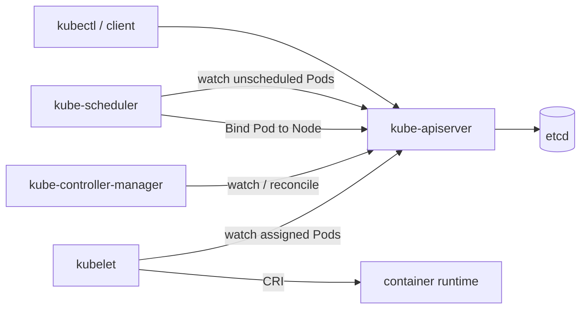

# Architecture

## Big picture

Kubernetes is a set of processes around a central API server. The API server is the only component that talks to etcd, the store of record. Everything else watches the API server for changes and reacts. The control plane components (`kube-apiserver`, `kube-controller-manager`, `kube-scheduler`) decide what should run where; the node components (`kubelet`, `kube-proxy`) make it real on each machine. Each control-plane binary has a thin `main` that hands off to a Cobra command (for example [cmd/kube-scheduler/scheduler.go:29](https://github.com/kubernetes/kubernetes/blob/8c64324b69ac1e444979f2fddf07a63baa759e5a/cmd/kube-scheduler/scheduler.go#L29)), with the real implementation under `pkg/`.

## Components

### kube-apiserver

The front door and the only writer to etcd. It validates and persists API objects and serves watches that every other component subscribes to. Entry point: [cmd/kube-apiserver/apiserver.go:32](https://github.com/kubernetes/kubernetes/blob/8c64324b69ac1e444979f2fddf07a63baa759e5a/cmd/kube-apiserver/apiserver.go#L32). Implementation lives under `pkg/controlplane` and `pkg/kubeapiserver`.

### kube-scheduler

Watches for Pods with no node assigned, picks a feasible node, and writes the binding back to the API server. Entry point: [cmd/kube-scheduler/scheduler.go:29](https://github.com/kubernetes/kubernetes/blob/8c64324b69ac1e444979f2fddf07a63baa759e5a/cmd/kube-scheduler/scheduler.go#L29). Core logic is in `pkg/scheduler`.

### kube-controller-manager

Runs the built-in controllers (Deployment, ReplicaSet, Node, and others). Each controller watches objects and reconciles observed state toward desired state. Implementation under `pkg/controller`.

### kubelet

The per-node agent. It watches the API server for Pods assigned to its node and drives the container runtime through the CRI to start and stop containers. Entry point: [cmd/kubelet/kubelet.go:35](https://github.com/kubernetes/kubernetes/blob/8c64324b69ac1e444979f2fddf07a63baa759e5a/cmd/kubelet/kubelet.go#L35). Implementation under `pkg/kubelet`.

## How a request flows

Scheduling one Pod is a representative path. All anchors are in `pkg/scheduler/schedule_one.go`.

1. `ScheduleOne` pulls the next entity off the queue and dispatches a Pod to `scheduleOnePod` ([schedule_one.go:67](https://github.com/kubernetes/kubernetes/blob/8c64324b69ac1e444979f2fddf07a63baa759e5a/pkg/scheduler/schedule_one.go#L67)).
2. `scheduleOnePod` resolves the scheduling profile for the Pod and allocates a fresh `CycleState` for the cycle ([schedule_one.go:93](https://github.com/kubernetes/kubernetes/blob/8c64324b69ac1e444979f2fddf07a63baa759e5a/pkg/scheduler/schedule_one.go#L93)).
3. `schedulingCycle` refreshes the node snapshot, then runs the scheduling algorithm ([schedule_one.go:177](https://github.com/kubernetes/kubernetes/blob/8c64324b69ac1e444979f2fddf07a63baa759e5a/pkg/scheduler/schedule_one.go#L177)).
4. `schedulePod` filters nodes, scores the survivors, and picks the highest score ([schedule_one.go:564](https://github.com/kubernetes/kubernetes/blob/8c64324b69ac1e444979f2fddf07a63baa759e5a/pkg/scheduler/schedule_one.go#L564)).
5. `prepareForBindingCycle` assumes the Pod into the cache and runs Reserve and Permit plugins ([schedule_one.go:196](https://github.com/kubernetes/kubernetes/blob/8c64324b69ac1e444979f2fddf07a63baa759e5a/pkg/scheduler/schedule_one.go#L196)).
6. Binding runs in a separate goroutine, so the next Pod does not wait on the API write ([schedule_one.go:141](https://github.com/kubernetes/kubernetes/blob/8c64324b69ac1e444979f2fddf07a63baa759e5a/pkg/scheduler/schedule_one.go#L141)).

The default binder POSTs a `v1.Binding` to the API server, the one write that actually ties the Pod to a node ([default_binder.go:52](https://github.com/kubernetes/kubernetes/blob/8c64324b69ac1e444979f2fddf07a63baa759e5a/pkg/scheduler/framework/plugins/defaultbinder/default_binder.go#L52)).

## Key design decisions

The API server is the single writer to etcd, and every other component is a watcher that reconciles toward declared state. This keeps the consistency model in one place and lets controllers run independently.

The scheduler optimistically assumes a Pod into its cache and then binds asynchronously ([schedule_one.go:141](https://github.com/kubernetes/kubernetes/blob/8c64324b69ac1e444979f2fddf07a63baa759e5a/pkg/scheduler/schedule_one.go#L141)). The API round-trip for the bind is taken off the critical path, so scheduling throughput is not gated on it. The trade-off is that the cache can briefly hold a placement that the API has not yet confirmed.

## Extension points

The scheduler is built entirely from framework plugins. The `Framework` interface defines the extension points: PreFilter, Filter, Score, Reserve, Permit, PreBind, and Bind ([pkg/scheduler/framework/interface.go:200](https://github.com/kubernetes/kubernetes/blob/8c64324b69ac1e444979f2fddf07a63baa759e5a/pkg/scheduler/framework/interface.go#L200)). At the cluster level, Kubernetes exposes Custom Resource Definitions plus controllers, admission webhooks, and the CRI, CNI, and CSI interfaces for runtimes, networking, and storage.
