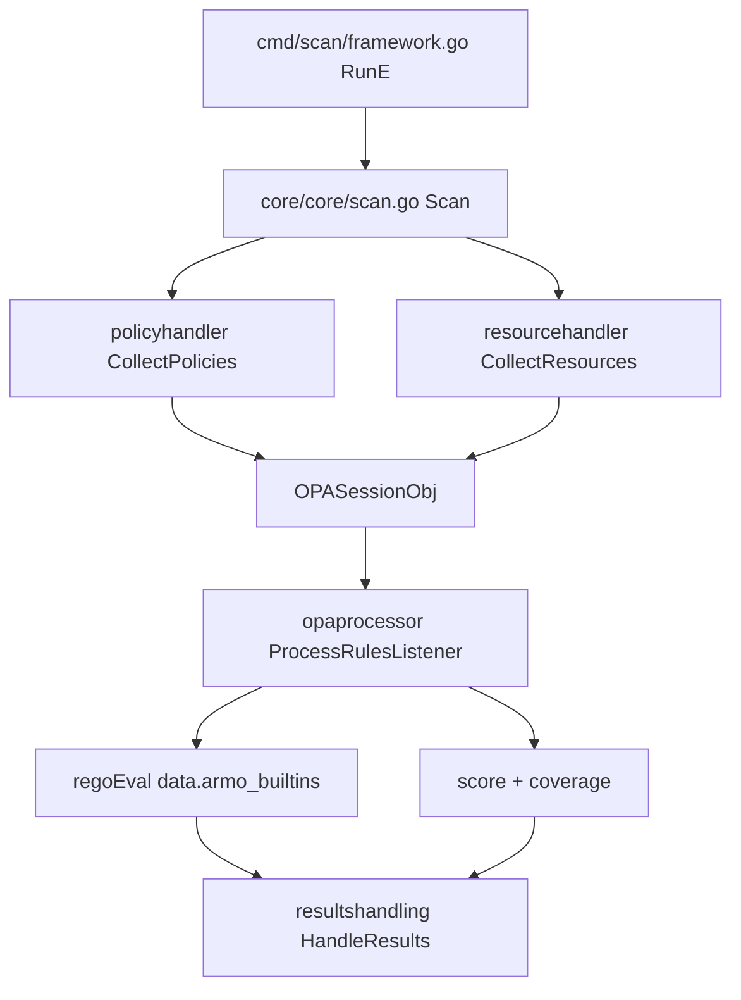

# Architecture

## Big picture

Kubescape splits into two halves. This repository is the CLI and scan engine: it collects resources, pulls policy content, evaluates it, and prints results. A separate set of in-cluster microservices (operator, vulnerability scanner, node-agent, storage) lives in other repositories under the `kubescape` org and is deployed by Helm. This page covers the CLI.

The CLI entry point is small. `main.go:21` defines `func main()` and only calls `cmd.Execute(ctx, version, commit, date)`; the `version`, `commit`, and `date` values are filled at build time by GoReleaser (`main.go:14-19`). Everything below is a Cobra command tree under `cmd/` that drives method implementations in `core/core/`.

## Components

### Command tree (`cmd/`)

Cobra commands define the surface: `scan` (framework, control, workload, image), `fix`, `patch`, `download`, `list`, `config`, and `diff`. Each command validates flags and calls into `core`. For example `cmd/scan/framework.go:70` defines the `RunE` for `scan framework`.

### Scan engine (`core/core/`)

Holds the implementation behind each command as methods on the `Kubescape` type: `scan.go`, `fix.go`, `patch.go`, `image_scan.go`, `download.go`. `core/core/scan.go:183` `Scan` is the pipeline that ties the other packages together.

### Engine parts (`core/pkg/`)

The working packages: `policyhandler` (policy retrieval), `resourcehandler` (K8s and file collection), `opaprocessor` (Rego and CEL evaluation), `resourcesprioritization` (attack-track priority), `score`, `containerscan`, `fixhandler`, `vapreconcile` (ValidatingAdmissionPolicy), `reportcrypto`, `anonymizer`, `hostsensorutils`, and `resultshandling` (printers and reporters).

### Shared types and config (`core/cautils/`)

Common data structures and configuration: `OPASessionObj` (`core/cautils/datastructures.go:49`), `ScanInfo` (`core/cautils/scaninfo.go:102`), and `getter/` which downloads policy content from GitHub releases. `core/meta/ksinterface.go:11` defines `IKubescape`, the interface boundary between the CLI and the core.

### Image scanning (`pkg/imagescan/`)

Wraps Anchore Grype and Syft for image vulnerability scanning and SBOM generation (`pkg/imagescan/imagescan.go`).

## How a request flows

Tracing `kubescape scan framework nsa`:

1. `cmd/scan/framework.go:70` `RunE` validates flags, sets the scan type with `scanInfo.SetScanType(cautils.ScanTypeFramework)` (`cmd/scan/framework.go:122`) and `scanInfo.SetPolicyIdentifiers(frameworks, apisv1.KindFramework)` (`cmd/scan/framework.go:124`), then calls `ks.Scan(scanInfo)` (`cmd/scan/framework.go:126`) and `results.HandleResults(...)` (`cmd/scan/framework.go:131`).
2. `core/core/scan.go:183` `Scan` runs the pipeline. It builds the K8s client, tenant config, host scanner, resource handler, reporter, and printer through `getInterfaces` (`core/core/scan.go:191`). It selects a policy getter (`core/core/scan.go:205` `getter.NewDownloadReleasedPolicy()`); air-gapped mode is decided by `isAirGappedMode` (`core/core/scan.go:397`).
3. Policies are collected: `policyhandler.NewPolicyHandler(...).CollectPolicies(...)` (`core/core/scan.go:232-233`, defined at `core/pkg/policyhandler/handlepullpolicies.go:51`), which builds the `*OPASessionObj`.
4. Resources are collected: `resourcehandler.CollectResources(...)` (`core/core/scan.go:242`, defined at `core/pkg/resourcehandler/handlerpullresources.go:18`) loads live K8s objects or YAML/JSON files into the session.
5. Evaluation: `opaprocessor.NewOPAProcessor(scanData, ...)` (`core/core/scan.go:256`) then `ProcessRulesListener(...)` (`core/core/scan.go:258`, defined at `core/pkg/opaprocessor/processorhandler.go:83`).
6. Results are handed to the result handler: `resultsHandling.SetData(scanData)` (`core/core/scan.go:281`), with optional encryption and anonymization paths after it.
7. Back in the command, the exit gate compares scores: risk-score against `FailThreshold` (`cmd/scan/framework.go:135`) and compliance-score against `ComplianceThreshold` (`cmd/scan/framework.go:139`), plus severity, coverage, and policy-degradation gates (`cmd/scan/framework.go:142-144`).

## Key design decisions

- Policy content is not compiled into the binary. The scanner downloads controls from GitHub releases (`core/core/scan.go:205`, `core/cautils/getter`), and the rule bodies live in the separate `kubescape/regolibrary` repository. NSA/CISA, MITRE, and CIS rule updates ship without rebuilding the CLI, and `--keep-local` / `--use-from` switch the engine to air-gapped operation (`core/core/scan.go:397`).
- Per-control timeout is implemented with a context. A control that exceeds `ControlTimeout` is marked timed out and counted as not-evaluated rather than failing the whole scan (`core/pkg/opaprocessor/processorhandler.go:143-151`). Coverage and degradation are tracked through `BuildScanCoverage` (`core/pkg/opaprocessor/processorhandler.go:98`), and a degraded run can be turned into a gate (`cmd/scan/framework.go:144`).
- Two score directions. Risk-score is higher-is-worse and bounded by `FailThreshold`; compliance-score is higher-is-better and bounded below by `ComplianceThreshold`. The two are gated in opposite directions (`cmd/scan/framework.go:135-139`).

## Extension points

- Control content is external. New or modified rules are authored in `kubescape/regolibrary` and consumed by the getter, not by editing this repository.
- Rules are written in Rego and call Kubescape-registered Cosign builtins such as `cosign_verify` and `cosign_has_signature`, registered once at `core/pkg/opaprocessor/processorhandler.go:513-517`. A rule can express image-signature checks directly in policy.
- A second rule language, CEL, is wired into the dispatch at `core/pkg/opaprocessor/processorhandler.go:494-503`, with a CEL environment at `core/pkg/opaprocessor/cel/env.go`. The evaluator is a stub at this commit (see Internals).
- `vapreconcile` generates Kubernetes ValidatingAdmissionPolicy objects, letting posture controls be enforced by the API server.
