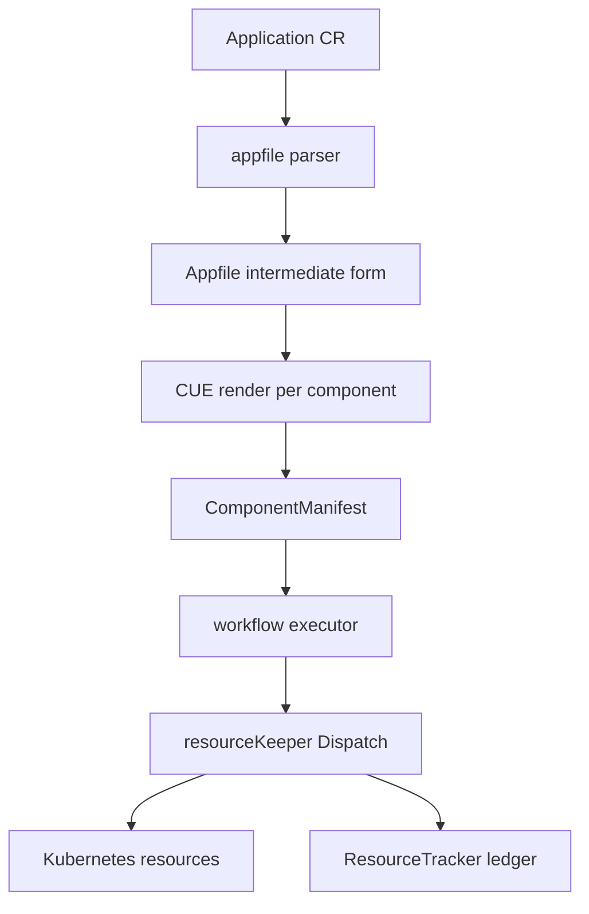

# Architecture

## Big picture

KubeVela is a CRD controller for Kubernetes. The only input a user writes is one `Application` custom resource in the API group `core.oam.dev`. The `Application` carries three things: a list of components, a list of policies, and a workflow (`src/apis/core.oam.dev/v1beta1/application_types.go:51-65`). The controller parses that resource into an intermediate representation, renders each component through its CUE definition into real Kubernetes objects, runs the workflow steps that apply them, and records what it applied so it can garbage-collect later.

## Components

### API types

The OAM API types live in `src/apis/core.oam.dev/`. The `Application` type and its `ApplicationSpec` are in `src/apis/core.oam.dev/v1beta1/application_types.go:81-87` and `:51-65`. The composition unit, `ApplicationComponent`, with its `Type`, `Properties`, and `Traits`, is in `src/apis/core.oam.dev/common/types.go:351`.

### Controller-manager

The reconcile logic runs in the controller-manager, whose entry point is `src/cmd/core/main.go:25` calling `app.NewCoreCommand()`. The `Application` reconciler itself is `src/pkg/controller/core.oam.dev/v1beta1/application/application_controller.go:109`.

### pkg subsystems

The work is split across packages under `src/pkg/`: `appfile` parses an `Application` into the intermediate form, `cue` evaluates the CUE templates, `workflow` runs the step engine, `resourcekeeper` and `resourcetracker` maintain the ledger of applied resources and garbage-collect them, `multicluster` handles cross-cluster delivery, and `definition` resolves the X-Definition CUE types.

### CLI and kubectl plugin

Two more entry points exist for operators: the `vela` CLI, built from `./references/cmd/cli/main.go` (`src/makefiles/build.mk:4`), and a kubectl plugin under `src/cmd/plugin/main.go`.

## How a request flows

Tracing the reconcile of one `Application` end to end, the central function is `Reconcile` at `src/pkg/controller/core.oam.dev/v1beta1/application/application_controller.go:109`:

1. Fetch the `Application` (`:115-124`).
2. Build the parser and handler: `appfile.NewApplicationParser(r.Client)` and `NewAppHandler` (`:144-145`).
3. Convert the `Application` into the `Appfile` intermediate form: `appParser.GenerateAppFile(logCtx, app)` (`:180`), implemented at `src/pkg/appfile/parser.go:87`.
4. Apply policies: `handler.ApplyPolicies(logCtx, appFile)` (`:211`).
5. Generate the workflow instance and the runner set: `handler.GenerateApplicationSteps(...)` (`:222`).
6. Execute: `executor.New(workflowInstance)` then `workflowExecutor.ExecuteRunners(authCtx, runners)` (`:231-236`), timed by a histogram (`:237`).

The component-apply workflow step is where rendering meets the cluster: it calls `h.resourceKeeper.Dispatch(ctx, resources, applyOptions)` (`src/pkg/controller/core.oam.dev/v1beta1/application/generator.go:104`), whose body is `src/pkg/resourcekeeper/dispatch.go:61`.

## Key design decisions

The decision that shapes everything else is to express the abstraction layer in CUE templates rather than Go. ComponentDefinitions and TraitDefinitions are CUE, evaluated at reconcile time, and a trait is merged onto a workload with CUE's structural unification (`Unify`) at `src/pkg/appfile/appfile.go:564` and `:570`. The payoff is that platform teams add new component and trait types without recompiling the controller; the cost is that CUE evaluation errors need their own formatting path, `FormatCUEError` (`src/pkg/appfile/appfile.go:604`).

The second decision is to track applied resources in a `ResourceTracker` CR rather than relying on owner references alone. Deletion is computed from the ledger diff, so resources dropped from the declaration are reliably reclaimed. The ledger can be stored compressed (`src/apis/core.oam.dev/v1beta1/resourcetracker_types.go:86`).

## Extension points

- **X-Definitions**: ComponentDefinition, TraitDefinition, WorkflowStepDefinition, and PolicyDefinition are CRDs written in CUE that third parties supply to add new capability types.
- **Addons**: the addon system under `src/pkg/addon` packages and installs extensions.
- **Terraform and external runtimes**: a component whose category is Terraform is rendered as a Terraform module instead of through CUE (`src/pkg/appfile/appfile.go:343`).
- **Multi-cluster**: delivery to remote clusters goes through the `multicluster` package.
