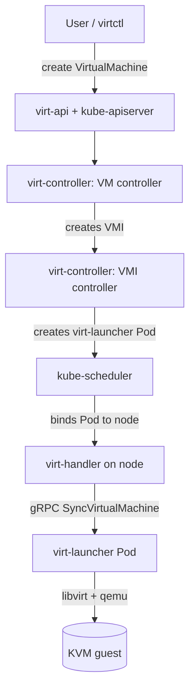

# Architecture

## Big picture

KubeVirt is a set of binaries, each with its own `main` under `cmd/`, that extend a Kubernetes cluster. There is no single entry point. `virt-operator` installs and upgrades the rest. `virt-api` and `virt-controller` form the control plane. `virt-handler` runs on every node, and one `virt-launcher` Pod wraps each running VM. The `virtctl` CLI covers operations that do not map cleanly onto the REST API.

## Components

### virt-operator

The install and lifecycle operator. It is the cluster's entry point for KubeVirt: you apply the operator manifest and a `KubeVirt` custom resource, and it deploys, upgrades, and manages the other components ([docs/getting-started.md](https://github.com/kubevirt/kubevirt/blob/main/docs/getting-started.md)).

### virt-api

The aggregated API server. It hosts the admission webhooks that validate KubeVirt custom resources and serves subresources such as console, VNC, and pause that do not fit the plain REST object model.

### virt-controller

The cluster-level controllers. They reconcile `VirtualMachineInstance`, `VirtualMachine`, migrations, replica sets, and pools. The `main` at `cmd/virt-controller/virt-controller.go:28` does nothing but call `watch.Execute()`.

### virt-handler

A DaemonSet running on each node. It reconciles the desired state of VMIs against the actual domains on its node and talks to the local `virt-launcher` over gRPC (`pkg/virt-handler/vm.go:2055`). It does not run libvirt itself.

### virt-launcher

One Pod per VM. It carries libvirt and QEMU inside the Pod and drives the domain through `LibvirtDomainManager` (`pkg/virt-launcher/virtwrap/manager.go:1371`).

### virtctl

The user-facing CLI under `cmd/virtctl`. It handles start, stop, console, vnc, and migrate, the operations awkward to express as REST calls.

## How a request flows

Starting a VM goes through these hops:

1. The user creates a `VirtualMachine`. The VM controller creates a `VirtualMachineInstance` (VMI).
2. The VMI controller's reconcile loop, `execute(key)` at `pkg/virt-controller/watch/vmi/vmi.go:306`, fetches the VMI and calls `c.sync(...)` at `pkg/virt-controller/watch/vmi/vmi.go:364`.
3. When no Pod exists yet, `sync()` at `pkg/virt-controller/watch/vmi/lifecycle.go:66` renders a launch manifest via `RenderLaunchManifest(vmi)` at `pkg/virt-controller/watch/vmi/lifecycle.go:156`, then creates the Pod via `createPod(...)` at `pkg/virt-controller/watch/vmi/lifecycle.go:174`.
4. The standard `kube-scheduler` binds the Pod to a node.
5. That node's `virt-handler` detects the VMI and calls `client.SyncVirtualMachine(vmi, options)` at `pkg/virt-handler/vm.go:2055`, sending the request over gRPC to the local `virt-launcher`.
6. `virt-launcher`'s `SyncVMI()` at `pkg/virt-launcher/virtwrap/manager.go:1371` converts the VMI to a libvirt domain and starts QEMU.

## Key design decisions

The defining choice is one `virt-launcher` Pod per VMI, with libvirt and QEMU running inside that Pod. This makes a VM a first-class Kubernetes workload: it reuses the standard scheduler, Pod networking, PVCs, and eviction rather than a parallel hypervisor scheduler. The trade-off is an extra layer (Pod wrapping a VM) compared with a bare hypervisor.

A second choice is delegation. `virt-handler` does not run libvirt; it sends desired state to the node-local `virt-launcher` over gRPC (`pkg/virt-handler/vm.go:2055`). The declarative-to-imperative translation, from the Kubernetes VMI spec to libvirt domain XML, is confined to one converter (`pkg/virt-launcher/virtwrap/converter/converter.go:967`).

## Extension points

- Custom resources: `VirtualMachine`, `VirtualMachineInstance`, `VirtualMachineInstanceMigration`, `VirtualMachineInstanceReplicaSet` (defined in `staging/src/kubevirt.io/api/core/v1/types.go`).
- Admission webhooks served by `virt-api` for validating those resources.
- The `KubeVirt` CR consumed by `virt-operator` to configure the install, including software emulation for nodes without hardware virtualization.
