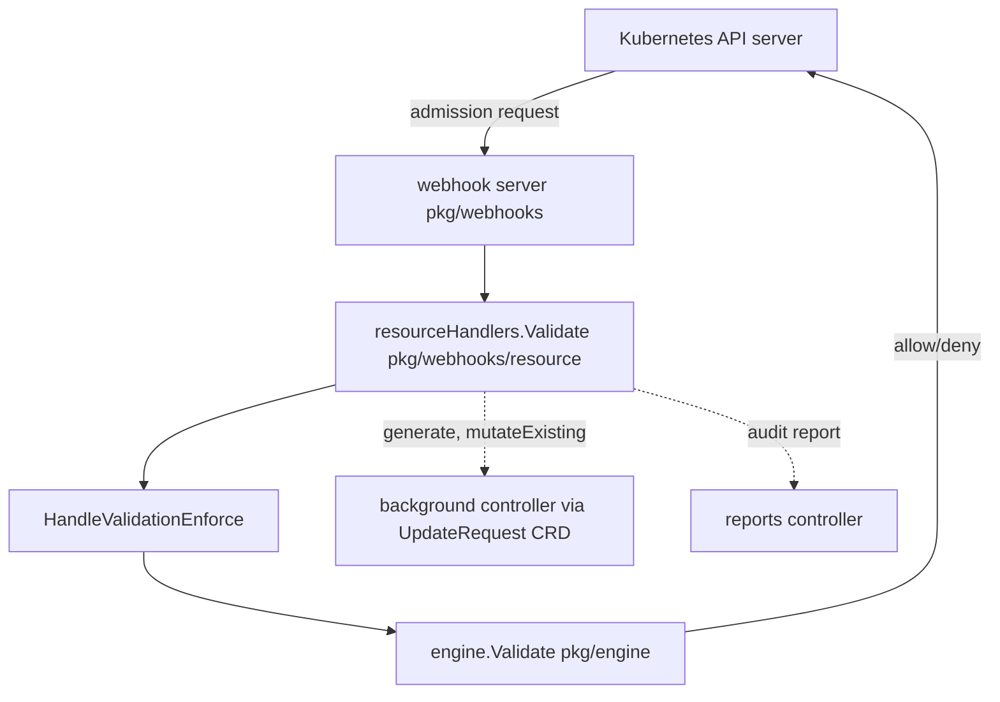

# Architecture

## Big picture

Kyverno is not one process. It splits into several binaries under `cmd/`: the admission controller (`cmd/kyverno/main.go`), a background controller (`cmd/background-controller`), a cleanup controller (`cmd/cleanup-controller`), a reports controller (`cmd/reports-controller`), and the `kubectl-kyverno` CLI (`cmd/cli`). The admission controller is the part the API server calls. The other controllers reconcile state that cannot or should not be computed inside a synchronous admission request. The shared evaluation logic lives in `pkg/engine`, which all paths route through.

## Components

### Webhook server (`pkg/webhooks`)

The HTTP entry point. `pkg/webhooks/server.go` registers routes on a mux. CEL-based policies get dedicated paths: `/mpol/*policies` and `/nmpol/*policies` for MutatingPolicy (`server.go:78`, `server.go:91`), `/vpol/*policies` for ValidatingPolicy (`server.go:105`), `/ivpol/validate/*policies` and `/ivpol/mutate/*policies` for ImageVerificationPolicy (`server.go:131`, `server.go:144`), and `/gpol/*policies` for GeneratingPolicy (`server.go:158`). The older `ClusterPolicy` path is wired through `registerWebhookHandlersWithAll` (`server.go:182`, `server.go:384`). Each handler is wrapped in a chain (`handlerFunc(...).WithFilter(...).WithMetrics(...).WithAdmission(...).ToHandlerFunc(...)`) that layers filtering, RBAC lookup, metrics, and tracing onto the raw handler.

### Engine (`pkg/engine`)

The policy evaluator. The `Engine` interface (`pkg/engine/api/engine.go:17`) exposes six methods: `Validate`, `Mutate`, `Generate`, `VerifyAndPatchImages`, `ApplyBackgroundChecks`, and `ContextLoader`. Every policy application funnels through this interface, so the webhook server and the background controller share one evaluation code path.

### CEL policy engines (`pkg/cel`)

The newer policy types each have their own engine under `pkg/cel/policies` (`vpol`, `mpol`, `ivpol`, `gpol`). `cmd/kyverno/main.go:24-31` imports them (for example `vpolengine "github.com/kyverno/kyverno/pkg/cel/policies/vpol/engine"`). The Go types for these CEL CRDs live in a separate module, `github.com/kyverno/api`, imported at `cmd/kyverno/main.go:14`.

### Controllers (`pkg/controllers`)

Reconcile loops for things outside the admission hot path: the policy cache, policy status, the cert manager that mints the webhook TLS, webhook registration, and the global context. Generation and mutation of existing resources are handed off here rather than completed inline.

## How a request flows

A ValidatingWebhook admission request takes this path:

1. The API server POSTs the admission request to the webhook server. The admission middleware in `pkg/webhooks/handlers/admission.go` builds the `AdmissionRequest` and calls `resourceHandlers.Validate`.
2. `pkg/webhooks/resource/handlers.go:112` `Validate` calls `retrieveAndCategorizePolicies` (`handlers.go:117`) to sort matched policies into validate, mutate, generate, and audit-warn buckets.
3. It builds a `validation.NewValidationHandler` (`handlers.go:127`) and runs `vh.HandleValidationEnforce` inside a `wait.Group` (`handlers.go:145`). If the request is not a dry run, generate and mutate-existing work is dispatched to the background path with `handleBackgroundApplies` (`handlers.go:150`).
4. `pkg/webhooks/resource/validation/validation.go:74` `HandleValidationEnforce` builds a `PolicyContext` from the request (`validation.go:88`), then for each policy opens a `tracing.ChildSpan` and calls `v.engine.Validate(ctx, policyContext)` (`validation.go:107`). A failed `engineResponse.IsSuccessful()` marks that policy as failed (`validation.go:115`).
5. After all policies run, `webhookutils.BlockRequest(engineResponses, failurePolicy, logger)` decides whether to deny (`validation.go:148`). If blocked, the handler returns the blocked messages (`validation.go:152`); otherwise `handlers.go:177` returns `ResponseSuccess`.
6. The audit report is created on a separate goroutine with its own 30-second timeout context, deliberately decoupled from the HTTP request lifecycle (`handlers.go:159`).
7. Inside the engine, `pkg/engine/engine.go:68` `Validate` matches the policy context (`engine.go:75`), calls `e.validate` (`engine.go:76`), records execution stats with `WithStats` (`engine.go:79`), and, if metrics are enabled, calls `RecordResponse` (`engine.go:81`).
8. `pkg/engine/validation.go:16` `validate` expands rules via `autogen.Default.ComputeRules(policy, gvk.Kind)` (`validation.go:30`). For each rule a `handlerFactory` picks the right handler by rule type (Assert, verifyManifest, PodSecurity, CEL, or the default `NewValidateResourceHandler` at `validation.go:58`), then `e.invokeRuleHandler` runs it (`validation.go:72`).

## Key design decisions

Inline versus background. Validation and mutation must answer the admission request synchronously, so they run inline. Generation and mutation of already-existing resources are not bounded by the admission timeout and run asynchronously through the background controller via the `UpdateRequest` CRD (`handlers.go:150`). The audit report path is also moved off the request goroutine with its own timeout context (`handlers.go:159`), so report writes never slow down or fail the admission decision.

Rule isolation. Within a single policy, `validate` checkpoints the JSON context before the rule loop and restores it after (`pkg/engine/validation.go:26-27`), so variables set by one rule do not leak into the next.

One engine interface. Because every policy application goes through the `Engine` interface (`pkg/engine/api/engine.go:17`), the webhook controller and the background controller evaluate policies the same way.

## Extension points

- **Policy CRDs**: the `ClusterPolicy` and `Policy` resources, plus the CEL-based ValidatingPolicy, MutatingPolicy, ImageVerificationPolicy, and GeneratingPolicy. These are the primary surface users author.
- **Context entries**: a rule's `Context` can pull data from ConfigMaps, API calls, image registries, or the global context, loaded through the `ContextLoader` (`pkg/engine/engine.go:164`).
- **Native admission policy binding**: a `RuleResponse` can carry a `vapBinding` or `mapBinding` (`pkg/engine/api/ruleresponse.go:48-52`), tying Kyverno into the Kubernetes-native ValidatingAdmissionPolicy and MutatingAdmissionPolicy.
- **Image verification**: integrates with Sigstore/cosign for signature checks through the ImageVerificationPolicy path.
