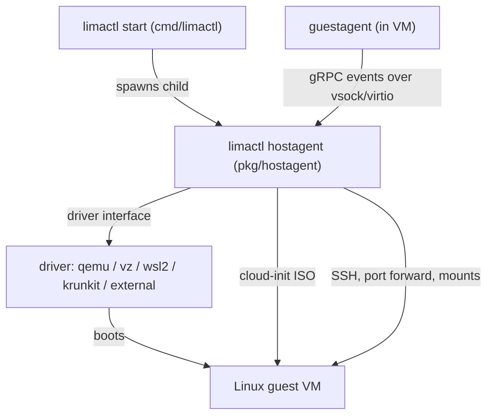

# Architecture

## Big picture

Lima splits into three layers: a CLI (`limactl`), a per-instance host daemon (the hostagent), and an agent inside the guest (the guestagent). The CLI parses templates and orchestrates lifecycle; the hostagent runs as a long-lived child process that drives the VM through a pluggable driver and manages SSH, mounts, port forwarding, and DNS; the guestagent runs in the VM and streams events back to the host. The `main()` entry point is a cobra app at `cmd/limactl/main.go:33`.

## Components

### CLI: `cmd/limactl`

The user-facing binary, built with cobra. It implements `start`, `stop`, `shell`, `list`, `edit`, `snapshot`, and more. `main()` lives at `cmd/limactl/main.go:33`. The `lima` binary is a thin wrapper around `limactl shell`.

### Instance lifecycle: `pkg/instance`

Owns create/start/stop for an instance. `Create` is at `pkg/instance/create.go:24`, `Prepare` at `pkg/instance/start.go:50`, and `Start` at `pkg/instance/start.go:286`, which calls `StartWithPaths` at `pkg/instance/start.go:168`.

### Host daemon: `pkg/hostagent`

A daemon launched as the child process `limactl hostagent <name>`. It boots the VM via the driver and manages SSH, mounts, port forwarding, and DNS. `New` is at `pkg/hostagent/hostagent.go:128` and `Run` at `pkg/hostagent/hostagent.go:389`.

### Driver layer: `pkg/driver` and `pkg/driver/{qemu,vz,wsl2,krunkit}`

The VM backend abstraction. The `Driver` interface is defined at `pkg/driver/driver.go:81`, and `Info` (capability flags) at `pkg/driver/driver.go:110`. Both in-tree drivers and external gRPC plugins implement it.

### Guest agent: `pkg/guestagent` and `cmd/lima-guestagent`

Runs inside the VM and exposes a gRPC `GuestService` over vsock/virtio, defined at `pkg/guestagent/api/guestservice.proto:8`. It notifies the host of port events, inotify changes, and time sync.

### Provisioning: `pkg/cidata`

Generates the cloud-init ISO9660 (`user-data`) image that provisions the guest. `GenerateCloudConfig` is at `pkg/cidata/cidata.go:361` and `GenerateISO9660` at `pkg/cidata/cidata.go:386`.

## How a request flows

`limactl start <name>` walks through the layers as follows (anchors at the pinned commit):

1. `startAction` at `cmd/limactl/start.go:570` calls `loadOrCreateInstance` at `cmd/limactl/start.go:215` to build or load the instance from a template.
2. Networking is reconciled via `reconcile.Reconcile` at `cmd/limactl/start.go:599`.
3. `instance.Start` at `cmd/limactl/start.go:626` calls `Start` at `pkg/instance/start.go:286`, then `StartWithPaths` at `pkg/instance/start.go:168`.
4. `StartWithPaths` builds the `"hostagent"` argument (`pkg/instance/start.go:218`), constructs `haCmd = exec.CommandContext(...)` at `pkg/instance/start.go:234`, and launches it in the background with `haCmd.Start()` at `pkg/instance/start.go:249`.
5. The child process enters `hostagentAction` at `cmd/limactl/hostagent.go:43`, which calls `hostagent.New` at `cmd/limactl/hostagent.go:109` and then `ha.Run` at `cmd/limactl/hostagent.go:136`.
6. Inside `New` (`pkg/hostagent/hostagent.go:128`), the driver is resolved and the cloud-init ISO is built with `cidata.GenerateISO9660` at `pkg/hostagent/hostagent.go:188`.
7. `Run` at `pkg/hostagent/hostagent.go:389` boots the VM with `a.driver.Start(ctx)` at `pkg/hostagent/hostagent.go:424`, then calls `startRoutinesAndWait` at `pkg/hostagent/hostagent.go:498`.
8. `startHostAgentRoutines` at `pkg/hostagent/hostagent.go:543` waits for SSH readiness, sets up mounts, and starts `watchGuestAgentEvents` at `pkg/hostagent/hostagent.go:697` to apply port forwarding.

## Key design decisions

- **Configuration as data, not push.** Guest configuration is injected at boot through a cloud-init ISO9660 image generated by `pkg/cidata` (`GenerateISO9660` at `pkg/cidata/cidata.go:386`), rather than pushing config to a running agent.
- **gRPC over vsock/virtio for host/guest events.** The guestagent serves `GuestService` (`pkg/guestagent/api/guestservice.proto:8`), where `GetEvents` is a server stream. SSH carries shell and command execution and port forwarding; event notification prefers the vsock gRPC channel.
- **Driver interface keeps backends swappable.** A single `Driver` interface (`pkg/driver/driver.go:81`) lets QEMU, vz, WSL2, krunkit, and external drivers be selected per instance.

## Extension points

- **External drivers as separate processes.** Out-of-tree backends implement the gRPC `service Driver` (`pkg/driver/external/driver.proto:7`) and run as their own executables, registered in the `ExternalDrivers` map (`pkg/registry/registry.go:42`).
- **Templates.** YAML templates under `templates/` define reusable instance configurations.
- **Wrapper binaries.** `cmd` ships `nerdctl.lima`, `docker.lima`, `kubectl.lima`, `podman.lima`, and `apptainer.lima` wrappers plus per-driver binaries.

## Sources

1. Lima source at commit [`9a3f1c4`](https://github.com/lima-vm/lima/commit/9a3f1c443389c673eb619f7b1922b1a4d8e4fd16), accessed 2026-06-24.
2. [lima-vm/lima README](https://github.com/lima-vm/lima), accessed 2026-06-24.
