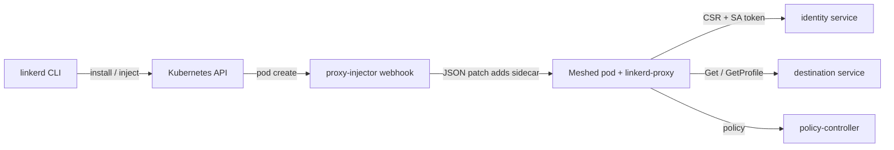

# Architecture

## Big picture

Linkerd has two planes. The data plane is a Rust micro-proxy (`linkerd-proxy`) injected as a sidecar into each meshed pod; its source lives in the separate `linkerd/linkerd2-proxy` repository (source 6). The control plane is a set of Go services in this repository that configure those proxies: a destination service for discovery, an identity service that issues mTLS certificates, and admission webhooks that inject the sidecar and validate config. A Rust policy controller resolves authorization CRDs and serves them to proxies. The `linkerd` CLI drives install and day-two operations.

## Components

### CLI (`cli/`)

The `linkerd` binary handles `install`, `inject`, `check`, and related commands. Its entry point is `cli/main.go`. The CLI renders Helm charts locally and prints manifests for `kubectl apply`.

### Control plane controllers (`controller/`)

The control plane ships as a single Go binary that dispatches on its first argument. `controller/cmd/main.go:21` switches over `os.Args[1]` into `destination`, `heartbeat`, `identity`, `proxy-injector`, `sp-validator`, and `service-mirror` (`controller/cmd/main.go:21-33`).

- `destination`: a gRPC discovery server. Proxies call `Get` for endpoints (`controller/api/destination/server.go:142`) and `GetProfile` for per-service ServiceProfile config (`controller/api/destination/server.go:307`).
- `identity`: the mTLS certificate authority. It receives proxy CSRs and issues short-lived leaf certificates through `Certify` (`pkg/identity/service.go:212`).
- `proxy-injector`: a mutating admission webhook that injects the sidecar on pod creation (`controller/proxy-injector/webhook.go:31`).
- `sp-validator`: a validating webhook for ServiceProfile resources.
- `heartbeat` and `service-mirror`: telemetry and cross-cluster mirroring.

### Policy controller (`policy-controller/`)

A Rust service that resolves server-side authorization policy (the `Server` and `ServerAuthorization` style CRDs) from Kubernetes and serves it to proxies. It is built with cargo (`policy-controller/Cargo.toml`) and split into `core`, `grpc`, `k8s`, and `runtime` crates.

### Supporting trees

`viz/` adds observability (Prometheus metrics, tap, dashboard). `multicluster/` handles cross-cluster service mirroring. `web/` is the dashboard. `charts/` holds the Helm charts for the control plane, CRDs, and the injection patch chart. `proto/` holds the gRPC protobuf definitions.

## How a request flows

Trace a pod creation through proxy injection:

1. The webhook server receives the admission request. It reads the body with a 10MB limit and hands it to `processReq` (`controller/webhook/server.go:124`, `server.go:129`).
2. `processReq` decodes the `AdmissionReview`, checks the request UID is non-empty, then calls the registered handler (`controller/webhook/server.go:160-171`).
3. The handler is `Inject`. It reads the Helm Values from a mounted ConfigMap, reads the trust anchor PEM, and sets `IdentityTrustAnchorsPEM` (`controller/proxy-injector/webhook.go:31`, `webhook.go:43-51`).
4. It builds a `ResourceConfig` and calls `ParseMetaAndYAML(request.Object.Raw)` to parse the workload and build an injection report (`controller/proxy-injector/webhook.go:57-63`).
5. `report.Injectable()` decides admissibility. If injectable, it adds the `created-by` annotation, inherits namespace annotations, and fills the default opaque ports annotation (`controller/proxy-injector/webhook.go:102-123`).
6. It generates the patch with `resourceConfig.GetPodPatch(true, overrider)` (`controller/proxy-injector/webhook.go:125`).
7. The handler returns an `AdmissionResponse` with `PatchType: JSONPatch` (`controller/proxy-injector/webhook.go:143-149`), and `processReq` packs it into the `AdmissionReview` response for the server to marshal as JSON (`controller/webhook/server.go:183`).

Once the pod runs, its proxy bootstraps mTLS against the identity service (see [Internals](./internals)) and queries the destination service for endpoints.

## Key design decisions

Linkerd builds the injection patch by rendering the same Helm chart used at install time, rather than hand-writing a JSON patch. `GetPodPatch` renders the `patch` chart's `templates/patch.json` at runtime and turns the result into a JSON Patch (`pkg/inject/inject.go:814-831`). Install-time templating and runtime sidecar injection share one template path and one `Values` type. The cost is a regex cleanup of trailing commas the template emits (`pkg/inject/inject.go:834`).

The other defining decision is the data plane itself: a purpose-built Rust micro-proxy instead of Envoy, chosen for low latency, low memory, and memory safety (sources 6, 12, 13).

## Extension points

- Admission webhooks: the proxy-injector (mutating) and sp-validator (validating) are standard Kubernetes webhooks.
- CRDs: ServiceProfile drives per-service routes and retries; the policy controller consumes `Server` and `ServerAuthorization` style authorization CRDs.
- Gateway API and GitOps: Linkerd integrates with the Kubernetes Gateway API and with Helm, Flux, and Argo for delivery (source 12).

## Sources

- Source 6: [linkerd/linkerd2-proxy (Rust data plane)](https://github.com/linkerd/linkerd2-proxy)
- Source 12: [Linkerd vs Istio (Buoyant)](https://www.buoyant.io/linkerd-vs-istio)
- Source 13: [What is a service mesh? (linkerd.io)](https://linkerd.io/what-is-a-service-mesh/)
