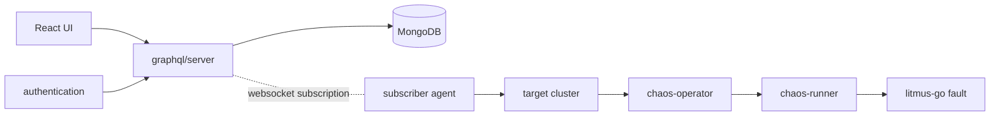

# Architecture

## Big picture

Litmus has two planes. The Chaos Control Plane (ChaosCenter) is the central tool that constructs, schedules, and visualizes chaos workflows. The Chaos Execution Plane is a chaos agent plus operators that run and monitor the experiment inside a target Kubernetes cluster. This split is stated directly in the README (`README.md:31-52`).

This repository holds the control plane (under `chaoscenter/`). The execution plane operators live in separate repositories: `chaos-operator` reconciles the ChaosEngine resource, `chaos-runner` starts the experiment job, `litmus-go` injects the fault, and `chaos-exporter` exposes results as Prometheus metrics.

## Components

### graphql/server

The GraphQL API and the heart of the control plane. It is a gqlgen-generated schema served over Gin, with MongoDB as the state store. The server entry point is `chaoscenter/graphql/server/server.go:94`, the executable schema is built at `server.go:124`, services are wired at `server.go:185`, and the `/query` endpoint is mounted at `server.go:192`.

### authentication

A separate REST authentication service under `chaoscenter/authentication/`, with a dex integration under `chaoscenter/authentication/dex-server/`. The entry point is `chaoscenter/authentication/api/main.go`.

### subscriber

The chaos agent that runs in each target cluster. It dials back to the control plane over a websocket and applies pushed manifests to the cluster. Its entry point is `chaoscenter/subscriber/subscriber.go:138`, and it starts listening for actions at `subscriber.go:159`.

### web, event-tracker, upgrade-agents

The React UI (`chaoscenter/web/`), an event tracker, and upgrade agents round out the control plane services.

## How a request flows

This traces re-running an existing experiment (the `RunChaosExperiment` mutation) from the API to the target cluster. All anchors are at the pinned commit.

1. `chaoscenter/graphql/server/graph/chaos_experiment_run.resolvers.go:24` `RunChaosExperiment` is the resolver entry point. It runs an RBAC check with `authorization.ValidateRole` at `:31`, loads the experiment from MongoDB at `:43`, and calls `RunChaosWorkFlow` at `:50`.
2. `chaoscenter/graphql/server/pkg/chaos_experiment_run/handler/handler.go:670` `RunChaosWorkFlow` confirms the target infra is active, sorts revisions newest-first to pick the latest manifest, and branches to `RunCronExperiment` if the kind is `cronworkflow`.
3. `handler.go:934` `GenerateExperimentManifestWithProbes` expands probes into the manifest, then `handler.go:944` calls `chaos_infrastructure.SendExperimentToSubscriber(...)`.
4. `chaoscenter/graphql/server/pkg/chaos_infrastructure/infra_utils.go:226` `SendExperimentToSubscriber` delegates to `SendRequestToSubscriber` at `infra_utils.go:206`, which pushes the action onto the agent's in-memory channel at `infra_utils.go:220` (`observer <- newAction`).
5. The subscriber in the target cluster receives the action. `chaoscenter/subscriber/subscriber.go:159` starts `AgentConnect` (`chaoscenter/subscriber/pkg/requests/webhook.go:16`), which builds the `subscription { infraConnect(...) }` query at `webhook.go:17` and dials the websocket at `webhook.go:30`, then applies the pushed manifest to Kubernetes.
6. On the server side, the subscription resolver is `chaoscenter/graphql/server/graph/chaos_infrastructure.resolvers.go:272` `InfraConnect`. It registers the channel in `data_store.Store.ConnectedInfra[infraID]` at `:287`, then waits on `ctx.Done()` to delete the channel and mark the infra inactive on disconnect.

## Key design decisions

The control plane never connects out to a target cluster. Instead, each target cluster's subscriber dials back to the control plane on startup and holds an `infraConnect` GraphQL subscription open (`chaoscenter/subscriber/pkg/requests/webhook.go:17`, `chaos_infrastructure.resolvers.go:272`). At experiment time the server just pushes an action onto that open channel (`infra_utils.go:219`).

The benefit is reach: a target cluster behind NAT or a firewall only needs outbound connectivity, and one ChaosCenter can govern many clusters.

The trade-off is that connection state lives in the GraphQL server process memory. The `ConnectedInfra` map of channels is part of `StateData` in `chaoscenter/graphql/server/pkg/data-store/store.go:10-18`. A server restart drops every agent connection until each redials, and the state is not shared across replicas. The `InfraConnect` resolver force-disconnects a duplicate connection for the same infra ID (`chaos_infrastructure.resolvers.go:281-285`), so the control plane effectively assumes a singleton.

## Extension points

- **Chaos custom resources** (`README.md:39-52`): ChaosExperiment is the installable fault template and supports BYOC (bring-your-own-chaos) for third-party fault tooling; ChaosEngine binds a fault to a target and defines steady-state probes; ChaosResult holds the verdict that the exporter reads.
- **ChaosHub**: experiment bundles shared and versioned through `litmuschaos/chaos-charts`.
- **Resilience probes**: http, cmd, k8s, and prom probes defined under `chaoscenter/graphql/server/pkg/probe/`.
- **GitOps**: experiment sync under `chaoscenter/graphql/server/pkg/gitops`.
