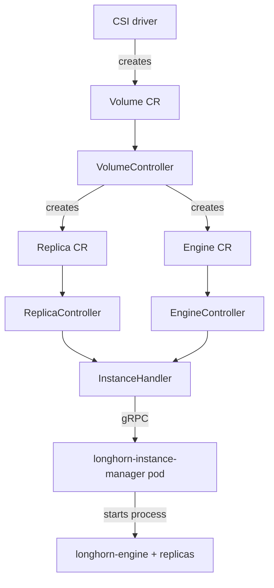

# Architecture

## Big picture

Longhorn splits cleanly into a control plane and a data plane. The control plane is `longhorn-manager`, a single Go binary that runs as a DaemonSet, one pod per node. It owns the CRDs and the controllers that reconcile them. The data plane is the per-volume engine and replica processes, started inside `longhorn-instance-manager` pods on each node, with the actual block I/O handled by `longhorn-engine`. The manager never serves I/O itself; it declares desired state and drives the data plane toward it.

## Components

### CLI and daemon entrypoint (`main.go`, `app/`)

The binary uses `urfave/cli` to bundle several subcommands: `daemon`, `recurring-job`, `csi`, `pre-upgrade`, `post-upgrade`, `uninstall`, and more (`main.go:63-74`). The manager's resident mode is `app.DaemonCmd()`. `startManager` (`app/daemon.go:250`) wires clients and calls `controller.StartControllers` (`app/daemon.go:332`).

### CRD types (`k8s/pkg/apis/longhorn/v1beta2/`)

Every Longhorn object is a CRD: `Volume`, `Engine`, `Replica`, `Node`, `InstanceManager`, snapshot and backup types, `ShareManager`, backing image types, `EngineImage`, `RecurringJob`, `Orphan`, and others. `register.go` registers them into the scheme.

### Controllers (`controller/`)

The core. There is one controller per CRD. `controller/controller_manager.go:43` constructs 30+ controllers, and each is launched with its own `go ...Run()` loop (for example `controller/controller_manager.go:191`). Controllers do not call the Kubernetes API directly; they go through the `datastore` package.

### Datastore (`datastore/`)

A thin wrapper over informer caches and typed clients. Controllers read and write objects through `c.ds.*`, which keeps cache consistency in one place and makes the controllers mockable in tests.

### Scheduler (`scheduler/`)

`scheduler/replica_scheduler.go` holds the pure placement logic that decides which node and disk a replica lands on, evaluating anti-affinity, zones, node selectors, and disk capacity.

### Engine API (`engineapi/`)

The client boundary to the data plane. `engineapi/instance_manager.go:16` imports `longhorn/longhorn-instance-manager/pkg/client`, and the client holds an `InstanceServiceClient` and a `ProcessManagerClient` (`engineapi/instance_manager.go:55-56`). This is how the manager asks a node's instance manager to start or stop engine and replica processes over gRPC.

### CSI, webhook, upgrade (`csi/`, `webhook/`, `upgrade/`)

`csi/` implements the CSI driver for dynamic provisioning, snapshots, and expansion. `webhook/` holds admission and conversion webhooks. `upgrade/` handles migration between versions.

## How a request flows

Creating a volume from a `PersistentVolumeClaim` runs end to end like this:

1. The CSI driver creates a `Volume` CR (`k8s/pkg/apis/longhorn/v1beta2/volume.go:454`). `VolumeController.processNextWorkItem` (`controller/volume_controller.go:252`) dequeues it into `syncVolume` (`controller/volume_controller.go:307`).
2. `syncVolume` fetches the volume with `c.ds.GetVolume` (`controller/volume_controller.go:320`), then checks `isResponsibleFor` (`controller/volume_controller.go:334`). If this manager is not the owner it returns immediately. Otherwise it claims ownership by writing its node into `Status.OwnerID` (`controller/volume_controller.go:342`) and lists the engines, replicas, and frontends (`controller/volume_controller.go:355`).
3. The reconcile body (`controller/volume_controller.go:603-659`) calls `handleVolumeAttachmentCreation`, then `ReconcileEngineReplicaState` (`controller/volume_controller.go:607`), then `ReconcileVolumeState` (`controller/volume_controller.go:655`), then `cleanupReplicas` (`controller/volume_controller.go:659`). A deferred block (`controller/volume_controller.go:550`) flushes spec and status changes and requeues on conflict.
4. Replica top-up runs in `replenishReplicas` (`controller/volume_controller.go:3066`). It first tries to reuse a failed replica via `CheckAndReuseFailedReplica` (`controller/volume_controller.go:3118`); failing that it goes through `RequireNewReplica` (`controller/volume_controller.go:3142`) and creates a new `Replica` CR with `newReplicaCR` (`controller/volume_controller.go:3143`).
5. Scheduling happens in `ScheduleReplica` (`scheduler/replica_scheduler.go:66`), which calls `FindDiskCandidates` (`scheduler/replica_scheduler.go:138`), `getNodeCandidates` (`scheduler/replica_scheduler.go:213`), `getDiskCandidates` (`scheduler/replica_scheduler.go:301`), and finally `scheduleReplicaToDisk` (`scheduler/replica_scheduler.go:673`) to fill in `Replica.Spec.NodeID` and `DiskID`.
6. `ReplicaController` and `EngineController` pick up their CRs and both delegate to the shared `InstanceHandler.ReconcileInstanceState` (`controller/instance_handler.go:324`); the engine path is `controller/engine_controller.go:373`.
7. To create the real process, `InstanceHandler.createInstance` (`controller/instance_handler.go:544`) calls the controller's `CreateInstance` (`controller/engine_controller.go:630`), builds a client with `engineapi.NewInstanceManagerClient` (`controller/engine_controller.go:655`), and issues `c.EngineInstanceCreate` (`controller/engine_controller.go:718`). This gRPC call crosses from control plane into data plane and starts the process on the target node.

## Key design decisions

- **Microservice per volume.** One volume equals one engine plus N replicas, each an independent process, rather than a shared pool behind one controller. This keeps the blast radius to a single volume and lets each volume be scheduled and upgraded on its own. The cost is process count and overhead that scale with the number of volumes.
- **CRDs as a state machine.** `VolumeSpec` is the desired state, `VolumeStatus` is the observed state, and the controller reconciles the gap. Real I/O is the engine's job; the manager only orchestrates it declaratively.
- **Distributed ownership instead of a single leader.** Because the manager runs on every node, Longhorn does not elect one active controller. Each CR carries `Status.OwnerID`, and a manager reconciles only the CRs it owns. `syncVolume` bails out early when `isResponsibleFor` (`controller/volume_controller.go:5965`) returns false. Ownership is pinned to the volume's attach node, which keeps the manager controlling a volume on the same node as its engine.
- **Datastore abstraction.** Controllers never hold a raw Kubernetes client; they go through `datastore.DataStore`, balancing cache consistency against testability.

## Extension points

- **CSI driver** (`csi/`): the standard integration surface for Kubernetes provisioning, snapshots, and expansion.
- **Admission and conversion webhooks** (`webhook/`): validate and convert CRDs across API versions.
- **CRDs** themselves: `Volume`, `Node`, `RecurringJob`, `BackingImage`, and the rest are the public API that tooling builds on.
- **Backup targets**: S3 and NFS endpoints for backups, configured through settings and CRDs.
