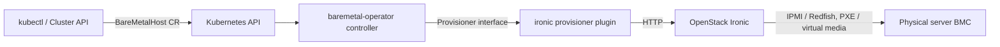

# Architecture

## Big picture

The baremetal-operator is an Ironic orchestrator. It publishes the `BareMetalHost` CRD as a Kubernetes API, then runs a controller that reconciles each host through an explicit finite state machine. BMO itself only calls the Ironic API. The real work, power control over IPMI or Redfish, PXE or virtual media boot, and disk writes, is done by Ironic.

## Components

### CRD types (`apis/metal3.io/v1alpha1/`)

The `BareMetalHost` type and its companions live in their own Go module (`apis/metal3.io/`). `BareMetalHost` is defined at `apis/metal3.io/v1alpha1/baremetalhost_types.go:865`, carrying a `Spec` and a `Status`. Keeping the types in a separate module lets external controllers such as `cluster-api-provider-metal3` depend on the API without importing the operator itself.

### Controller and state machine (`internal/controller/metal3.io/`)

This package holds the reconcile logic and the finite state machine. The controller entry point is `Reconcile` at `internal/controller/metal3.io/baremetalhost_controller.go:119`, and the state machine is `host_state_machine.go`, whose state-to-handler map is built at `host_state_machine.go:44`.

### Webhooks (`internal/webhooks/metal3.io/`)

Validating and defaulting admission webhooks for the CRD.

### Provisioner (`pkg/provisioner/`)

The `Provisioner` interface (`pkg/provisioner/provisioner.go:143`) and its implementations: `ironic` for production, `fixture` for compile-time bypass in tests, and `demo`. It also contains the plugin loader (`pkg/provisioner/plugin.go:99`).

### Hardware utilities (`pkg/hardwareutils/`)

BMC protocol handling, in its own Go module.

## How a request flows

A single provisioning step of one host runs as follows:

1. controller-runtime invokes `Reconcile`, which fetches the BMH (`baremetalhost_controller.go:119`, fetch at `:132`). A `metal3.io/paused` annotation returns immediately (`:148`).
2. The controller resolves and validates the BMC credentials secret (`buildAndValidateBMCCredentials`, `:200`).
3. It builds a `reconcileInfo`, then creates a provisioner with `ProvisionerFactory.NewProvisioner(...)` (`:240`). On `ErrNotReady` it requeues after a delay (`:242`).
4. `newHostStateMachine(...)` is built and `stateMachine.ReconcileState(ctx, info)` advances the machine by one step (`:250`-`:251`). `actResult.Result()` returns the controller-runtime `ctrl.Result` (`:252`).
5. Inside `ReconcileState` (`host_state_machine.go:177`), a `defer` schedules `updateHostStateFrom`, then delete, detached, and registration checks run in order before the current state's handler is looked up in the `handlers()` map (`:44`) and executed.
6. For the provisioning state, `handleProvisioning` (`host_state_machine.go:540`) calls `actionProvisioning` (`baremetalhost_controller.go:1365`), which calls `prov.Provision(...)` (`:1392`). If the result is `Dirty`, the host is requeued (`:1417`); when there is no more work, the handler advances the next state to `Provisioned` (`host_state_machine.go:548`).
7. At the end of `Reconcile`, if `actResult.Dirty()` or conditions changed, `saveHostStatus` writes the status subresource back and fires post-save callbacks and events (`baremetalhost_controller.go:270`-`:286`).

## Key design decisions

The model is pull-based reconcile plus an explicit finite state machine. State is persisted in `Status.Provisioning.State`, and each reconcile is an idempotent single step. The `actionResult` interface expresses, by type, whether to requeue and whether to save status. The maintainers note that status is saved only when told to, otherwise an unrecoverable error would create an infinite loop reconciling the same object (`baremetalhost_controller.go:266`-`:269`).

State transitions for (de)provisioning are gated by capacity. When the next state is inspecting, provisioning, or deprovisioning, `ensureCapacity` checks for a free slot on the provisioner; if none is free the action is delayed rather than pushed (`host_state_machine.go:87`, `:107`-`:114`). This keeps BMO from overloading Ironic.

## Extension points

- The `BareMetalHost` CRD itself, consumed by external controllers such as `cluster-api-provider-metal3`.
- Validating and defaulting webhooks under `internal/webhooks/metal3.io/`.
- The `Provisioner` interface (`pkg/provisioner/provisioner.go:143`), loaded at runtime as a Go `.so` plugin (`pkg/provisioner/plugin.go:99`). Third parties can ship their own provisioner backend. See [Internals](./internals) for how the loader validates a plugin.
