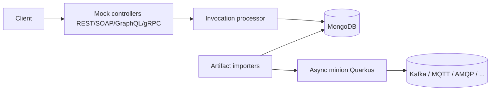

# Architecture

## Big picture

Microcks is a Maven multi-module project (`pom.xml:10-15`). The `webapp` module is the Spring Boot core: it holds the REST API, the per-protocol mock controllers, the artifact importers, the services, the MongoDB repositories, and the Angular single-page UI. The `commons/model`, `commons/util`, and `commons/util-el` modules hold the shared domain model and expression-language helpers. The `minions/async` module is a separate Quarkus application that handles event-driven protocols. The `distro` module assembles distributions.

The core runs on Spring Boot 4.0.7 with Java 25 (`webapp/pom.xml:6,18` resolve `spring-boot.version` from `pom.xml:64`). The async minion runs on Quarkus 3.31.4 (`minions/async/pom.xml:24`). The application entry point is `webapp/src/main/java/io/github/microcks/MicrocksApplication.java:38`, annotated `@SpringBootApplication @EnableAsync @EnableScheduling` (`MicrocksApplication.java:29-31`).

## Components

### webapp (Spring Boot core)

The `webapp` module owns everything a synchronous mock needs. Under `io.github.microcks` it is organised into `web` (controllers and invocation processors), `service` (import and test orchestration), `repository` (Spring Data Mongo), plus `event`, `listener`, `security`, `task`, `util`, and `config`. The mock controllers in `webapp/src/main/java/io/github/microcks/web/` cover REST (`RestController`), SOAP (`SoapController`), GraphQL (`GraphQLController`), gRPC (`GrpcServerCallHandler`), and dynamic REST (`DynamicMockRestController`). The same directory also holds `McpController` (exposes mocks as a Model Context Protocol server) and `AICopilotController`.

### commons/model

The domain model lives in `commons/model/src/main/java/io/github/microcks/domain/`. The central types are `Service` (`Service.java:27`), `Operation` (`Operation.java:32`), and `Response` (`Response.java:26`). These are the units a mock is built from, described in detail in [Internals](./internals).

### minions/async (Quarkus async engine)

The async minion is a standalone Quarkus app under `minions/async`. Its producer managers live in `minions/async/src/main/java/io/github/microcks/minion/async/producer/` and include `KafkaProducerManager`, `MQTTProducerManager`, `AMQPProducerManager`, `NATSProducerManager`, `GooglePubSubProducerManager`, `AmazonSNSProducerManager`, `AmazonSQSProducerManager`, and WebSocket producers. It both publishes AsyncAPI mock messages to brokers and runs AsyncAPI contract tests.

## How a request flows

A REST mock call goes end to end as follows, verified at the documented commit.

1. The request hits `RestController.execute(...)` mapped to `/rest/{service}/{version}/**` (`RestController.java:97-107`); the `/rest-valid/...` variant adds request-body validation (`RestController.java:110-120`). Both call the private `doExecute(...)` (`RestController.java:123`).
2. `doExecute` resolves the service and operation, handles CORS OPTIONS when no operation matches, optionally validates the body against the OpenAPI schema, then delegates the invocation to `RestInvocationProcessor`.
3. `RestInvocationProcessor.processInvocation(...)` (`RestInvocationProcessor.java:145`) resolves any fallback or proxy-fallback to pick the dispatcher and rules, then calls `computeDispatchCriteria(...)` (`RestInvocationProcessor.java:164`).
4. `computeDispatchCriteria(...)` (`RestInvocationProcessor.java:327`) runs `switch (dispatcher)` (`RestInvocationProcessor.java:342`) to build a criteria string per dispatch style: URI-based styles use `DispatchCriteriaHelper.extractFromURIPattern`, while `SCRIPT`/`GROOVY` evaluate user script via `scriptEngine.eval(...)` (`RestInvocationProcessor.java:360`).
5. `getResponse(...)` (`RestInvocationProcessor.java:450`) looks the response up in MongoDB with `responseRepository.findNonCallbackByOperationIdAndDispatchCriteria(...)` (`RestInvocationProcessor.java:455`), an exact-match query. If nothing matches, it retries treating the criteria as a response name via `findNonCallbackByOperationIdAndName` (`RestInvocationProcessor.java:464`).
6. If still nothing and a fallback exists, the fallback name is used. If a proxy is configured, `proxyService.callExternal(...)` forwards the call upstream (`RestInvocationProcessor.java:213`). With a dispatcher set and no match, the processor returns HTTP 400 (`RestInvocationProcessor.java:231`).
7. The processor assembles headers and content, fires any callback or AsyncAPI trigger, and returns a `ResponseResult` (`RestInvocationProcessor.java:258`).

## Key design decisions

The matching strategy is the central design choice: instead of evaluating routing rules on every request, Microcks precomputes a `dispatchCriteria` string at import time and stores it on each `Response`. At runtime it recomputes a string in the same format from the live request and resolves the response with a single exact-match MongoDB query. The criteria keys are generated sorted, so query-parameter order does not matter. This symmetry is covered in depth in [Internals](./internals).

A second notable decision is observability: OpenTelemetry explain tracing records each mock decision (dispatcher selection, response lookup, delay, proxy) as span events inside `processInvocation` (`RestInvocationProcessor.java:159-262`), so the reason a mock returned a given response can be read off a trace.

## Extension points

- Multiple dispatch styles, including `SCRIPT`/`GROOVY`/`JS` dispatchers that run user-supplied scripts to choose a response (`RestInvocationProcessor.java:342-384`).
- Pluggable artifact importers under `webapp/src/main/java/io/github/microcks/util/` for OpenAPI, AsyncAPI, Postman, SoapUI, gRPC, GraphQL, and HAR.
- Proxy and fallback specifications on an operation, letting a mock forward to a real upstream when no example matches.
- The async minion broker producers, which add new transports for AsyncAPI mocks and tests.
