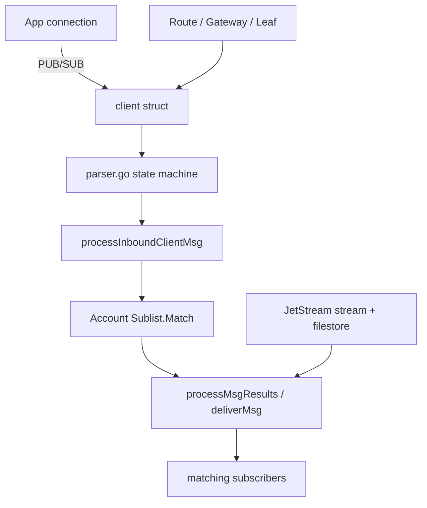

# Architecture

## Big picture

The server lives almost entirely in the `server/` package; `main.go` is a thin CLI wrapper. A running `Server` ([`server/server.go:168`](https://github.com/nats-io/nats-server/blob/bd058fac3d0c04398698b113e986b35065212fda/server/server.go#L168)) accepts connections, and every connection becomes a `client` ([`server/client.go:259`](https://github.com/nats-io/nats-server/blob/bd058fac3d0c04398698b113e986b35065212fda/server/client.go#L259)) regardless of whether it is an application, another server in the cluster, a gateway, a leaf node, or an internal JetStream connection. A `kind` field on the struct distinguishes them, so one code path handles CLIENT, ROUTER, GATEWAY, LEAF, JETSTREAM, and SYSTEM connections.

Routing is subject-based. Each account owns a subscription-interest tree (a `Sublist`), and publishing a message means matching its subject against that tree to find subscribers.

## Components

### Connection and protocol handling

`server/client.go` holds the `client` struct, the read loop, and the publish/subscribe processing. `server/parser.go` is a hand-written state machine that turns the wire protocol into operations. Both are on the hot path for every message.

### Subscription matching

`server/sublist.go` implements the `Sublist`, a tree of subject tokens with a results cache. Subjects are split on `.` and walked level by level; each level carries normal child nodes plus wildcard nodes for `*` and `>`. A second, generic implementation lives in `server/gsl/`.

### Accounts and multi-tenancy

`server/accounts.go` defines `Account` ([`server/accounts.go:52`](https://github.com/nats-io/nats-server/blob/bd058fac3d0c04398698b113e986b35065212fda/server/accounts.go#L52)), the tenancy boundary. Each account holds its own `Sublist` (`acc.sl`) plus import/export rules, so the subject namespace is isolated per account.

### Clustering and connection types

`server/route.go` handles routes between servers in a cluster, `server/gateway.go` handles gateways that link clusters into a super-cluster, and `server/leafnode.go` handles leaf nodes that extend a cluster to the edge.

### JetStream persistence

`server/jetstream*.go`, `server/stream.go`, and `server/consumer.go` implement durable streams and consumers. `server/filestore.go` and `server/memstore.go` are the storage backends, and `server/raft.go` provides the consensus used to replicate JetStream state across a cluster.

### Authentication

`server/auth.go` and `server/auth_callout.go` handle authentication, built around JWTs and nkeys.

## How a request flows

Take a core publish: a client sends `PUB subject reply size`, then the payload, and the message reaches matching subscribers.

1. `readLoop` reads from the socket ([`server/client.go:1403`](https://github.com/nats-io/nats-server/blob/bd058fac3d0c04398698b113e986b35065212fda/server/client.go#L1403)) and hands bytes to `parse` ([`server/parser.go:137`](https://github.com/nats-io/nats-server/blob/bd058fac3d0c04398698b113e986b35065212fda/server/parser.go#L137)).
2. The parser accumulates the `PUB` arguments and, when complete, calls `processPub` ([`server/client.go:2880`](https://github.com/nats-io/nats-server/blob/bd058fac3d0c04398698b113e986b35065212fda/server/client.go#L2880)).
3. After the payload arrives, `processInboundClientMsg` ([`server/client.go:4311`](https://github.com/nats-io/nats-server/blob/bd058fac3d0c04398698b113e986b35065212fda/server/client.go#L4311)) updates stats, checks publish permissions, and resolves subscribers.
4. Matching first tries a per-client L1 cache, then falls back to `acc.sl.Match` ([`server/client.go:4433`](https://github.com/nats-io/nats-server/blob/bd058fac3d0c04398698b113e986b35065212fda/server/client.go#L4433), [`server/sublist.go:532`](https://github.com/nats-io/nats-server/blob/bd058fac3d0c04398698b113e986b35065212fda/server/sublist.go#L532)).
5. Delivery goes through `processMsgResults` ([`server/client.go:5127`](https://github.com/nats-io/nats-server/blob/bd058fac3d0c04398698b113e986b35065212fda/server/client.go#L5127)) and finally `deliverMsg` ([`server/client.go:3690`](https://github.com/nats-io/nats-server/blob/bd058fac3d0c04398698b113e986b35065212fda/server/client.go#L3690)) to each subscriber's write buffer.

The [Internals](./internals) page walks this path line by line.

## Key design decisions

The core protocol is at-most-once. A published message is matched against current interest and delivered to whoever is subscribed right now; nothing is stored. Durability is opt-in through JetStream, which layers persistence on top using its own append-only file format and Raft replication ([JetStream docs](https://docs.nats.io/nats-concepts/jetstream)).

Throughput on the publish path is bought with caching rather than locking. The shared per-account `Sublist` is protected by a read-write mutex, but the server avoids taking it on every publish by keeping a per-client L1 results cache keyed by subject, validated against the sublist's atomic generation counter ([`server/client.go:4421`](https://github.com/nats-io/nats-server/blob/bd058fac3d0c04398698b113e986b35065212fda/server/client.go#L4421)). The maintainers left a comment marking this as a measured optimization ([`server/client.go:4371`](https://github.com/nats-io/nats-server/blob/bd058fac3d0c04398698b113e986b35065212fda/server/client.go#L4371)).

Reusing one `client` struct across all connection kinds keeps the protocol code in a single place. The same parser and delivery logic serve application clients, inter-server routes, gateways, and leaf nodes, with behavior differences gated on `kind`.

## Extension points

NATS clients exist for 40+ languages as separate repositories under the `nats-io` organization ([nats-io org](https://github.com/nats-io)). JetStream exposes key/value and object-store APIs over the same protocol, leaf nodes provide an edge-connection point, and the server speaks MQTT and WebSocket in addition to its native protocol ([nats.io about](https://nats.io/about/)). Authentication can be delegated through auth callout ([`server/auth_callout.go`](https://github.com/nats-io/nats-server/blob/bd058fac3d0c04398698b113e986b35065212fda/server/auth_callout.go)).
