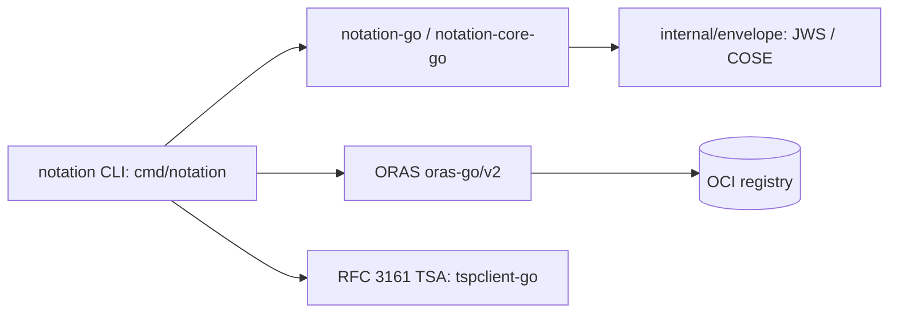

# Architecture

## Big picture

The `notation` binary is a thin command layer. `cmd/notation/` holds the CLI commands, `internal/` holds local helpers (registry auth, config, TLS, revocation, tracing, envelope handling), and the core signing and verification logic lives in the imported libraries `notation-go` and `notation-core-go`. Registry access goes through ORAS (`oras.land/oras-go/v2`). The root cobra command registers every subcommand in `cmd/notation/main.go:57-70`: `blob`, `sign`, `verify`, `list`, `cert`, `policy`, `key`, `plugin`, `login`, `logout`, `version`, `inspect`.

## Components

### Command layer (`cmd/notation/`)

Each subcommand defines its flags and a `RunE`, then delegates the real work to `notation-go`. `main()` (`cmd/notation/main.go:77`) calls `run()` (`cmd/notation/main.go:30`), which builds the cobra root, registers subcommands, and executes with a context that cancels on interrupt.

### Envelope handling (`internal/envelope/`)

Converts a signature format name into a media type and defines the payload that gets signed. `GetEnvelopeMediaType` maps `jws` and `cose` to their envelope media types (`internal/envelope/envelope.go:42`); the signed payload type is `Payload` (`internal/envelope/envelope.go:37`).

### Registry access (`cmd/notation/registry.go`, ORAS)

`getRepository` (`cmd/notation/registry.go:44`) resolves the user input into a repository. Remote registries build an ORAS `remote.Repository` (`cmd/notation/registry.go:100`); an OCI image layout on disk uses `notationregistry.NewOCIRepository` (`cmd/notation/registry.go:53`), an Experimental path.

### Local helpers (`internal/`)

`internal/auth`, `internal/config`, `internal/httputil`, `internal/x509`, `internal/revocation`, and `internal/trace` provide registry credentials, TLS handling, certificate pools, revocation checking, and logging.

## How a request flows

Tracing `notation sign <ref>` end to end:

1. `signCommand` defines the flags (`cmd/notation/sign.go:60`). Its `RunE` (`cmd/notation/sign.go:119`) checks the timestamp flags for consistency, then calls `runSign` (`cmd/notation/sign.go:149`).
2. `runSign` initializes the logger, then gets a signer with `sign.GetSigner` (`cmd/notation/sign.go:154`). A local key produces a generic signer; an external key in a KMS produces a plugin signer.
3. The repository is resolved by `getRepository` (`cmd/notation/sign.go:158`), which for a remote target builds the ORAS client (`cmd/notation/registry.go:100`).
4. Signing options are assembled by `prepareSigningOpts` (`cmd/notation/sign.go:162`). The envelope type is converted to a media type via `envelope.GetEnvelopeMediaType` (`internal/envelope/envelope.go:42`). With `--timestamp-url`, an RFC 3161 timestamper and a TSA revocation validator are configured (`cmd/notation/sign.go:214-230`).
5. The tag is resolved to a digest by `resolveReference` (`cmd/notation/sign.go:166`); a tag reference triggers a mutability warning to stderr (`cmd/notation/sign.go:167`), and the signed target is pinned to the digest (`cmd/notation/sign.go:172`).
6. The core call is `notation.SignOCI` (`cmd/notation/sign.go:175`), implemented in `notation-go`. The signature is pushed as an OCI Referrer attached to the subject; a failed Referrers index cleanup yields a garbage-collection warning (`cmd/notation/sign.go:177-183`).
7. Output reports the signed digest and the pushed signature digest (`cmd/notation/sign.go:186-187`).

`notation verify` is symmetric: `runVerify` (`cmd/notation/verify.go:103`) gets a verifier, resolves the repository and reference, then calls `notation.Verify` (`cmd/notation/verify.go:147`) and renders the outcome through a display handler.

## Key design decisions

The pivotal decision is to store signatures as OCI Referrers in the same repository as the artifact. `getRemoteRepository` first tries the Referrers API and falls back to the Referrers tag schema when a registry does not support it (`cmd/notation/registry.go:59-93`). Because the signature lives in the same repository, keyed to the artifact digest, it follows the artifact when copied across registries. This is the decisive break from v1, where TUF metadata lived in a separate server.

Verification level is set by the trust policy: `strict`, `permissive`, `audit`, or `skip`. Under `permissive`, revocation and expiry failures are logged rather than enforced, which can leave a verifier exposed to a rollback attack if a registry is compromised. The advisory recommends short signature expiry and `strict` ([source 4](https://github.com/notaryproject/specifications/blob/v1.1.0/specs/trust-store-trust-policy.md), [source 9](https://github.com/notaryproject/specifications/security/advisories/GHSA-57wx-m636-g3g8)).

## Extension points

- Signing plugins for external key stores such as KMS and HSM, reached through the plugin signer path (`cmd/notation/sign.go:154`).
- The `plugin` subcommand for installing and managing plugins (`cmd/notation/main.go:65`).
- RFC 3161 timestamping authorities, wired in through `tspclient-go` (`cmd/notation/sign.go:214-230`).
- OCI image layout input as an Experimental alternative to a remote registry (`cmd/notation/registry.go:53`).
