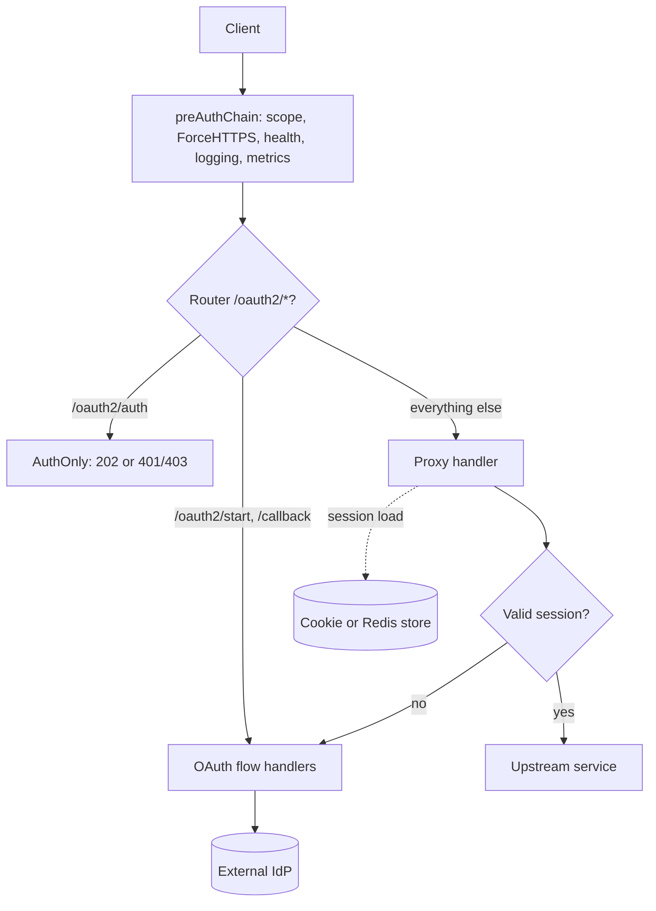

# Architecture

## Big picture

OAuth2 Proxy is a single Go binary that runs as a reverse proxy. The process starts in `main.go`: it loads configuration, validates it, builds an `OAuthProxy`, and starts serving (`main.go:69-78`). The `OAuthProxy` type in `oauthproxy.go` is the core object. It holds the configured provider, the session store, the email validator, a set of `justinas/alice` middleware chains, and the reverse proxy to the upstream.

Every request passes through a router built in `buildServeMux` (`oauthproxy.go:318`). A small set of `/oauth2/*` endpoints handle the login dance; everything else is caught by a catch-all handler that either proxies the request upstream or forces a login.

## Components

### Entry point and configuration

`main.go` parses flags, loads either the legacy flag/TOML configuration or the newer alpha YAML on top of it (`loadConfiguration`, `main.go:84`), runs `validation.Validate`, then constructs and starts the proxy (`main.go:69-78`). The `NewValidator` call wires up the email allow-list before the proxy is built (`main.go:69`, `validator.go:107`).

### The proxy core

`OAuthProxy` (`oauthproxy.go`, constructed in `NewOAuthProxy` at `oauthproxy.go:124`) owns the HTTP surface. The router is assembled in `buildServeMux` (`oauthproxy.go:318`) and the `/oauth2` subrouter in `buildProxySubrouter` (`oauthproxy.go:343`). Path constants for the endpoints live at `oauthproxy.go:50-55` (`/sign_in`, `/sign_out`, `/start`, `/callback`, `/auth`, `/userinfo`).

### Providers

The `providers/` package contains one implementation per identity provider behind a common interface, `Provider` (`providers/providers.go:22`). `NewProvider` selects the implementation from the configured provider type with a `switch` (`providers/providers.go:35`). Implementations include Google, GitHub, GitLab, Azure, Microsoft Entra ID, ADFS, Keycloak OIDC, and a generic OIDC provider.

### Sessions

`pkg/sessions` holds the two session backends: a cookie store (`pkg/sessions/cookie/session_store.go`) and a server-side persistent store (Redis) built on the ticket abstraction (`pkg/sessions/persistence/ticket.go`). `pkg/middleware/stored_session.go` is the middleware that loads, validates, and refreshes the session on each request.

### Middleware chains

Two `alice` chains gate the handlers. `buildPreAuthChain` (`oauthproxy.go:361`) installs request scope, optional HTTPS redirect, health and readiness checks, the request logger, and metrics. `buildSessionChain` (`oauthproxy.go:411`) loads the session before the proxy and auth handlers run.

## How a request flows

Trace one unauthenticated request to a protected path.

1. The request enters the router and runs the pre-auth chain (`oauthproxy.go:322-323`), then the session chain, which loads any existing session into the request scope (`pkg/middleware/stored_session.go:107`).
2. It reaches the catch-all `Proxy` handler (`oauthproxy.go:1041`). `Proxy` calls `getAuthenticatedSession` (`oauthproxy.go:1142`).
3. `getAuthenticatedSession` reads the session from the request scope, lets allowed routes and trusted IPs pass, and otherwise requires a session. With no session it returns `ErrNeedsLogin` (`oauthproxy.go:1143-1150`).
4. `Proxy` handles `ErrNeedsLogin` by showing the sign-in page or starting the OAuth flow. `doOAuthStart` (`oauthproxy.go:825`) generates a CSRF cookie (and a PKCE code verifier when the provider uses one), then redirects to the provider's login URL (`oauthproxy.go:851-883`).
5. The provider redirects back to `/oauth2/callback`. `OAuthCallback` (`oauthproxy.go:885`) decodes the state, loads the CSRF cookie (`oauthproxy.go:916`), exchanges the code for tokens via `redeemCode` (`oauthproxy.go:926`, `oauthproxy.go:979`), enriches the session, checks the CSRF state, validates the session, applies the email validator and `provider.Authorize`, and on success saves the session and redirects to the app (`oauthproxy.go:933-972`).
6. On the next request the session exists, `getAuthenticatedSession` returns it, `Proxy` adds identity headers and forwards the request to the upstream (`oauthproxy.go:1046-1053`).

## Key design decisions

- **No authentication of its own.** The proxy delegates the credential check to an external provider through the `Provider` interface (`providers/providers.go:22`). Authorization is deliberately thin: an email check (`validator.go:107`) plus the provider's `Authorize` (`oauthproxy.go:1154-1160`).
- **Two session backends with different security properties.** The cookie store keeps the encrypted session in the browser; the Redis-backed store keeps it server side and gives each session its own encryption secret (see [Internals](./internals)).
- **Subrequest support is a first-class path.** `/oauth2/auth` is registered separately from the rest of the `/oauth2` subrouter so it does not get no-cache headers, which lets nginx cache the auth result briefly (`oauthproxy.go:328-331`). `AuthOnly` returns 403 rather than 401 in the unauthorized case to avoid infinite redirects in subrequest setups (`oauthproxy.go:1025-1031`).
- **Encoded paths are preserved.** The router uses `UseEncodedPath()` so a path like `/%2F/` reaches the upstream intact (`oauthproxy.go:319-321`).

## Extension points

- **Providers**: implement the `Provider` interface (`providers/providers.go:22`) and register it in `NewProvider` (`providers/providers.go:35`). The interface covers login URL generation, code redemption, session enrichment, authorization, validation, refresh, and token-based session creation.
- **Identity headers**: `addHeadersForProxying` injects configured headers from the session before forwarding (`oauthproxy.go:1046-1052`), so the upstream can consume the authenticated identity.
- **Session stores**: cookie and Redis backends sit behind the `SessionStore` interface in `pkg/apis/sessions`, with the persistence ticket model reused by server-side stores.
