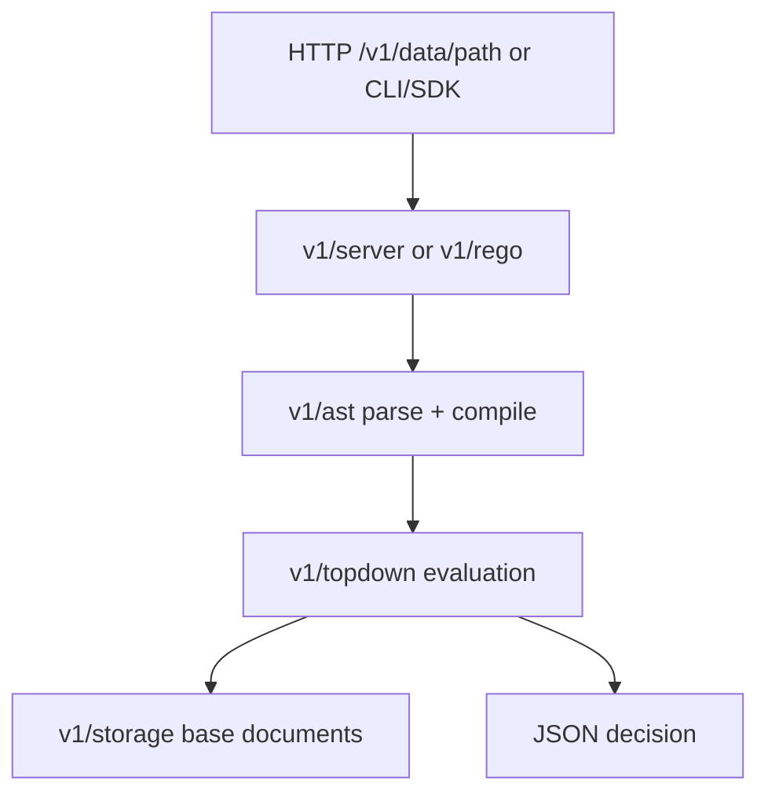

# Architecture

## Big picture

OPA is one Go binary made of layered packages. The CLI in `cmd/` bundles subcommands under a cobra root (`cmd/commands.go:14`), and `main.go:22` runs `cmd.RootCommand.Execute()`. Below the CLI sit four layers that do the real work: `v1/ast/` parses and compiles Rego, `v1/topdown/` evaluates it, `v1/rego/` orchestrates compile-then-evaluate as a high-level API, and `v1/server/` exposes that as a REST policy decision point. Storage of external data is abstracted behind `v1/storage/`, and policy plus data are packaged for distribution by `v1/bundle/`.

## Components

### CLI (`cmd/`)

Subcommands such as `eval`, `run`, `test`, `build`, `fmt`, `check`, `bench`, and `exec` are registered on the cobra root `RootCommand` (`cmd/commands.go:14`). `opa run --server` starts the long-running PDP; the other commands are one-shot tools over the same evaluation core.

### AST and compiler (`v1/ast/`)

This package holds the Rego parser, compiler, and type checker, across `parser.go`, `compile.go`, `term.go`, and `policy.go`. It turns Rego source text into a compiled, type-checked AST that the evaluator consumes.

### Evaluation engine (`v1/topdown/`)

The evaluator runs top-down evaluation with unification. The main loop lives in `eval.go` and `query.go`, and the built-in functions (`http.go`, `crypto.go`, `glob.go`, and many more) live in the same directory. This is where a query is actually computed against input and data.

### High-level API (`v1/rego/`)

`v1/rego/rego.go` is the orchestration layer. `rego.New(...).Eval()` ties together parse, compile, and evaluate. Both the server and embedded library users enter the engine through this package.

### REST server (`v1/server/`)

The server is the PDP. `v1DataGet` (`v1/server/server.go:1512`) and `v1DataPost` (`v1/server/server.go:1741`) handle the default decision path `/v1/data/<path>`, evaluating the named rule against the request's `input` and returning JSON.

### Storage and bundles (`v1/storage/`, `v1/bundle/`)

`v1/storage/` defines the `Store` interface (`v1/storage/interface.go:20`) for base documents (external data), with an in-memory implementation included. `v1/bundle/` handles loading, signing, and verifying bundles, the distribution unit that packages policy plus data and is pulled over HTTP or OCI.

## How a request flows

A policy decision over HTTP runs as follows.

1. A client sends `GET` or `POST` to `/v1/data/<path>`, handled by `v1DataGet` (`v1/server/server.go:1512`) or `v1DataPost` (`v1/server/server.go:1741`).
2. The handler turns the request `input` into an AST value and evaluates the named query through the `rego` API.
3. `(*Rego).Eval` (`v1/rego/rego.go:1502`) opens a transaction and calls `PrepareForEval` (`v1/rego/rego.go:1788`), which parses and compiles the policy once.
4. `(*Rego).eval` (`v1/rego/rego.go:2309`) builds a `topdown` query for the default rego target and runs it.
5. `(*Query).Iter` (`v1/topdown/query.go:565`) drives the evaluation loop in `(*eval).eval` (`v1/topdown/eval.go:404`), and the result is serialized back to JSON.

Embedded library users hit the same path: they call `rego.New(...).Eval()` directly rather than going through the server.

## Key design decisions

The most consequential layout decision is the v1 shim. The root packages `rego/`, `ast/`, and `topdown/` are not the implementation; they re-export `v1/*` through type aliases. For example `rego/rego.go` declares `type Rego = v1.Rego` and `type EvalContext = v1.EvalContext` against `github.com/open-policy-agent/opa/v1/rego`. This let OPA 1.0 switch Rego's default language from v0 to v1 without breaking existing import paths: callers keep importing `github.com/open-policy-agent/opa/rego` while new code consolidates under `v1/`.

A second decision is the separation between policy and data behind the `Store` interface (`v1/storage/interface.go:20`). External base documents are read through transactions, keeping the evaluation of policy distinct from the data it reads.

## Extension points

- Built-in functions live alongside the evaluator in `v1/topdown/` and the engine accepts custom built-ins through the `rego` API.
- `v1/plugins/` provides plugins for decision logging, bundle download, and status reporting.
- `v1/sdk/` is the embeddable SDK for running OPA inside another Go program.
- `wasm/`, `v1/ir/`, and `v1/compile/` compile Rego to WASM and an intermediate representation as alternative evaluation targets.
