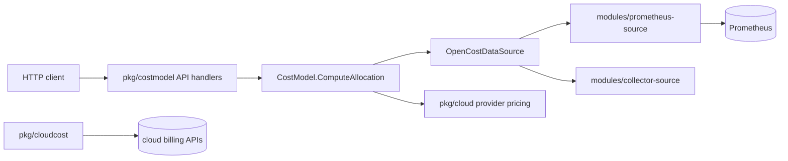

# Architecture

## Big picture

OpenCost ships as a single Go binary. The entry point in `cmd/costmodel/main.go:11` does nothing but call the cobra command tree, and the real work lives in three layers: the cost model and HTTP API (`pkg/costmodel`), the shared domain types and data-source abstraction (`core/`), and the metrics backends (`modules/`). At runtime it queries usage metrics from a data source (Prometheus by default), multiplies them by cloud provider pricing, and returns cost allocations over an HTTP API on port `9003`. Cloud billing data flows through a separate pipeline (`pkg/cloudcost`).

## Components

### Entry point and command tree

`cmd/costmodel/` is the single-binary entry point. `main.go:11` calls `cmd.Execute(nil)`, which resolves to the default cost-model command in `pkg/cmd/commands.go:35`. That command's `Execute` lives in `pkg/cmd/costmodel/costmodel.go:33` and wires up the HTTP router and the cost model.

### Core domain library

`core/` is a shared module holding the domain types (`core/pkg/opencost`: Allocation, Asset, CloudCost, Window), the data-source abstraction (`core/pkg/source`), and storage, logging, filtering, and cluster helpers. It is imported by both the main binary and the metrics modules.

### Cost model and API

`pkg/costmodel` holds the cost model and the HTTP handlers. It builds a per-pod map of resource usage, joins it with pricing, and assembles the cost allocation set. `pkg/cloud/<provider>` carries the pricing logic for AWS, Azure, GCP, Alibaba, Oracle, DigitalOcean, Scaleway, and OTC. `pkg/cloudcost` runs the separate billing-API pipeline, `pkg/clustercache` caches Kubernetes objects, and `pkg/metrics` exports OpenCost's own metrics.

### Metrics modules

`modules/prometheus-source` and `modules/collector-source` are two implementations of metric retrieval. Both sit behind the `OpenCostDataSource` interface so the backend can be swapped without touching the cost model.

## How a request flows

Tracing `GET /allocation`, the core API that returns cost split by namespace, pod, or controller:

1. The route is registered in `pkg/cmd/costmodel/costmodel.go:55` as `router.GET("/allocation", a.ComputeAllocationHandler)` on an httprouter.
2. `pkg/costmodel/aggregation.go:330` `ComputeAllocationHandler` parses query parameters: `window` is required and parsed at `aggregation.go:337` via `ParseWindowWithOffset`, aggregation properties at `aggregation.go:350`, plus `includeIdle`, `idleByNode`, `shareIdle`, and `filter`. Filtering is applied inside the query before aggregation so filters can still match on properties like cluster and node before they are merged away (`aggregation.go:391`).
3. The handler calls `a.Model.QueryAllocation(...)` at `aggregation.go:395`.
4. `pkg/costmodel/allocation.go:32` `ComputeAllocation` splits any window longer than `BatchDuration` into sub-windows, computes each, and folds the results with `Accumulate` (`allocation.go:125`). Labels, annotations, and services are not propagated through that intersection for performance, so they are re-applied explicitly here.
5. `pkg/costmodel/allocation.go:219` `computeAllocation` (lowercase) does the work for one window: build the pod map with `buildPodMap` (`allocation.go:260`), fan out the remaining metric queries in parallel, then assemble the allocation set from the pod map.
6. The fan-out starts at `allocation.go:272` with `source.NewQueryGroup()` and `ds := cm.DataSource.Metrics()`. RAM, CPU, GPU, PV, network, and NAT-gateway queries are issued through futures and awaited later.
7. The data-source boundary is the `MetricsQuerier` interface in `core/pkg/source/datasource.go:11`, with methods such as `QueryRAMBytesAllocated` at `datasource.go:49`.
8. The Prometheus implementation is `PrometheusMetricsQuerier.QueryRAMBytesAllocated` in `modules/prometheus-source/pkg/prom/metricsquerier.go:525`. The actual PromQL is an `avg(avg_over_time(container_memory_allocation_bytes{...}[dur])) by (container, pod, namespace, node, uid, ...)` defined at `metricsquerier.go:527`.

In short: usage metrics from Prometheus are multiplied by cloud pricing per pod, then idle and shared costs are distributed to produce Allocations.

## Key design decisions

- Pull model. OpenCost runs in-cluster and periodically queries the metrics that Prometheus already collects, rather than receiving pushed events. Billing data (CloudCost) is ingested by a separate pipeline against the cloud provider's billing API.
- Data source is an abstraction, not a hard dependency. The `OpenCostDataSource` interface means Prometheus is replaceable; the `collector-source` module is an alternative backend enabled with `COLLECTOR_DATA_SOURCE_ENABLED`.
- Workload cost is defined as `max(request, usage)`, per the OpenCost Specification. Idle cost is allocation cost that does not attribute to any workload.

## Extension points

- Cloud providers: pricing logic per provider under `pkg/cloud/<provider>`.
- Data sources: implement `MetricsQuerier` (`core/pkg/source/datasource.go:11`) to back the cost model with a different metrics store.
- Plugins: external cost sources (Datadog, OpenAI, MongoDB Atlas) live in the separate `opencost-plugins` repository.
- MCP server: `pkg/mcp` exposes an interface for AI agents to query cost data.
