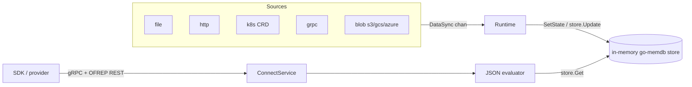

# Architecture

## Big picture

flagd is a Go monorepo with three modules: `core/` is a reusable library (evaluator, store, sync, model, telemetry), `flagd/` is the daemon (cobra command, runtime, services), and `flagd-proxy/` is a separate binary that fans sync streams out to many flagd instances. Two data paths run through it: flag ingestion (sync sources push definitions into an in-memory store) and flag evaluation (requests read from that store through the evaluator).

## Components

### core (reusable library)

The `core/` module holds the parts meant to be embedded as well as run standalone. The evaluator turns a flag definition plus an evaluation context into a value and a reason (`core/pkg/evaluator/json.go`). The store is the in-memory flag database (`core/pkg/store/store.go`). The sync layer defines the contract between flag sources and the runtime (`core/pkg/sync/isync.go:13-27`). The model package defines the `Flag` type and reason codes (`core/pkg/model/flag.go`).

### flagd (daemon)

The `flagd/` module is the runnable daemon. `flagd/main.go:11` just calls `cmd.Execute`, which dispatches to the cobra `start` subcommand (`flagd/cmd/start.go`). The runtime is wired in `flagd/pkg/runtime/from_config.go:55`. Evaluation requests are served by the connect service (`flagd/pkg/service/flag-evaluation/connect_service.go`).

### flagd-proxy

A separate binary that subscribes to one set of sync sources and re-exposes them to many flagd instances, reducing load on the upstream source (1).

## How a request flows

A boolean evaluation (`/flagd.evaluation.v1.Service/ResolveBoolean`) flows like this:

1. The connect service receives the gRPC request at `FlagEvaluationService.ResolveBoolean` (`flagd/pkg/service/flag-evaluation/flag_evaluator_v1.go:207`). It reads the `flagd-selector` header, turns it into a `store.NewSelector`, and stores it plus the proto version on the context (`flag_evaluator_v1.go:214-217`).
2. The shared generic resolver `resolve[T]` (`flagd/pkg/service/flag-evaluation/flag_evaluator.go:349`) merges the request context, configured static context, and mapped headers (`flag_evaluator.go:356`), calls the evaluation function, and translates errors into connect codes via `errFormat` (`flag_evaluator.go:395-409`).
3. The evaluation body is `Resolver.ResolveBooleanValue` (`core/pkg/evaluator/json.go:205`), which delegates to the generic `resolve[bool]` and then `evaluateVariant` (`core/pkg/evaluator/json.go:326`).
4. `evaluateVariant` fetches the flag from the store (`json.go:335`), returns early with `DISABLED` if the flag is off (`json.go:349-352`), otherwise applies the JSONLogic targeting rule and returns either `TARGETING_MATCH` or the `STATIC` default (`json.go:378`, `json.go:420`).

## Key design decisions

- The store is not a plain map. flagd uses `hashicorp/go-memdb`, a transactional in-memory database with multiple indexes (id compound, source, priority, flagSetId, key, and compound variants) (`core/pkg/store/store.go:47-118`). This is what lets a selector header scope an evaluation to a specific source or flag set.
- When two sync sources define the same flag key, the source's position in the configured `sources` slice acts as priority; the higher-priority source wins (`core/pkg/store/store.go:42`, `store.go:232`). Source URIs are registered verbatim, so a sync's `DataSync.Source` must match the configured URI exactly, query string and all (`flagd/pkg/runtime/from_config.go:84-90`).
- Three evaluation protocol versions share one HTTP handler, multiplexed by `bufSwitchHandler` (`connect_service.go:177-181`). This keeps older clients working while v2 adds optional value and variant fields.

## Extension points

- Sync source providers are selected by provider/scheme in `SyncBuilder.syncFromConfig` (`core/pkg/sync/builder/syncbuilder.go:99-134`): file, fsnotify, fileinfo, kubernetes, http, grpc, gcs, azblob, and s3.
- The `ISync` interface (`core/pkg/sync/isync.go:13-27`) is the contract a new flag source implements: `Init`, `Sync`, `ReSync`, `IsReady`.
- JSONLogic custom operators (`fractional`, `starts_with`, `ends_with`, `sem_ver`) are registered globally in `NewResolver` (`core/pkg/evaluator/json.go:147-150`).
- OpenTelemetry trace and metrics providers are built at runtime startup (`from_config.go:67-82`).
