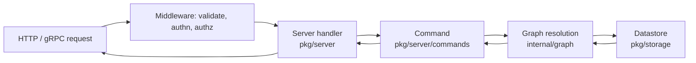

# Architecture

## Big picture

OpenFGA is a single Go binary that exposes a gRPC API and an HTTP gateway. A request lands on a transport handler, passes through middleware (validation, authentication, API authorization), reaches a server handler, which delegates to a transport-independent command, which drives the graph resolution engine, which reads relationship tuples from a pluggable datastore. The CLI in [`cmd/`](https://github.com/openfga/openfga/tree/9a556d8a134db308a7690f328dade79104922c8a/cmd) wires this together and starts the server.

## Components

### CLI and server bootstrap (`cmd/`)

[`cmd/openfga/main.go:14-26`](https://github.com/openfga/openfga/blob/9a556d8a134db308a7690f328dade79104922c8a/cmd/openfga/main.go#L14-L26) builds a Cobra root command and attaches the `run`, `migrate`, `validate-models`, and `version` subcommands. The server itself starts in [`cmd/run/run.go`](https://github.com/openfga/openfga/blob/9a556d8a134db308a7690f328dade79104922c8a/cmd/run/run.go), which loads configuration, opens the datastore, and handles graceful shutdown. `migrate` applies database schema migrations.

### Transport handlers (`pkg/server/`)

[`pkg/server/`](https://github.com/openfga/openfga/tree/9a556d8a134db308a7690f328dade79104922c8a/pkg/server) holds the gRPC/HTTP handlers: one file per API surface (`check.go`, `batch_check.go`, `list_objects.go`, `list_users.go`, `expand.go`, `write.go`, `read.go`). An AuthZEN-compatible endpoint lives in [`pkg/server/authzen.go`](https://github.com/openfga/openfga/blob/9a556d8a134db308a7690f328dade79104922c8a/pkg/server/authzen.go). Handlers do request validation and API authorization, then hand off to a command.

### Commands (`pkg/server/commands/`)

[`pkg/server/commands/`](https://github.com/openfga/openfga/tree/9a556d8a134db308a7690f328dade79104922c8a/pkg/server/commands) is the business-logic layer decoupled from transport. `CheckQuery.Execute` ([`check_command.go:102`](https://github.com/openfga/openfga/blob/9a556d8a134db308a7690f328dade79104922c8a/pkg/server/commands/check_command.go#L102)) builds the internal resolve request and invokes the resolver.

### Graph engine (`internal/graph/`)

[`internal/graph/`](https://github.com/openfga/openfga/tree/9a556d8a134db308a7690f328dade79104922c8a/internal/graph) is the core. `LocalChecker` resolves a check by walking the model's rewrite rules and reading tuples. Resolvers are composed into a chain (caching, dispatch throttling, shadow evaluation) built in [`builder.go`](https://github.com/openfga/openfga/blob/9a556d8a134db308a7690f328dade79104922c8a/internal/graph/builder.go).

### Type system (`pkg/typesystem/`)

[`pkg/typesystem/`](https://github.com/openfga/openfga/tree/9a556d8a134db308a7690f328dade79104922c8a/pkg/typesystem) parses and validates authorization models and builds a weighted graph of the model for query-path optimization. The `TypeSystem` carries an `authzWeightedGraph` field ([`typesystem.go:184`](https://github.com/openfga/openfga/blob/9a556d8a134db308a7690f328dade79104922c8a/pkg/typesystem/typesystem.go#L184)).

### Storage (`pkg/storage/`)

[`pkg/storage/`](https://github.com/openfga/openfga/tree/9a556d8a134db308a7690f328dade79104922c8a/pkg/storage) defines the `OpenFGADatastore` and `RelationshipTupleReader` interfaces ([`storage.go:152`](https://github.com/openfga/openfga/blob/9a556d8a134db308a7690f328dade79104922c8a/pkg/storage/storage.go#L152)) with implementations for in-memory, PostgreSQL, MySQL, and SQLite.

## How a request flows

Tracing a `Check` call end to end:

1. [`pkg/server/check.go:37`](https://github.com/openfga/openfga/blob/9a556d8a134db308a7690f328dade79104922c8a/pkg/server/check.go#L37) `(*Server).Check` starts a trace span, validates the request, and runs API authorization via `checkAuthz` ([`check.go:63`](https://github.com/openfga/openfga/blob/9a556d8a134db308a7690f328dade79104922c8a/pkg/server/check.go#L63)).
2. If the `ExperimentalWeightedGraphCheck` flag is set for the store, it tries the v2 path `s.v2Check` and falls back to v1 on non-timeout errors ([`check.go:69-152`](https://github.com/openfga/openfga/blob/9a556d8a134db308a7690f328dade79104922c8a/pkg/server/check.go#L69-L152)).
3. The v1 path builds the resolver chain with `getCheckResolverBuilder(storeID).Build()` ([`check.go:156`](https://github.com/openfga/openfga/blob/9a556d8a134db308a7690f328dade79104922c8a/pkg/server/check.go#L156)), resolves the model ([`check.go:162`](https://github.com/openfga/openfga/blob/9a556d8a134db308a7690f328dade79104922c8a/pkg/server/check.go#L162)), constructs `NewCheckCommand` ([`check.go:168`](https://github.com/openfga/openfga/blob/9a556d8a134db308a7690f328dade79104922c8a/pkg/server/check.go#L168)), and calls `checkQuery.Execute` ([`check.go:182`](https://github.com/openfga/openfga/blob/9a556d8a134db308a7690f328dade79104922c8a/pkg/server/check.go#L182)).
4. `(*CheckQuery).Execute` ([`check_command.go:102`](https://github.com/openfga/openfga/blob/9a556d8a134db308a7690f328dade79104922c8a/pkg/server/commands/check_command.go#L102)) builds a `ResolveCheckRequest`, wraps the datastore with a per-request tuple cache, and calls `c.checkResolver.ResolveCheck` ([`check_command.go:150`](https://github.com/openfga/openfga/blob/9a556d8a134db308a7690f328dade79104922c8a/pkg/server/commands/check_command.go#L150)).
5. `(*LocalChecker).ResolveCheck` ([`internal/graph/check.go:395`](https://github.com/openfga/openfga/blob/9a556d8a134db308a7690f328dade79104922c8a/internal/graph/check.go#L395)) checks resolution depth, detects cycles, short-circuits self-defining tuples, prunes unreachable paths with `PathExists`, then evaluates the relation's rewrite rule via `CheckRewrite` ([`check.go:465`](https://github.com/openfga/openfga/blob/9a556d8a134db308a7690f328dade79104922c8a/internal/graph/check.go#L465)).

The [internals](./internals) page walks these branches in detail.

## Key design decisions

- **Stateless engine, pluggable storage.** All authorization state lives behind the `RelationshipTupleReader` interface ([`storage.go:152`](https://github.com/openfga/openfga/blob/9a556d8a134db308a7690f328dade79104922c8a/pkg/storage/storage.go#L152)), so instances scale horizontally and storage is swappable.
- **Resolver chain as a circular linked list.** Resolvers are ordered least-to-most expensive, and the last delegates back to the first ([`builder.go:66-104`](https://github.com/openfga/openfga/blob/9a556d8a134db308a7690f328dade79104922c8a/internal/graph/builder.go#L66-L104)). The `CheckResolver` contract requires that `Delegate.ResolveCheck` not cause infinite recursion ([`interface.go:13-40`](https://github.com/openfga/openfga/blob/9a556d8a134db308a7690f328dade79104922c8a/internal/graph/interface.go#L13-L40)).
- **Consistency is tunable per request.** Unless a request asks for `HIGHER_CONSISTENCY`, the engine consults a cache-invalidation timestamp and may serve from cache ([`check_command.go:110-112`](https://github.com/openfga/openfga/blob/9a556d8a134db308a7690f328dade79104922c8a/pkg/server/commands/check_command.go#L110-L112)). Strong consistency is opt-in.
- **Online strategy selection.** Rather than a fixed rule for which resolution strategy to use, the planner in [`internal/planner/`](https://github.com/openfga/openfga/tree/9a556d8a134db308a7690f328dade79104922c8a/internal/planner) learns per query path with Thompson Sampling.

## Extension points

- **Datastore drivers** implement `OpenFGADatastore` / `RelationshipTupleReader` ([`pkg/storage/storage.go:152`](https://github.com/openfga/openfga/blob/9a556d8a134db308a7690f328dade79104922c8a/pkg/storage/storage.go#L152)). The SQLite and MySQL adapters were community contributions.
- **Authentication** supports none, pre-shared key, and OIDC ([`internal/authn/`](https://github.com/openfga/openfga/tree/9a556d8a134db308a7690f328dade79104922c8a/internal/authn)).
- **AuthZEN endpoint** ([`pkg/server/authzen.go`](https://github.com/openfga/openfga/blob/9a556d8a134db308a7690f328dade79104922c8a/pkg/server/authzen.go)) exposes an OpenID AuthZEN-compatible API on top of `Check`.
