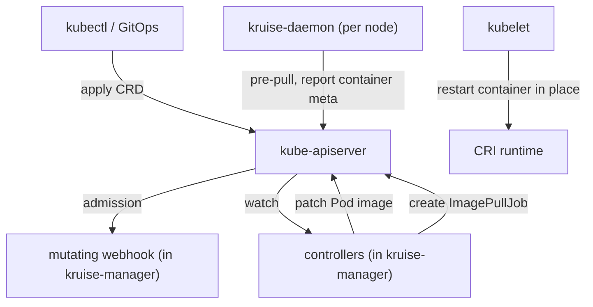

# Architecture

## Big picture

OpenKruise ships as two deployment units. The first is `kruise-manager`, a single binary that hosts every controller plus the admission webhook server. The second is `kruise-daemon`, a DaemonSet that runs an agent on every node. The manager decides what should happen to workloads; the daemon does the per-node work the kubelet cannot, such as pre-pulling images and reading real container metadata from the container runtime. The mutating webhook injects the hooks that make in-place update safe. All three cooperate; none of them delivers in-place update alone.

## Components

### kruise-manager

The central component. `main.go` is the entry point. It registers the webhook first, waits for the webhook to become ready, then registers the controllers (`main.go:236-267`). The controller setup runs inside a goroutine that blocks on `webhook.WaitReady()`, so controllers never reconcile against a Pod path before the webhook can mutate it (`main.go:260-262`). Leader election uses the lock name `kruise-manager` (`main.go:129-130`).

Controllers live under `pkg/controller/` and map one-to-one to CRDs: `cloneset`, `statefulset` (Advanced StatefulSet), `daemonset` (Advanced DaemonSet), `sidecarset`, `uniteddeployment`, `broadcastjob`, `advancedcronjob`, `ephemeraljob`, `imagepulljob` / `imagelistpulljob`, `nodeimage`, `nodepodprobe`, `podprobemarker`, `containerrecreaterequest`, `containerlaunchpriority`, `persistentpodstate`, `podunavailablebudget`, `podreadiness`, `resourcedistribution`, `sidecarterminator`, and `workloadspread`.

### kruise-daemon

A per-node agent deployed as a DaemonSet. Its entry point is `cmd/daemon/main.go`, which builds the daemon via `NewDaemon` (`cmd/daemon/main.go:85`). Its responsibilities are split into subpackages under `pkg/daemon/`: `imagepuller` (pre-pull images via the CRI), `criruntime` and `kuberuntime` (talk to the container runtime), `containermeta` (report the real image running in each container), `containerrecreate` (recreate containers on request), and `podprobe` (run custom Pod probes).

### Admission webhook

The webhook is part of the `kruise-manager` binary and is the linchpin of in-place update. Its mutating path injects a Kruise-specific Pod readiness gate into Pods that Kruise manages (`pkg/webhook/pod/mutating/pod_readiness.go:30-37`). On Pod create, it calls `util.InjectReadinessGateToPod(pod, appspub.KruisePodReadyConditionType)`. During an in-place update the controller can then flip that condition to make the Pod NotReady and drain traffic before the image swap.

## How a request flows

Take a rolling in-place update of a CloneSet, from `Reconcile` to a patched Pod.

1. `Reconcile` delegates to `reconcileFunc`, which is `doReconcile` (`pkg/controller/cloneset/cloneset_controller.go:198-200`).
2. `doReconcile` fetches the CloneSet, checks scale expectations, claims Pods and PVCs, lists and sorts ControllerRevisions to pick the current and update revisions, and waits on a resourceVersion expectation so the informer cache is fresh.
3. If the revision changed, the controller creates an ImagePullJob so `kruise-daemon` pre-pulls the new image before any Pod is touched (`createImagePullJobsForInPlaceUpdate`).
4. `syncCloneSet` (`pkg/controller/cloneset/cloneset_controller.go:403`) restores the current and update Pod templates, runs scale first, then update.
5. `realControl.Update` (`pkg/controller/cloneset/sync/cloneset_update.go:47`) walks each target Pod through `updatePod` (`cloneset_update.go:254`). If the policy is `InPlaceIfPossible` or `InPlaceOnly` and the update can be done in place, it calls `inplaceControl.Update` (`cloneset_update.go:306`). If in-place is impossible and the policy is `InPlaceOnly`, it errors instead of recreating (`cloneset_update.go:319-320`).
6. The shared in-place engine (`pkg/util/inplaceupdate/inplace_update.go`) computes the diff, optionally marks the Pod NotReady, and patches the running Pod. The kubelet restarts the container without rescheduling.

The full code walk is in [Internals](./internals).

## Key design decisions

In-place update exploits one upstream guarantee: patching only the `image` field of a Pod spec restarts the container without recreating the Pod. OpenKruise chooses in-place only when the diff is confined to the image (and, since v1.8, to resources via the resize subresource); anything broader falls back to normal recreate. Because the Pod is not recreated, the change skips the scheduler, CNI, and CSI and avoids PVC rebinding, which is what makes it fast at scale.

That choice forces the two-plus-one component split. The mutating webhook injects a readiness gate so the controller can drain traffic during the swap, and the per-node daemon reports the real runtime image so the controller can judge completion without trusting kubelet status alone. The controller cannot deliver in-place update by itself; the webhook and daemon are prerequisites, not optional add-ons.

## Extension points

- CRDs under `apis/apps/{v1alpha1,v1beta1}` and `apis/policy`, served on the API groups `apps.kruise.io` and `policy.kruise.io`. CloneSet supports conversion from v1alpha1 to v1beta1.
- SidecarSet injects and independently upgrades sidecar containers, including native Kubernetes sidecars since v1.7.
- The admission webhooks are the integration surface for Pod mutation and validation.
- The `inplaceupdate.Interface` and `UpdateOptions` function hooks let each workload controller share one in-place engine while customizing behaviour (see [Internals](./internals)).
