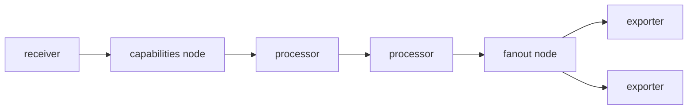

# Architecture

## Big picture

The Collector reads a YAML config and compiles it into a directed acyclic graph of components, then pushes telemetry through that graph. Five component kinds make up the graph: receivers ingest telemetry, processors transform it in order, exporters send it out, connectors join one pipeline's output to another pipeline's input, and extensions run beside the pipelines for side concerns like health checks and zpages.

## Components

### Receivers, processors, exporters, connectors, extensions

Each kind lives in its own top-level directory: `receiver/`, `processor/`, `exporter/`, `connector/`, and `extension/`. A receiver is the entry point, a processor is an ordered middle stage, and an exporter is the exit to a backend. A connector acts as an exporter in one pipeline and a receiver in another, which is how signal conversion and routing between pipelines is expressed. An extension sits outside the data path.

### Service and graph

The `service` package owns the running pipelines, and `service/internal/graph` builds and drives the component DAG. The graph is a `simple.DirectedGraph` from gonum wrapped in the `Graph` struct (`service/internal/graph/graph.go:60`), with a map from `pipeline.ID` to the nodes of that pipeline.

### Config plumbing

`confmap` provides the configuration providers registered at startup: `env`, `file`, `http`, `https`, and `yaml` schemes (`cmd/otelcorecol/main.go:31`). The `otelcol` package wires settings together and starts the service.

## How a request flows

Startup builds the graph, then telemetry flows through it.

1. `cmd/otelcorecol/main.go` constructs `otelcol.CollectorSettings` and registers the confmap providers (`cmd/otelcorecol/main.go:25`).
2. `setupConfigurationComponents` gets the config, runs `confmap.Validate`, then calls `service.New` with each component's config and factory (`otelcol/collector.go:178`, `otelcol/collector.go:212`).
3. The service calls `Build` in `service/internal/graph` (`service/internal/graph/graph.go:75`), which creates nodes, draws edges, then instantiates components.
4. At runtime each stage hands data to the next through one interface, for example `ConsumeTraces(ctx, ptrace.Traces) error` (`consumer/traces.go:15`).

## Key design decisions

Receivers are shared across pipelines of the same signal type. The receiver node ID is derived from "pipeline type" plus "component ID", so two trace pipelines naming the same receiver get one instance (`service/internal/graph/receiver.go:24`).

The graph holds processors in a slice because their order matters, and holds receivers and exporters in maps to deduplicate shared instances (`service/internal/graph/graph.go:385`).

A fanout node is always inserted before the exporters, even when there is exactly one exporter, in which case it acts as a noop (`service/internal/graph/graph.go:280`). This keeps the fanout logic in one place rather than special-casing single-exporter pipelines.

## Extension points

Third parties implement components against the factory and consumer interfaces. A receiver, processor, exporter, connector, or extension is added by providing a factory; the hundreds of community components in `opentelemetry-collector-contrib` are built this way. Operators select the components they want and build a binary with OCB. The `consumer.Traces`, `consumer.Metrics`, and `consumer.Logs` interfaces (`consumer/traces.go:15`) are the contract every pipeline stage implements.
