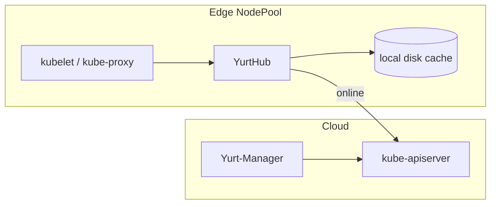

# Architecture

## Big picture

OpenYurt follows a classic cloud-edge layout (`README.md:31-34`). A normal Kubernetes control plane runs in the cloud. Edge nodes run in remote sites and are grouped by physical region into a NodePool. On each edge node a sidecar named YurtHub intercepts all traffic from kubelet and kube-proxy to the apiserver, so it can forward to the cloud when the link is up and serve from a local cache when it is down. Controllers and webhooks run in Yurt-Manager in the cloud.

## Components

### YurtHub

A node sidecar that runs as a static pod on every worker node. It is a reverse proxy plus local cache that intercepts every request from kubelet, kube-proxy, and other node components to the kube-apiserver. The code lives under `pkg/yurthub/`. The binary entry point is `cmd/yurthub/yurthub.go:27`, which builds the command from `app.NewCmdStartYurtHub`.

### Yurt-Manager

A collection of edge-focused controllers and webhooks. Controllers live under `pkg/yurtmanager/controller/`, including `nodepool`, `yurtappset`, `nodelifecycle`, `csrapprover`, `raven`, `platformadmin`, and `hubleader`. It runs in the cloud against the standard apiserver.

### Raven-Agent

Provides layer-3 network connectivity among pods in different physical regions, covering edge-to-edge and edge-to-cloud paths (`README.md:42-50`). It is driven by the Gateway CRD defined under `pkg/apis/raven/`.

### YurtIoTDock

One instance is deployed per edge NodePool. It bridges the EdgeX Foundry platform and manages edge devices through Kubernetes CRDs (`README.md:42-50`). Its API types live under `pkg/apis/iot/`.

## How a request flows

Trace a read request from kubelet through YurtHub:

1. YurtHub starts at `cmd/yurthub/yurthub.go:27`. `Run` (`cmd/yurthub/app/start.go:94`) assembles the cache, certificates, health checkers, and proxy handler: `cachemanager.NewCacheManager` at `start.go:128`, `proxy.NewYurtReverseProxyHandler` at `start.go:172`, and `server.RunYurtHubServers` at `start.go:184`.
2. Requests enter at `pkg/yurthub/proxy/proxy.go:149` (`ServeHTTP`). It first runs a readiness check (`proxy.go:152-162`).
3. The default path (`proxy.go:212`) calls `p.loadBalancer.PickOne(req)` to get a healthy cloud apiserver backend (`proxy.go:214`). If one is available, `backend.ServeHTTP` forwards to the cloud. If none is available, meaning the node is offline, it falls through to `p.localProxy.ServeHTTP` (`proxy.go:217`), which answers from the local cache. This is edge autonomy.
4. On a forwarded request, the response passes through `modifyResponse` (`pkg/yurthub/proxy/remote/loadbalancer.go:352`). For a 2xx it applies any response filter, then calls `cacheResponse` (`loadbalancer.go:409-412`).
5. `cacheResponse` (`loadbalancer.go:431`) tees the response body with `hubutil.NewDualReadCloser` (`pkg/yurthub/util/util.go:284`): one copy goes straight to the client, the other goes through a goroutine to `localCacheMgr.CacheResponse` and onto disk (`loadbalancer.go:433-438`).
6. If forwarding fails, `errorHandler` (`loadbalancer.go:333`) runs. For a get or list it returns the cached object via `localCacheMgr.QueryCache(req)` (`loadbalancer.go:343-346`).

## Key design decisions

The central decision is non-intrusiveness: the cloud control plane is unmodified upstream Kubernetes, and all edge behaviour is added at the node through the YurtHub proxy and through controllers in Yurt-Manager. The README frames this as preserving intact Kubernetes API compatibility (`README.md:24-25`).

The second non-obvious decision is the leader YurtHub for pool-scope metadata. Resources such as `services` and `discovery.k8s.io/endpointslices` are treated as pool scope by default (`cmd/yurthub/app/options/options.go:126-129`). If every node's YurtHub listed and watched these from the cloud apiserver independently, the WAN load would multiply by node count. Instead a leader YurtHub is elected per NodePool (`pkg/yurtmanager/controller/hubleader/`, `pkg/yurthub/proxy/multiplexer/`); the leader fetches from the cloud and followers read from the leader through `loadBalancerForLeaderHub` (`proxy.go:171-189`). The multiplexer collapses the pool into a single list/watch.

## Extension points

- CRDs across several API groups under `pkg/apis/`: `apps` (NodePool, YurtAppSet), `iot` (PlatformAdmin, Device), `network` (PoolService), and `raven` (Gateway).
- Webhooks and controllers in Yurt-Manager (`pkg/yurtmanager/controller/`).
- `HostNetwork` on a NodePool allows CNI plugins such as flannel (`pkg/apis/apps/v1beta2/nodepool_types.go:47-51`).
- EdgeX Foundry integration through YurtIoTDock.
