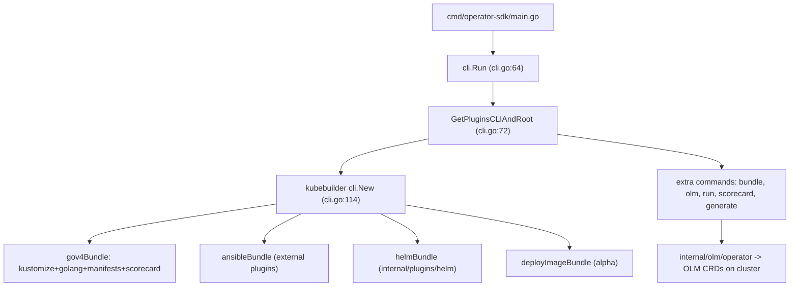

# Architecture

## Big picture

The Operator SDK is a single CLI binary. Its entry point is `cmd/operator-sdk/main.go`, which calls `cli.Run()` defined at `internal/cmd/operator-sdk/cli/cli.go:64`. The defining choice is that the SDK has no scaffolding engine of its own. It embeds the kubebuilder v4 plugin-based CLI (`sigs.k8s.io/kubebuilder/v4 v4.6.0`, `go.mod:44`) and registers plugin bundles plus a set of extra commands on top.

## Components

### CLI assembly

`GetPluginsCLIAndRoot()` (`internal/cmd/operator-sdk/cli/cli.go:72-128`) builds the CLI. It constructs four plugin bundles and hands them to kubebuilder's `cli.New(...)` (`cli.go:114`):

- `gov4Bundle`: kustomize v2, golang v4, manifests v2, scorecard v2 (`cli.go:73-82`).
- `ansibleBundle`: kustomize v2, the external `operator-framework/ansible-operator-plugins` ansible v1, manifests v2, scorecard v2 (`cli.go:84-93`, `go.mod:16`).
- `helmBundle`: the in-tree helm v1 plugin from `internal/plugins/helm/v1` (`cli.go:95-104`).
- `deployImageBundle`: an alpha bundle (`cli.go:106-113`).

So a Go Operator's `init` and `create api` are kubebuilder commands. The SDK's own value sits in the `manifestsv2` and `scorecardv2` plugins and the extra commands `bundle`, `cleanup`, `generate`, `olm`, `run`, `scorecard`, and `pkgmantobundle` registered at `cli.go:50-58`.

### OLM operator layer

`internal/olm/operator` holds the code that talks to a cluster. It creates and approves OLM custom resources to install an Operator. The shared kube client lives in `operator.Configuration` (`internal/olm/operator/config.go:32-42`).

## How a request flows

Tracing `operator-sdk run bundle <bundle-image>`, the SDK-specific path that deploys a bundle image through OLM:

1. The command is defined at `internal/cmd/operator-sdk/run/bundle/cmd.go:27-65`. It builds an installer with `bundle.NewInstall(cfg)`, loads config in `PreRunE`, then in `Run` opens a `cfg.Timeout` context and calls `i.Run(ctx)` (`cmd.go:46-54`).
2. `Install.Run` calls `setup` then `InstallOperator` (`internal/olm/operator/bundle/install.go:66-70`).
3. `setup` (`install.go:73-150`) loads bundle labels and the CSV with `operator.LoadBundle` (`install.go:87`), checks install-mode compatibility with `InstallMode.CheckCompatibility` (`install.go:93`), and decides whether the index image is a File-Based Catalog or SQLite with `fbcutil.IsFBC` (`install.go:98`). SQLite triggers a deprecation warning (`install.go:135`). It then fills package name, catalog source name, starting CSV, and supported install modes (`install.go:141-147`).
4. `OperatorInstaller.InstallOperator` (`internal/olm/operator/registry/operator_installer.go:55-102`) writes to OLM: create the CatalogSource via `CatalogCreator.CreateCatalog` (`operator_installer.go:56`), `ensureOperatorGroup` (`operator_installer.go:73`), `createSubscription` (`operator_installer.go:79`), `waitForInstallPlan` then `approveInstallPlan` (`operator_installer.go:84-89`), and finally `getInstalledCSV` (`operator_installer.go:94`).

## Key design decisions

The SDK delegates scaffolding to kubebuilder and keeps its own implementation to the OLM glue: deploy, bundle, scorecard. The trade-off is concrete. The SDK follows kubebuilder's layout evolution for free, but its releases are pinned hard to specific upstream versions: kubebuilder v4.6.0 (`go.mod:44`) and ansible-operator-plugins v1.42.2 (`go.mod:16`).

The subscription is created with manual install-plan approval, `withInstallPlanApproval(v1alpha1.ApprovalManual)` (`operator_installer.go:281-285`). The CLI then approves the plan itself: `approveInstallPlan` sets `ip.Spec.Approved = true` under `RetryOnConflict` and updates it (`operator_installer.go:319-339`). The CLI acts as the approver on behalf of the user rather than leaving the plan pending.

## Extension points

The plugin model is the main extension surface. Each bundle is a kubebuilder plugin set, and the SDK pulls one (ansible v1) from an external repository (`operator-framework/ansible-operator-plugins`, `go.mod:16`), showing plugins can live outside the tree. The global `--verbose` flag is added to the root command after the fact (`cli.go:140-148`), with a `TODO(estroz): upstream PR for global --verbose` noting the patch is not yet merged upstream. The Operators the SDK produces are themselves extension points for Kubernetes, defining CRDs reconciled by controllers.

## Sources

1. operator-framework/operator-sdk repository: <https://github.com/operator-framework/operator-sdk>
2. Operator SDK documentation site: <https://sdk.operatorframework.io/>
3. operator-framework/operator-lifecycle-manager: <https://github.com/operator-framework/operator-lifecycle-manager>
