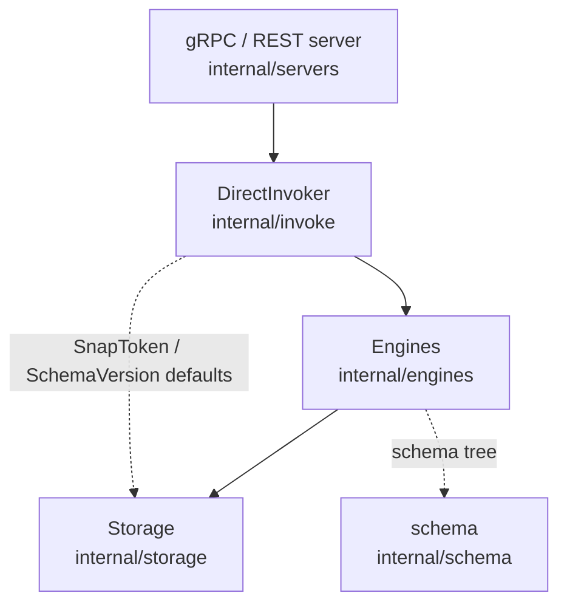

# Architecture

## Big picture

Permify is layered. A thin gRPC/REST server layer validates requests and hands them to an invoker, the invoker fills in consistency defaults and delegates to the engines, and the engines resolve the authorization question by reading schema and relationship data from storage. The binary entry point is `cmd/permify/permify.go`, where `main()` registers the CLI commands (`serve`, `validate`, `coverage`, `ast`, `migrate`) on a cobra root and, before anything else, registers a consistent-hash gRPC balancer and the Kubernetes resolver (`cmd/permify/permify.go:16-17`).

## Components

### Server layer (`internal/servers`)

Handles gRPC and REST. `PermissionServer` exposes `Check`, `BulkCheck`, `Expand`, `LookupEntity` (and its streaming form), `LookupSubject`, and `SubjectPermission`. Each RPC starts an OpenTelemetry span, runs `request.Validate()`, and then delegates to the invoker. `Check` is a thin wrapper: validate, call `r.invoker.Check`, translate errors to gRPC status (`internal/servers/permission_server.go:32-50`). `BulkCheck` caps a batch at 100 items and rejects larger batches (`internal/servers/permission_server.go:80-85`).

### Invoker layer (`internal/invoke`)

`DirectInvoker` ties together the schema reader, data reader, and the four engines (Check, Expand, Lookup, SubjectPermission) (`internal/invoke/invoke.go:56-72`). It is the common pre-processing point for every RPC: it validates depth, fills in a SnapToken from the latest snapshot when the request omits one, fills in the schema version from the head version when omitted, clones the request with depth decremented, and finally increments `CheckCount` atomically (`internal/invoke/invoke.go:105-192`).

### Engines (`internal/engines`)

The core of authorization resolution: `check.go`, `expand.go`, `lookup.go`, `entity_filter.go`, `subject_filter.go`, `subject_permission.go`, and `bulk.go`. The Check engine walks the compiled schema tree and combines results with boolean operators run concurrently.

### Schema (`internal/schema`) and storage (`internal/storage`)

`internal/schema` holds helpers that resolve entity, permission, relation, and rule definitions out of the compiled schema. `internal/storage` is the persistence abstraction: `postgres/` is the production store, `memory/` is for development, `proxies/` adds decorators such as caching, and `storage/context/` carries per-request contextual tuples and attributes.

## How a request flows

Tracing one `Check`:

1. The server receives the RPC. `PermissionServer.Check` validates and calls the invoker (`internal/servers/permission_server.go:32-49`).
2. The invoker validates depth, fills SnapToken and SchemaVersion defaults, clones the request with depth minus one, and calls the Check engine (`internal/invoke/invoke.go:105-192`). Depth is rejected when negative via `checkDepth` (`internal/invoke/utils.go:10-16`).
3. The Check engine reads the entity definition and runs `engine.check(...)(ctx)` (`internal/engines/check.go:63-84`).
4. `check()` looks up the reference type of the permission and branches: a permission with a rewrite goes to `checkRewrite`, an attribute to `checkDirectAttribute`, a relation to `checkDirectRelation`, otherwise `checkDirectCall` (`internal/engines/check.go:108-164`).
5. `checkRewrite` maps UNION, INTERSECTION, and EXCLUSION onto the corresponding combiners (`internal/engines/check.go:168-187`).
6. `checkDirectRelation` builds a `TupleFilter`, merges request-scoped contextual tuples with tuples read from storage, and either allows immediately on a subject match or recurses through the invoker for usersets (`internal/engines/check.go:252-260`).

## Key design decisions

The defining consistency choice is to implement the SnapToken (Zanzibar's zookie) on top of PostgreSQL's transaction snapshot rather than a dedicated store. `Token` wraps an `XID8` value plus a snapshot string (`internal/storage/postgres/snapshot/token.go:16-26`), and the invoker pins each check to the latest snapshot via `HeadSnapshot()` when the caller does not supply one (`internal/invoke/invoke.go:135-151`). This fixes the data generation a check reads so new and old data are not mixed.

Concurrency is the other deliberate choice. Boolean combinators run children in parallel under a cancellable context; `checkUnion` returns as soon as one child allows and then cancels the rest (`internal/engines/check.go:635-685`). Parallelism is bounded by a semaphore channel of size `concurrencyLimit`, default 100 (`internal/engines/utils.go:18-20`), enforced in `checkRun` (`internal/engines/check.go:820-862`).

## Extension points

- Storage backends implement the reader/writer interfaces in `internal/storage`, with PostgreSQL and in-memory provided and a `proxies/` layer for cache decoration.
- The gRPC and REST APIs are generated from the protobuf definitions under `proto/base/v1/`, and language SDKs live under `sdk/`.
- For distributed deployments, the consistent-hash balancer (`pkg/balancer`) and the Kubernetes resolver are registered at startup (`cmd/permify/permify.go:16-17`).
- ABAC rules are written in CEL and evaluated at decision time, so policy authors extend behaviour through schema rules rather than recompiling the engine.
