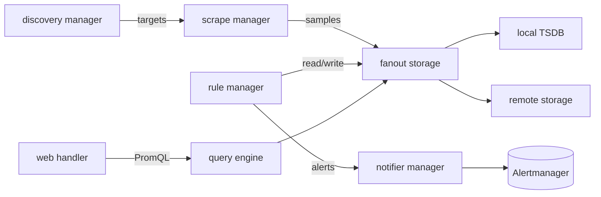

# Architecture

## Big picture

A Prometheus server is a single process that wires together a handful of long-running components. They are all constructed and connected in `cmd/prometheus/main.go`, and their goroutine lifecycles are bundled into an `oklog/run` run group, where each `g.Add(...)` registers a component's start and stop functions (`cmd/prometheus/main.go:1232` onward). The discovery managers find targets, the scrape manager pulls them, the TSDB stores the samples, the PromQL engine queries them, the rule manager evaluates rules, and the notifier ships alerts to Alertmanager.

## Components

### Discovery managers

Target discovery. There are two separate managers, one for scrape targets and one for notification (Alertmanager) targets, both built with `discovery.NewManager` (`cmd/prometheus/main.go:950`, `cmd/prometheus/main.go:956`). Service discovery plugins live under `discovery/` and can be compiled in or out with Go build tags (README:114-144).

### Scrape manager

Takes the targets discovery produces and pulls their HTTP metrics endpoints on an interval, built with `scrape.NewManager` (`cmd/prometheus/main.go:962`). The scrape loop and metric parsing live in `scrape/`.

### Storage

The local store is the TSDB, opened via `tsdb.Open` (`cmd/prometheus/main.go:1620`, wrapped by `openDBWithMetrics`). Remote write and remote read go through `remote.NewStorage` (`cmd/prometheus/main.go:917`). A fanout storage combines the local and remote stores into one `storage.Storage` with `storage.NewFanout` (`cmd/prometheus/main.go:918`), so the rest of the system sees a single appender (the storage write handle that batches samples behind a transaction) and querier.

### PromQL engine and rule manager

The query engine evaluates PromQL, built with `promql.NewEngine` (`cmd/prometheus/main.go:1002`). The rule manager evaluates recording and alerting rules, built with `rules.NewManager` and writing back through the fanout storage (`cmd/prometheus/main.go:1004`).

### Notifier and web handler

The notifier sends fired alerts to Alertmanager, built with `notifier.NewManager` (`cmd/prometheus/main.go:925`). The web handler serves the HTTP API and UI, built with `web.New` (`cmd/prometheus/main.go:1068`).

## How a request flows

One scrape, end to end:

1. `scrapeLoop.run` fires every interval and calls `scrapeAndReport` (`scrape/scrape.go:1263`, `scrape/scrape.go:1346`).
2. It gets an appender and defers the transaction boundary: `Commit` on success, `Rollback` on error (`scrape/scrape.go:1362-1377`).
3. It scrapes over HTTP and reads the body, reusing a pooled buffer (`scrape/scrape.go:1408`, `scrape/scrape.go:1413`).
4. The body is handed to `app.append(b, contentType, appendTime)` (`scrape/scrape.go:1446`). On failure it rolls back and writes stale markers (special NaN samples that mark a series as no longer present) via an empty scrape.
5. `scrapeLoopAppender.append` is the body of the work: it builds a parser for the content type with `textparse.New` (`scrape/scrape.go:1595`, `scrape/scrape.go:1605`) and loops over entries (`scrape/scrape.go:1653`).
6. Samples pass through an appender wrapped by `appenderWithLimits`, which enforces sample and bucket limits (`scrape/scrape.go:1643`).
7. They reach `headAppender.Append` in the TSDB (`tsdb/head_append.go:434`), which looks up the series by ref and creates it if absent (`tsdb/head_append.go:442`).
8. `s.appendable(...)` checks ordering, the out-of-order window, and the valid range before the sample is buffered as a `record.RefSample` (`tsdb/head_append.go:475`, `tsdb/head_append.go:497`).
9. The deferred `Commit` writes the WAL and applies the batch to the head chunk.

## Key design decisions

- **Pull, not push.** Prometheus scrapes targets over HTTP; pushing is supported only through an intermediary gateway for batch jobs (README:28-36). This keeps target health visible to the scraper.
- **Autonomous single server.** No dependency on distributed storage (README:28-33). HA and long-term retention are layered on with external systems such as Thanos or Mimir rather than built into the core (5).
- **Multi-dimensional model plus PromQL.** Metric name plus key/value labels, queried with PromQL, are the stated core differentiators (README:26-35).

## Extension points

- **Service discovery plugins** under `discovery/`, selectable at build time with Go tags (README:114-144).
- **Remote write and remote read** via `remote.NewStorage` (`cmd/prometheus/main.go:917`), the integration surface that downstream systems like Thanos and Mimir build on.
- **Exporters and client libraries** in separate repositories expose third-party systems and instrument applications.
