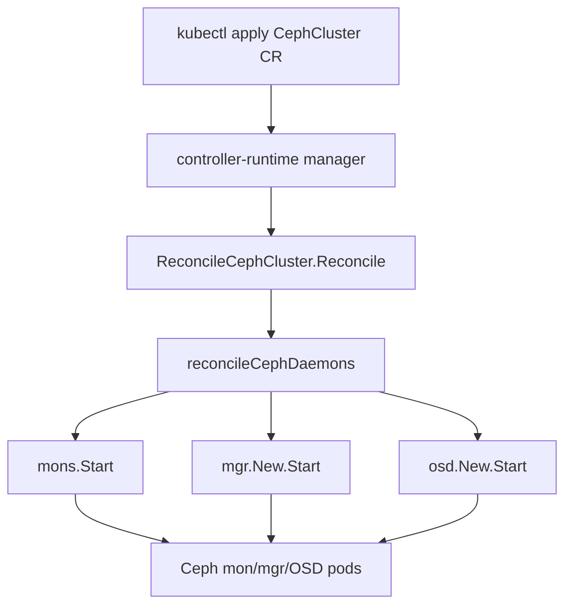

# Architecture

## Big picture

Rook is one Go binary that runs as a Kubernetes operator. The repository splits into `cmd/` for the CLI entry points and `pkg/` for the logic, where `pkg/apis/ceph.rook.io/v1` holds the CRD types and `pkg/operator/ceph` holds the controllers. The `rook` binary uses cobra to bundle the operator and a set of in-pod helper commands; `ceph operator` is the operator itself (`cmd/rook/main.go:27`).

The operator does not move storage bytes. It is a control plane that watches custom resources and, for each one, deploys and configures the matching Ceph daemons. The data path belongs to Ceph and the ceph-csi driver that the operator deploys.

## Components

### The operator process

`startOperator` builds the operator context and constructs an `Operator` via `New` (`cmd/rook/ceph/operator.go:54`, `pkg/operator/ceph/operator.go:68`), then calls `Run` (`pkg/operator/ceph/operator.go:85`). `Run` starts a controller-runtime manager through `runCRDManager` and then blocks in an infinite loop waiting on OS signals (`pkg/operator/ceph/operator.go:85`).

### The controller set

All per-resource controllers are registered in one place. `AddToManagerFuncs` lists more than twenty `Add` functions, including pool, object, file, nfs, rbd, client, nvmeof, mirror, csi, bucket, and cosi (`pkg/operator/ceph/cr_manager.go:75`). The CephCluster controller is registered separately by `cluster.Add` (`pkg/operator/ceph/cr_manager.go:113`). A second list, `AddToManagerFuncsMaintenance`, holds controllers used for disruption handling (`pkg/operator/ceph/cr_manager.go:70`).

### Ceph daemons

There is one controller per CRD, and each translates its resource into Ceph daemons: monitors (mon), managers (mgr), and object storage daemons (OSD). Rook does not reimplement Ceph operations; it orchestrates them by deploying the daemons and invoking the Ceph mgr and CLI from inside pods.

## How a request flows

A CephCluster reconcile runs end to end like this:

1. controller-runtime calls `ReconcileCephCluster.Reconcile`, which defers `RecoverAndLogException` to catch panics and reports the result through `reporting.ReportReconcileResult` (`pkg/operator/ceph/cluster/controller.go:311`).
2. The inner `reconcile` fetches the CephCluster with `r.client.Get` (`pkg/operator/ceph/cluster/controller.go:329`), adds a finalizer through `AddFinalizerIfNotPresent` (`pkg/operator/ceph/cluster/controller.go:340`), routes to `reconcileDelete` if a deletion timestamp is set (`pkg/operator/ceph/cluster/controller.go:351`), and skips work if the `SkipReconcileLabelKey` label is present (`pkg/operator/ceph/cluster/controller.go:356`).
3. `reconcileCephCluster` looks up or creates the per-namespace `*cluster` and runs the orchestration (`pkg/operator/ceph/cluster/controller.go:456`).
4. `reconcileCephDaemons` starts the mons (`pkg/operator/ceph/cluster/cluster.go:117`), confirms cluster identity is established (`pkg/operator/ceph/cluster/cluster.go:122`), runs post-mon actions, starts the mgr (`pkg/operator/ceph/cluster/cluster.go:145`), then the OSDs (`pkg/operator/ceph/cluster/cluster.go:160`), and configures the arbiter for stretch clusters (`pkg/operator/ceph/cluster/cluster.go:167`).

## Key design decisions

The operator reloads coarsely. When it receives `SIGHUP` it does not update individual reconcilers; it stops the entire controller-runtime manager and rebuilds it through `runCRDManager` (`pkg/operator/ceph/operator.go:110`). The log line is explicit: "reloading operator's CRDs manager, cancelling all orchestrations!" (`pkg/operator/ceph/operator.go:111`). This guarantees that a change to the operator's settings ConfigMap reaches every controller, at the cost of cancelling in-progress orchestrations.

## Extension points

The CRDs in `pkg/apis/ceph.rook.io/v1` are the primary surface. An administrator creates a CephCluster and then layer-specific resources (CephBlockPool, CephFilesystem, CephObjectStore, and others), each handled by its own controller registered in `pkg/operator/ceph/cr_manager.go:75`. Storage is consumed through standard Kubernetes interfaces: the ceph-csi driver fulfils PersistentVolumeClaims, and object stores expose an S3-compatible API.
