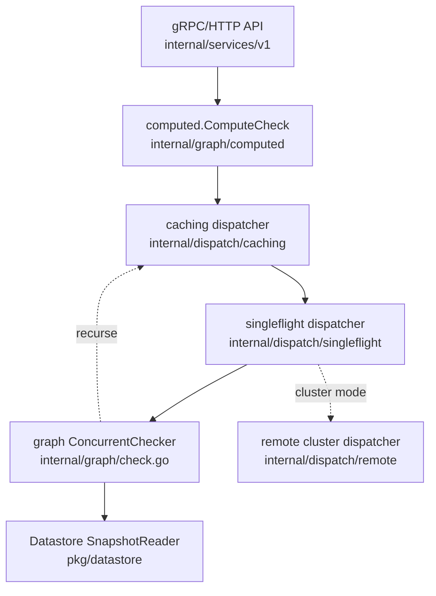

# Architecture

## Big picture

A SpiceDB node has four layers. The gRPC/HTTP API layer accepts requests and validates them against the schema. The dispatch layer turns one permission question into many smaller sub-checks, caches them, deduplicates them, and (in a cluster) fans them out to other nodes. The graph layer does the actual relationship-graph traversal. The datastore layer reads and writes relationships and schema at a specific revision. The binary entry point is `cmd/spicedb/main.go`, which builds the cobra command tree whose `serve` subcommand starts the servers.

## Components

### API services

The v1 gRPC services live in `internal/services/v1/`: Permissions, Schema, Watch, and Relationships. `permissions.go` holds `CheckPermission` and friends. This layer resolves the request's revision and schema, opens a snapshot reader, and validates that the named object types and relations exist before any graph work begins.

### Dispatch layer

`internal/dispatch/` distributes the authorization computation. It is a chain: `caching/` (memoizes sub-check results), `singleflight/` (collapses identical concurrent sub-checks into one), and either `graph/` for local traversal or `remote/` for redispatch to other nodes in a cluster. `combined/combined.go` assembles the chain. The local graph dispatcher is wired back into the caching dispatcher so each recursive sub-check is also cached.

### Graph engine

`internal/graph/` is the traversal engine: `check.go` for permission checks, `expand.go` for expanding a relation into its members, and `lookupresources*.go` / `lookupsubjects.go` for the reverse queries. `ConcurrentChecker` in `check.go` is the core: it either reads tuples directly or recursively evaluates a userset rewrite (union, intersection, exclusion).

### Datastore

`internal/datastore/` and `pkg/datastore/` define a common interface with drivers for CockroachDB, PostgreSQL, MySQL, Spanner, and an in-memory store (`memdb`), plus a `proxy`. The interface is MVCC-style: reads happen against an explicit revision. The schema DSL lives in `pkg/schema/` and `pkg/schemadsl/` (lexer, parser, compiler, generator), and core data structures in `pkg/tuple/`.

## How a request flows

A `CheckPermission` call traces as follows.

1. `(*permissionServer).CheckPermission` at `internal/services/v1/permissions.go:62` resolves the revision and schema hash with `consistency.RevisionFromContext` (`permissions.go:78`), opens a snapshot reader (`permissions.go:83`), builds the Caveat context (`permissions.go:85`), and validates the object types and relations with `namespace.CheckNamespaceAndRelations` (`permissions.go:95`).
2. It calls `computed.ComputeCheck` (`permissions.go:124`), passing `ResourceType = tuple.RR(objectType, permission)`, the subject ONR, and `MaximumDepth = config.MaximumAPIDepth`.
3. `computeCheck` at `internal/graph/computed/computecheck.go:89` creates a traversal bloom filter sized to the depth (`computecheck.go:113`), splits the resource IDs into chunks (`computecheck.go:122`), and calls `d.DispatchCheck` per chunk (`computecheck.go:123`), carrying the bloom filter in `Metadata.TraversalBloom` (`computecheck.go:131`).
4. The dispatch chain runs: a cache hit returns immediately; otherwise singleflight collapses duplicate in-flight checks, and a cluster deployment may redispatch to another node.
5. Local traversal runs in `(*ConcurrentChecker).Check` at `internal/graph/check.go:99`, then `checkInternal` (`check.go:165`). It first filters resource IDs that match the subject directly (`filterForFoundMemberResource`, `check.go:192`). With no userset rewrite it reads tuples in `checkDirect` (`check.go:304`); with a rewrite it recurses through `checkUsersetRewrite` (`check.go:539`), redispatching each child via `dispatch` (`check.go:561`).
6. Results pass through `computeCaveatedCheckResult` (`computecheck.go:170`) for Caveat evaluation and are converted to the API permissionship value before returning.

## Key design decisions

- **Configurable consistency over always-fresh reads.** The datastore exposes both `HeadRevision` (guaranteed fresh) and `OptimizedRevision` (likely-replicated, lower latency) at `pkg/datastore/datastore.go:711` and `:715`. Clients pick a consistency level per request, and `ZedToken` (`pkg/zedtoken/zedtoken.go`) lets them demand "at least as fresh as this earlier write" to avoid the New Enemy problem.
- **Dispatch as a cache-and-fan-out chain.** Building caching, singleflight, and the local graph into one self-referential chain (`internal/dispatch/combined/combined.go:201`, `:245`, `:318`) means a single check naturally spreads across nodes while each sub-result is memoized.
- **Pluggable datastores.** A single `Datastore` interface lets the same engine run on CockroachDB, PostgreSQL, MySQL, Spanner, or in-memory, trading Zanzibar's Spanner-only assumption for deployment flexibility.

## Extension points

- **Datastore drivers** implement the `datastore.Datastore` interface (`pkg/datastore/datastore.go`), the seam for adding a storage backend (this is how the MySQL driver was contributed).
- **Caveats** are user-defined CEL expressions in the schema (`pkg/caveats/`, `internal/caveats/`) that attach runtime conditions to relationships.
- **Watch API** (`internal/services/v1/`) streams relationship changes to downstream consumers in real time.
