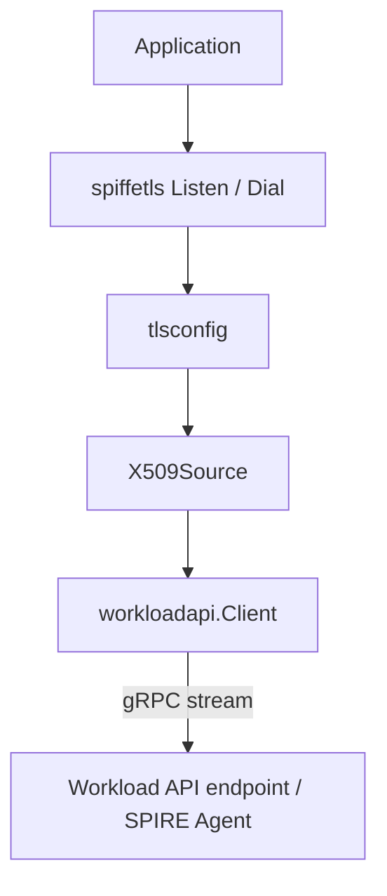

# Architecture

## Big picture

go-spiffe is a client library, so its architecture is a set of packages that sit between an application and a local Workload API endpoint. At the bottom is a gRPC client that streams identity material. Above it are typed sources that keep the latest SVID and trust bundle in memory. On top are helpers that wire those sources into Go's `crypto/tls` and gRPC. The packages live at the repository root under the `github.com/spiffe/go-spiffe/v2` module.

## Components

### spiffeid

Owns the `spiffeid.ID` and `spiffeid.TrustDomain` types: parsing, validation, and matching of `spiffe://` URIs (`spiffeid/id.go`, `spiffeid/trustdomain.go`, `spiffeid/match.go`). Everything else in the library names workloads with these types.

### svid and bundle

`svid/x509svid` and `svid/jwtsvid` hold the SVID types and their verification logic. `bundle/x509bundle`, `bundle/jwtbundle`, and `bundle/spiffebundle` hold trust bundles, the sets of trust anchors used to verify a peer.

### workloadapi

The Workload API client. A low-level `Client` (`workloadapi/client.go`) opens the gRPC streams, and higher-level `X509Source`, `JWTSource`, and `BundleSource` keep the freshest material and re-fetch on rotation (`workloadapi/x509source.go`, `workloadapi/watcher.go`).

### spiffetls and spiffegrpc

`spiffetls` and `spiffetls/tlsconfig` provide `Listen`/`Dial` helpers and build a `tls.Config` wired to a source. `spiffegrpc/grpccredentials` provides transport credentials for gRPC. `federation/` handles trust between trust domains over bundle endpoints.

## How a request flows

Trace an mTLS server bringing up its identity ([examples/spiffe-tls/server/main.go:35-39](https://github.com/spiffe/go-spiffe/blob/e9973f6314a3fa0e36eb1f00fbfe37bdc1554b96/examples/spiffe-tls/server/main.go#L35-L39)):

1. The application calls `spiffetls.ListenWithMode` with `MTLSServerWithSourceOptions(tlsconfig.AuthorizeID(clientID), ...)`. `tlsconfig` will wire an `X509Source` into `tls.Config.GetCertificate` and `VerifyPeerCertificate`.
2. Constructing the source calls `NewX509Source` ([workloadapi/x509source.go:31](https://github.com/spiffe/go-spiffe/blob/e9973f6314a3fa0e36eb1f00fbfe37bdc1554b96/workloadapi/x509source.go#L31)), which builds a watcher. It blocks until the first update arrives.
3. The watcher starts a background goroutine running `WatchX509Context` ([workloadapi/watcher.go:147-150](https://github.com/spiffe/go-spiffe/blob/e9973f6314a3fa0e36eb1f00fbfe37bdc1554b96/workloadapi/watcher.go#L147-L150)).
4. That opens a gRPC stream `FetchX509SVID` ([workloadapi/client.go:552](https://github.com/spiffe/go-spiffe/blob/e9973f6314a3fa0e36eb1f00fbfe37bdc1554b96/workloadapi/client.go#L552)) and loops on `stream.Recv()`, parsing each response into an `X509Context`.
5. On each update the source swaps in the new SVID and bundles under a lock ([workloadapi/x509source.go:102](https://github.com/spiffe/go-spiffe/blob/e9973f6314a3fa0e36eb1f00fbfe37bdc1554b96/workloadapi/x509source.go#L102)). TLS then reads the current SVID through `GetX509SVID` ([workloadapi/x509source.go:63](https://github.com/spiffe/go-spiffe/blob/e9973f6314a3fa0e36eb1f00fbfe37bdc1554b96/workloadapi/x509source.go#L63)).

## Key design decisions

The connection to the Workload API is always dialed over an insecure gRPC transport ([workloadapi/client.go:519](https://github.com/spiffe/go-spiffe/blob/e9973f6314a3fa0e36eb1f00fbfe37bdc1554b96/workloadapi/client.go#L519)). This is deliberate: the trust boundary is the ability to reach the socket itself, not TLS on top of it. The agent attests the workload by inspecting the connecting process, so the link is local and protected by file permissions.

Every gRPC call sets a `workload.spiffe.io: true` metadata header through `withHeader` ([workloadapi/client.go:661-664](https://github.com/spiffe/go-spiffe/blob/e9973f6314a3fa0e36eb1f00fbfe37bdc1554b96/workloadapi/client.go#L661-L664)). The Workload API spec requires this security header so a server can reject requests that lack it.

The endpoint address comes from the `SPIFFE_ENDPOINT_SOCKET` environment variable ([workloadapi/addr.go:13](https://github.com/spiffe/go-spiffe/blob/e9973f6314a3fa0e36eb1f00fbfe37bdc1554b96/workloadapi/addr.go#L13)). `TargetFromAddress` ([workloadapi/addr.go:31](https://github.com/spiffe/go-spiffe/blob/e9973f6314a3fa0e36eb1f00fbfe37bdc1554b96/workloadapi/addr.go#L31)) parses it into a gRPC target, accepting a TCP address or a Unix domain socket, with Windows named pipe support in a platform-specific file.

## Extension points

The `X509Source` accepts a picker function to choose among multiple SVIDs, defaulting to the first one. `tlsconfig` exposes `Authorizer` values (such as `AuthorizeID`) that decide which peer SPIFFE IDs are allowed. The `exp/` tree stages experimental formats like WIT-SVID for third parties to try before they stabilize.
