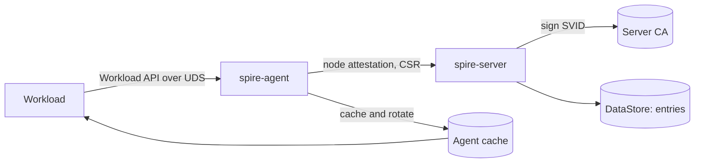

# Architecture

## Big picture

SPIRE is two binaries. `spire-server` is the certificate authority for one trust domain: it attests nodes, holds the registration entries, and signs SVIDs. `spire-agent` runs on each node, gets its own identity from the server through node attestation, then serves identities to local workloads over a Unix domain socket. Both binaries push almost every function through a plugin catalog (`pkg/common/catalog/`), so attestation, key management, and upstream authorities are swappable. The agent caches and rotates SVIDs ahead of time, so a workload's request is served from a local cache rather than a round trip to the server.

## Components

### spire-server

The trust-domain CA. Its entry point is `cmd/spire-server/main.go`, which delegates to the CLI through `entrypoint.NewEntryPoint(new(cli.CLI).Run).Main()`. It attests nodes, stores registration entries in a datastore, and signs workload SVIDs. The CA signing surface is `pkg/server/ca/ca.go:335` (`SignWorkloadX509SVID`). Server-side plugin families live under `pkg/server/plugin/`: `nodeattestor`, `upstreamauthority`, `keymanager`, `bundlepublisher`, `credentialcomposer`, and `notifier`.

### spire-agent

Runs on each node. Its entry point is `cmd/spire-agent/main.go`, the same thin CLI delegation. It performs node attestation to obtain its own SVID, then exposes the Workload API on a Unix domain socket. The agent's manager subscribes the cache to workload updates (`pkg/agent/manager/manager.go:258`) and an SVID rotator renews certificates through the server client (`pkg/agent/svid/rotator.go`, `RenewSVID`). Agent-side plugin families live under `pkg/agent/plugin/`: `nodeattestor`, `keymanager`, `svidstore`, and `workloadattestor`.

### Plugin catalog

All functionality is pluginized. The catalog implementation is `pkg/common/catalog/` (`catalog.go`, `builtin.go`, `bind.go`). Built-in plugins and external plugins (loaded through HashiCorp go-plugin) implement the same catalog interface, so the loading path is uniform.

## How a request flows

This traces a workload fetching an X509-SVID, end to end.

1. The workload calls the streaming RPC `FetchX509SVID` over the UDS. The handler is `pkg/agent/endpoints/workload/handler.go:251`. The request body is empty and carries no credential.
2. Workload attestation. The handler calls `h.c.Attestor.Attest(ctx)` at `handler.go:256`. The caller's PID comes from the connection itself: SPIRE reads the UDS peer credential from the kernel, using `unix.GetsockoptUcred` with `SO_PEERCRED` on Linux (`pkg/common/peertracker/uds_linux.go:10`) and `LOCAL_PEERPID` on BSD/macOS (`pkg/common/peertracker/uds_bsd.go:13`).
3. The attestor body is `pkg/agent/attestor/workload/workload.go:49` (`Attest(ctx, pid)`). It pulls the workload attestor plugins from the catalog and runs each in a goroutine to gather selectors from the PID (`workload.go:55-87`). It only returns an error if every plugin failed (`workload.go:89-91`).
4. Rate limiting. `h.rateLimit(ctx, MethodFetchX509SVID, selectors)` at `handler.go:262`. The agent's own calls (such as the health check) are exempt via `isAgent(ctx)` at `handler.go:86`.
5. Cache subscription. `h.c.Manager.SubscribeToCacheChanges(ctx, selectors)` at `handler.go:266`, which the manager maps to `m.cache.SubscribeToWorkloadUpdates` (`pkg/agent/manager/manager.go:258`). The SVID is not fetched from the server per request; the manager has already cached and rotated it.
6. The streaming loop (`handler.go:273-283`) receives cache updates on `subscriber.Updates()`, keeps only the identities for this caller with `filterIdentities`, and writes the chain and key with `sendX509SVIDResponse`. It exits on `ctx.Done()`. When an SVID rotates, the new one is pushed onto the open stream rather than polled.

Server-side signing happens outside this loop. The agent's rotator generates the key pair locally and sends a CSR to the server (`pkg/agent/svid/rotator.go`). The server CA receives only the public key, builds a template, signs it, and validates the resulting SPIFFE ID (`pkg/server/ca/ca.go:341-358`).

## Key design decisions

- **No credential from the workload.** Identity is derived only from kernel-verified process metadata (the PID from `SO_PEERCRED`, and the uid/gid/container ID derived from it). There is no bootstrap secret, so the secret distribution and rotation problem disappears.
- **Private keys never leave the node.** The agent (or a workload via an SVID store) generates the key pair locally and sends only a CSR. The server CA references only `params.PublicKey` when signing (`pkg/server/ca/ca.go:347`). The server never holds the workload's private key.
- **Two-factor attestation.** Node attestation (the agent proving itself with platform evidence) plus workload attestation (process attributes) form a hierarchy, where an entry's `ParentId` maps to the node and `Selectors` map to the workload.
- **Cache and push, not poll.** The agent rotates SVIDs ahead of expiry and pushes updates to open streams, so workloads avoid a per-request round trip to the server.

## Extension points

The plugin families are the extension surface. On the server: `nodeattestor`, `upstreamauthority`, `keymanager`, `bundlepublisher`, `credentialcomposer`, `notifier` (`pkg/server/plugin/`). On the agent: `nodeattestor`, `keymanager`, `svidstore`, `workloadattestor` (`pkg/agent/plugin/`). Plugins can be compiled in as built-ins or loaded as external processes through the same catalog interface (`pkg/common/catalog/`).
