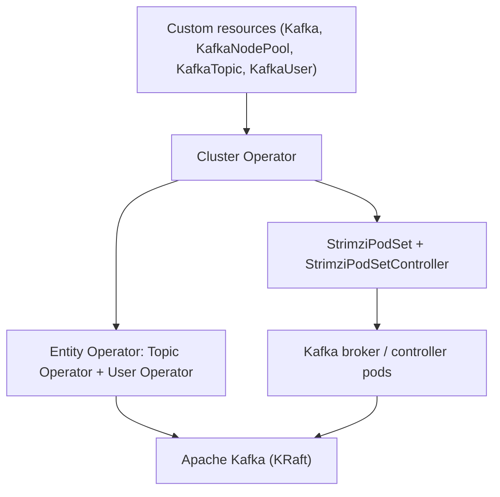

# Architecture

## Big picture

Strimzi is a multi-module Maven project. The top-level modules split cleanly between API models, the operators that act on them, and the helper agents that run inside Kafka containers. The `api/` module defines the custom resources, the operator modules reconcile them, and `operator-common/` holds the shared reconciliation machinery.



## Components

### api

Defines the CRD and API models as Java POJOs: `Kafka`, `KafkaNodePool`, `KafkaTopic`, `KafkaUser`, `KafkaConnect`, `KafkaMirrorMaker2`, `KafkaBridge`, `KafkaRebalance`, and `StrimziPodSet`. The CRDs are generated from these types by `crd-generator/`. The top-level `Kafka` type extends the Fabric8 `CustomResource` (`api/src/main/java/io/strimzi/api/kafka/model/kafka/Kafka.java:82`).

### cluster-operator

The core operator. It reconciles the Kafka cluster itself and its surrounding components (Cruise Control, Kafka Exporter, the Entity Operator). It depends on the Fabric8 Kubernetes client `7.7.0` (`pom.xml:75`) and uses Vert.x as its asynchronous execution model.

### topic-operator and user-operator

`topic-operator/` reflects `KafkaTopic` resources onto topics in Kafka, with its own `Main.java`. `user-operator/` reflects `KafkaUser` resources onto Kafka users, ACLs, and TLS certificates. The Cluster Operator deploys both as the Entity Operator.

### operator-common

Shared utilities: the `Reconciliation` context (`operator-common/src/main/java/io/strimzi/operator/common/Reconciliation.java`) and the Fabric8-based resource operators used across modules.

### in-container agents and certificate-manager

`kafka-init/`, `kafka-agent/`, and `tracing-agent/` run inside Kafka containers for rack configuration, broker metrics and configuration, and OpenTelemetry tracing. `certificate-manager/` handles the project's own CA and TLS certificate management.

## How a request flows

A `Kafka` reconcile starts at `KafkaAssemblyOperator.createOrUpdate` (`cluster-operator/src/main/java/io/strimzi/operator/cluster/operator/assembly/KafkaAssemblyOperator.java:156`). It builds a mutable `ReconciliationState` and runs `reconcile(reconcileState)` (`KafkaAssemblyOperator.java:231`), which chains the steps with Vert.x futures:

```text
initialStatus
  -> reconcileCas (clusterCa / clientsCa)
  -> emitCertificateSecretMetrics
  -> versionChange (Kafka / metadata version decision)
  -> reconcileKafka          (broker / controller pods)
  -> reconcileCruiseControl
  -> reconcileEntityOperator (topic + user operator)
  -> reconcileKafkaExporter
  -> reconcileKafkaAutoRebalancing
```

The `reconcileKafka` step calls `KafkaReconciler.reconcile(KafkaStatus, Clock)` (`cluster-operator/src/main/java/io/strimzi/operator/cluster/operator/assembly/KafkaReconciler.java:250`), another future chain that converges the desired state in order: network policy, PVCs, RBAC, listeners, per-broker config maps, then `podSet()` to create the pods and `rollingUpdate(podSetDiffs)` to restart only the brokers that need it.

Underneath all of this is the common skeleton in `AbstractOperator`. The public `reconcile(Reconciliation)` (`cluster-operator/src/main/java/io/strimzi/operator/cluster/operator/assembly/AbstractOperator.java:181`) takes a lock per resource and dispatches to `reconcileResource` (`AbstractOperator.java:211`), which skips on label mismatch, honours the `strimzi.io/pause-reconciliation` annotation, and otherwise calls the concrete `createOrUpdate`.

## Key design decisions

The most consequential decision is that Strimzi does not use Kubernetes StatefulSets for the Kafka pods. It defines its own CRD `StrimziPodSet` and runs its own `StrimziPodSetController` (`cluster-operator/src/main/java/io/strimzi/operator/cluster/operator/assembly/StrimziPodSetController.java:60`). This lets the operator fully control rolling update order, operate individual pods, apply per-broker configuration and storage, and manage mixed KRaft controller and broker roles, none of which a StatefulSet allows cleanly. The internals page traces this in detail.

The operator is high availability as active/passive. It uses Kubernetes Lease-based leader election; a replica that loses leadership exits so the container restarts (`cluster-operator/src/main/java/io/strimzi/operator/cluster/Main.java:230`). Reconciliation is event-driven via watches plus periodic resync, and each step is idempotent: it computes the desired state and applies the difference.

## Extension points

The custom resources are themselves the extension surface: `KafkaConnect` and `KafkaMirrorMaker2` for connectors and replication, `KafkaBridge` for HTTP-to-Kafka, `KafkaRebalance` for Cruise Control rebalancing, and `KafkaNodePool` to define groups of brokers or controllers. Authentication integrates with OAuth and OIDC, and TLS integrates with cert-manager.
