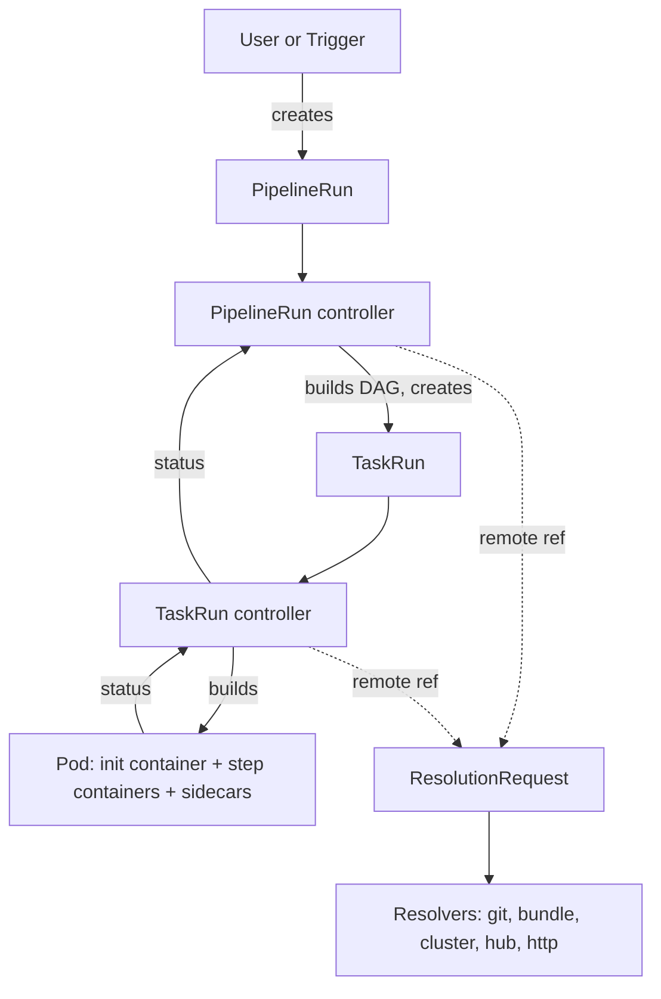

# Architecture

## Big picture

Tekton is a set of custom resource definitions plus controllers that turn those resources into pods. Nothing about the execution model is exotic: a `TaskRun` becomes a pod, a `PipelineRun` becomes a set of `TaskRun` objects, and Kubernetes does the scheduling. The interesting parts are the two places where Kubernetes does not do what Tekton needs, which are ordering steps inside a pod and fetching definitions that do not live in the cluster.

## Components

### The CRDs

`config/300-crds/` installs eight custom resource definitions.

| CRD | What it holds |
| --- | --- |
| `Task` | An ordered list of steps. Each step is a container image plus a command |
| `TaskRun` | One execution of a `Task`. Maps to exactly one pod |
| `Pipeline` | A set of tasks with dependencies between them |
| `PipelineRun` | One execution of a `Pipeline`. Creates `TaskRun` objects |
| `StepAction` | A single reusable step, referenced from a `Task` |
| `CustomRun` | Hands execution to a controller that is not Tekton |
| `ResolutionRequest` | A request to fetch a definition from outside the cluster |
| `VerificationPolicy` | Signature verification rules for fetched definitions |

### Controllers and binaries

`cmd/` builds eight binaries. The three that run as long-lived deployments are `controller` (the reconcilers), `webhook` (validation, defaulting, and conversion between API versions), and `resolvers` (remote resolution). The rest are injected into user pods: `entrypoint` (step sequencing, covered in [Internals](./internals)), `sidecarlogresults`, `nop`, and `workingdirinit`.

The reconcilers are built on the Knative controller framework from `knative.dev/pkg`, a legacy of the project's origin inside Knative.

### Resolvers

`pkg/resolution/resolver/` implements `git`, `bundle` (an OCI artifact), `cluster` (another namespace), `hub` (Artifact Hub), and `http`, sharing a `framework` package. A `Task` or `Pipeline` referenced remotely does not have to exist in the cluster before the run starts: the controller creates a `ResolutionRequest`, a resolver fulfils it, and `VerificationPolicy` can require the result to be signed.

## How a request flows

Take a `PipelineRun` from creation to a running container.

The PipelineRun controller picks it up at `pkg/reconciler/pipelinerun/pipelinerun.go:191` (`ReconcileKind`). It resolves the pipeline definition and every task reference it names at `:390` (`resolvePipelineState`), locally or through a resolver. The main body is `:545` (`reconcile`), which builds the dependency graph and then asks what can run right now at `:989` (`runNextSchedulableTask`). For each task that is ready it creates a `TaskRun` at `:1315` (`createTaskRuns`), a `CustomRun` at `:1477`, or, when a pipeline task references another pipeline, a child `PipelineRun` at `:1134` (`createChildPipelineRuns`).

The graph itself is small and readable. `pkg/reconciler/pipeline/dag/dag.go:73` (`Build`) constructs it from `runAfter` declarations and from result references between tasks, since consuming another task's result is itself a dependency. `:135` (`findCyclesInDependencies`) rejects cycles before anything runs. `:103` (`GetCandidateTasks`) returns the nodes whose predecessors are all done, and `pkg/reconciler/pipelinerun/resources/pipelinerunstate.go:459` (`DAGExecutionQueue`) turns that into the queue the reconciler acts on.

There is no separate scheduler process. Each reconcile pass re-evaluates the whole graph against current status and creates whatever is now runnable.

The TaskRun controller then takes over at `pkg/reconciler/taskrun/taskrun.go:137` (`ReconcileKind`). It resolves and validates the task at `:531` (`prepare`), runs the main body at `:729` (`reconcile`), and creates the pod at `:1082` (`createPod`), which delegates to `pkg/pod/pod.go:166` (`Builder.Build`). That builder is where steps become containers, workspaces become volumes, and the entrypoint rewriting described in [Internals](./internals) happens.

## Key design decisions

**One TaskRun, one pod.** This buys isolation and makes the Kubernetes scheduler responsible for placement, and it makes intra-task data sharing free, since steps share the pod's filesystem. The cost is that anything crossing a task boundary needs a workspace, in practice a persistent volume, which is the main source of friction in real pipelines. It is the constraint behind ongoing design work on trusted artifacts [1].

**Results ride the pod's termination message.** How a task returns a value is covered in [Internals](./internals); the architectural consequence is that results are small by design and Tekton has had to add a second mechanism for anything larger.

**API stability is a runtime flag, not a build.** `enable-api-fields` is read from a ConfigMap and applies cluster-wide, with `beta` as the default (`pkg/apis/config/feature_flags.go:73`). An alpha feature is present in every install and simply refused unless the cluster operator opts in.

**Definitions do not have to live in the cluster.** Remote resolution makes a pipeline reference a git revision or a signed OCI artifact, which is what lets one catalog serve many clusters.

## Extension points

- **`CustomRun`**: a pipeline task can name a `kind` Tekton does not implement, and a third-party controller executes it. This is how work that is not a pod gets into a Tekton pipeline.
- **Resolvers**: `pkg/resolution/resolver/framework` is a documented interface, so an organisation can add its own source of task definitions.
- **`StepAction`**: makes an individual step a referenceable, versioned object rather than something copied between tasks.
- **Sidecars**: containers that run alongside the steps for the duration of a task, for services a build needs, such as a registry or a database.
- **The rest of the Tekton family**: Triggers creates runs from webhooks, Chains watches completed runs and signs their outputs, Results archives them. All of them are separate controllers that read the same CRDs.
