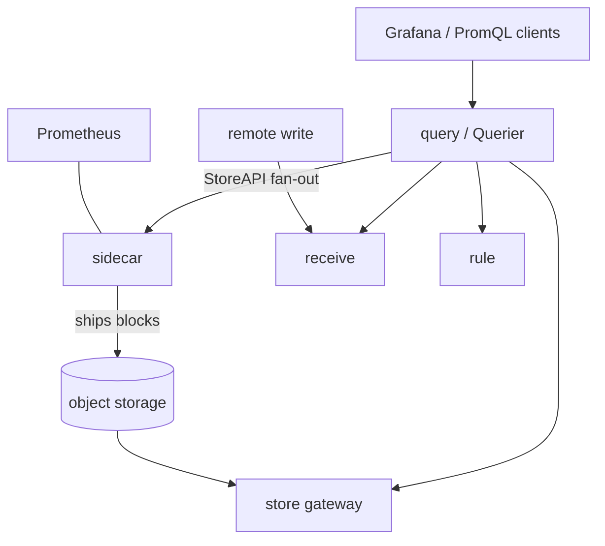

# Architecture

## Big picture

Thanos is one binary run as several roles. Some roles hold metric data and implement the gRPC StoreAPI (`pkg/store/storepb/rpc.proto:26`); one role, the Querier, has no data of its own and instead fans a query out to all of them and merges the results. The unifying abstraction is that every data source looks the same to the Querier, so sidecars, store gateways, receivers, rulers, and even other Queriers are interchangeable behind one interface.

## Components

### sidecar

Runs next to a Prometheus server. It uploads completed TSDB blocks to object storage through the shipper (`pkg/shipper/shipper.go:344`) and exposes Prometheus's recent in-memory data over the StoreAPI. Subcommand registered at `cmd/thanos/main.go:56-63`.

### store gateway

Serves historical blocks that live in object storage back over the StoreAPI. The block reader is the `BucketStore` (`pkg/store/bucket.go:384`), which reads blocks from the external `thanos-io/objstore` library.

### query (Querier)

The fan-out and merge engine. It implements PromQL and the StoreAPI but stores nothing itself; it discovers downstream StoreAPI endpoints and merges their series. The implementation is `ProxyStore` in `pkg/store/proxy.go:84`.

### receive

The push path. It accepts Prometheus remote-write and stores series locally, for sources that cannot be scraped. Package `pkg/receive/`.

### compact

Runs compaction and downsampling over blocks in object storage, keeping long-range queries fast. Packages `pkg/compact/` and `pkg/compactv2/`.

### rule, query-frontend

`rule` evaluates recording and alerting rules and is itself a StoreAPI source. `query-frontend` (`pkg/queryfrontend/`) splits and caches queries in front of the Querier.

## How a request flows

A PromQL query reaches a Querier, whose StoreAPI entry point is `ProxyStore.Series` (`pkg/store/proxy.go:277`).

1. `pkg/store/proxy.go:287` matches the request's external label selectors against the configured selector labels; an unrelated request returns early.
2. `pkg/store/proxy.go:302-309` extracts tenant info from gRPC metadata and re-attaches it to the outgoing context for multi-tenancy.
3. `pkg/store/proxy.go:312` narrows the candidate stores by time range and matchers; zero matches returns early.
4. `pkg/store/proxy.go:319-333` rebuilds the downstream `SeriesRequest`, folding external labels into the matchers and carrying through shard info and `WithoutReplicaLabels`.
5. `pkg/store/proxy.go:357` starts one asynchronous stream per store with `newAsyncRespSet`; a failure either emits a warning or aborts, per the partial-response strategy.
6. `pkg/store/proxy.go:376` loads all streams into a loser tree with `NewProxyResponseLoserTree`; if dedup is enabled, `pkg/store/proxy.go:378` wraps it in a `ResponseDeduplicator`.
7. `pkg/store/proxy.go:382-397` pulls series in global sorted order, honoring `r.Limit`, and sends each with `srv.Send`; `pkg/store/proxy.go:400` flushes any remaining buffered series.

## Key design decisions

- **No deduplication in the fan-in.** The `NewProxyStore` doc comment states dedup must happen at the highest level, just before PromQL (`pkg/store/proxy.go:160-161`). The proxy only deduplicates when the top-level option is enabled (`pkg/store/proxy.go:377-379`), which avoids repeated dedup in stacked, federated query layers.
- **Loser-tree k-way merge.** Sorted streams from many stores are merged with a tournament tree (`pkg/store/proxy_merge.go:197`) rather than buffering everything in memory, keeping merge comparisons and memory bounded.
- **One recursive StoreAPI abstraction.** Because the Querier is also a StoreAPI server, federated multi-layer query is a built-in property rather than a special mode. The `rpc.proto` comment notes this optimizes resource usage on federated queries (`pkg/store/storepb/rpc.proto:35`).

## Extension points

- **StoreAPI** (`pkg/store/storepb/rpc.proto:26`): any component that implements the `Series` streaming RPC can be queried by a Querier.
- **Object storage**: pluggable backends (S3, GCS, Azure, Swift, Tencent COS) through the external `thanos-io/objstore` library.
- **The `Client` interface** (`pkg/store/proxy.go:52`): the common type the Querier binds every downstream component to.
