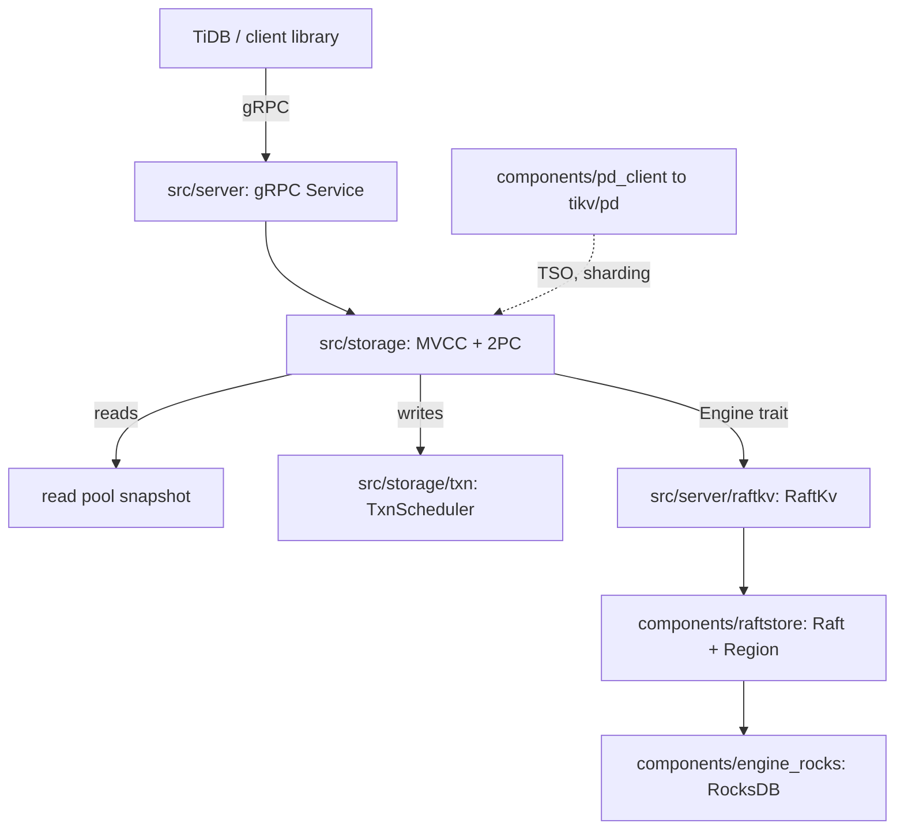

# Architecture

## Big picture

A TiKV node is a stack of layers. A gRPC server accepts requests from TiDB or a client library. Below it sits the transactional storage layer, which implements MVCC and Percolator two-phase commit. That layer reaches persistence only through the `Engine` trait, whose production implementation routes writes through Raft to a replicated state machine backed by RocksDB. A separate process, the Placement Driver (`tikv/pd`), tracks Regions and hands out timestamps. The repository is a Rust workspace of more than 70 crates under `components/`, with the server binary at `cmd/tikv-server/src/main.rs`.

## Components

### gRPC server

The server crate owns the network boundary with clients. Request handlers are generated by a `handle_request!` macro, for example `kv_get` dispatching to `future_get` (`src/server/service/kv.rs:339`). This is where TiDB and `client-rust` traffic enters the node. Code lives in `src/server/`.

### Transactional storage layer

`src/storage/` is the MVCC and transaction layer. `Storage<E, L, F>` (`src/storage/mod.rs:197`) is the facade that holds the engine, the transaction scheduler, the read pool, and the concurrency manager. MVCC encoding and decoding live in `src/storage/mvcc/`, and transaction command processing lives in `src/storage/txn/`. This layer implements Percolator-style two-phase commit.

### Engine abstraction and RocksDB

`components/engine_traits/` defines the storage abstraction, and `components/engine_rocks/` is the RocksDB implementation. Dummy implementations such as `engine_panic` exist so the layer can be swapped. Data is split across four RocksDB column families, named in `components/engine_traits/src/cf_defs.rs:4`: `default` for real values, `lock` for Percolator locks, `write` for commit records, and `raft` for Raft log and metadata.

### Raftstore

`components/raftstore/` (and `components/raftstore-v2/`) implement Raft consensus and Region management through the peer, apply, and store state machines. A write proposed here is replicated to a majority, committed, then applied to the state machine.

### Placement Driver client and transaction types

`components/pd_client/` talks to the Placement Driver for auto-sharding, Region rebalancing, and timestamp (TSO) allocation. `components/txn_types/` holds the transaction primitives `Key`, `Value`, `Lock`, `Write`, and `TimeStamp`. `components/concurrency_manager` holds the in-memory lock table and `max_ts` that keep async-commit and 1PC correct.

## How a request flows

A transactional read at a given `start_ts` (`kv_get`):

1. The gRPC `kv_get` handler dispatches to `future_get` via `handle_request!` (`src/server/service/kv.rs:339`); the function body is at `src/server/service/kv.rs:1614`.
2. `Storage::get` (`src/storage/mod.rs:610`) calls `get_entry` (`src/storage/mod.rs:625`), which spawns the work onto a read pool thread.
3. `prepare_snap_ctx` (`src/storage/mod.rs:694`) checks the in-memory locks in the concurrency manager and honours `bypass_locks`. This is where concurrency control such as `max_ts` takes effect.
4. The engine snapshot is taken (`src/storage/mod.rs:702`). Through the `Engine` trait this enters `RaftKv::async_snapshot` (`src/server/raftkv/mod.rs:653`), which uses a LocalReader lease read or read-index to keep the read linearizable without writing a Raft log entry.
5. `SnapshotStore::new(...)` is built (`src/storage/mod.rs:713`) and `PointGetter::get_entry` (`src/storage/mvcc/reader/point_getter.rs:188`) runs the MVCC logic: seek the `write` CF backward for `commit_ts <= start_ts`, then read the real value from the `default` CF at the found `start_ts`.

A transactional write goes through the scheduler instead of the read pool. `Storage::sched_txn_command` (`src/storage/mod.rs:1861`) validates the command (Prewrite at `src/storage/mod.rs:1874`), the `TxnScheduler` (`src/storage/txn/scheduler.rs:422`) acquires per-key latches (`src/storage/txn/scheduler.rs:404`) and runs the command, and the resulting modifications are sent through `RaftKv::async_write` (`src/server/raftkv/mod.rs:503`), which converts them into a `RaftCmdRequest` (`src/server/raftkv/mod.rs:578`) and hands them to raftstore.

## Key design decisions

The storage layer persists only through the `Engine` trait (`impl Engine for RaftKv` at `src/server/raftkv/mod.rs:438`). The same transaction and MVCC code therefore runs on both RaftKv (a single RocksDB) and RaftKv2 (partitioned-raft-kv with one tablet per Region), with the choice made at runtime in `cmd/tikv-server/src/main.rs:248`.

Reads do not go through the Raft log. `RaftKv::async_snapshot` uses a lease read or read-index to keep the leader's reads linearizable while avoiding a log write. Only writes (`async_write`) traverse Raft. This asymmetry keeps the read path cheap.

Values are stored where they cost least to read. A short value is embedded directly in the `lock` or `write` CF, while a long value is offloaded to the `default` CF keyed by `start_ts`. A point read then saves one CF round trip for short values.

## Extension points

The `Engine` trait (`components/engine_traits`) is the main interface a third party would implement to back the transaction layer with a different store. Coprocessor push-down from TiDB is handled in `src/coprocessor/` and `src/coprocessor_v2/`. Change data capture is built on `components/cdc` plus `components/resolved_ts`, and bulk ingestion goes through `components/sst_importer`. Clients in other languages (`client-go`, `client-java`, `client-python`) target the same gRPC API as `client-rust`.

## Sources

- [4] [tikv/tikv README](https://github.com/tikv/tikv)
- [10] [TiKV Documentation](https://tikv.org/docs/latest/concepts/overview/)
