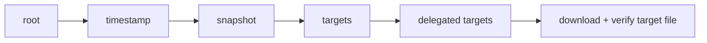

# Architecture

## Big picture

python-tuf splits into three packages with distinct responsibilities. `tuf.api` is the low-level Metadata API: it serializes and deserializes TUF metadata (root, timestamp, snapshot, targets) and provides the signature-verification primitives. `tuf.ngclient` is the high-level client that implements the TUF specification's detailed client workflow. `tuf.repository` is a base class for building repository-side tooling that produces and signs that metadata. The client is what most integrators touch.

The client refreshes the four top-level metadata roles in a fixed order, each step verifying the next before trusting it.



## Components

### Metadata API: `tuf/api`

The low-level layer. `Metadata[T]` is the generic wrapper around a signed payload ([tuf/api/metadata.py:81](https://github.com/theupdateframework/python-tuf/blob/9a3c304/tuf/api/metadata.py#L81)). The role payload types live in `tuf/api/_payload.py`, the largest file in the codebase, with `Signed` as the abstract base ([tuf/api/_payload.py:84](https://github.com/theupdateframework/python-tuf/blob/9a3c304/tuf/api/_payload.py#L84)). JSON is the only built-in serializer (`tuf/api/serialization/json.py`), and DSSE envelope support lives in `tuf/api/dsse.py`.

### Client: `tuf/ngclient`

The high-level layer. `Updater` implements the client workflow ([tuf/ngclient/updater.py:78](https://github.com/theupdateframework/python-tuf/blob/9a3c304/tuf/ngclient/updater.py#L78)). The trust-set state machine `TrustedMetadataSet` is an internal module ([tuf/ngclient/_internal/trusted_metadata_set.py:94](https://github.com/theupdateframework/python-tuf/blob/9a3c304/tuf/ngclient/_internal/trusted_metadata_set.py#L94)). HTTP fetching is abstracted behind `FetcherInterface` with `Urllib3Fetcher` as the default; `requests_fetcher.py` is deprecated.

### Repository helpers: `tuf/repository`

The abstract base class `Repository(ABC)` defines `open`, `close`, `edit`, `do_snapshot`, and `do_timestamp` ([tuf/repository/_repository.py:35](https://github.com/theupdateframework/python-tuf/blob/9a3c304/tuf/repository/_repository.py#L35)). It is the foundation for repository tooling such as the bundled examples and RSTUF.

## How a request flows

`Updater.refresh()` loads the four roles in order ([tuf/ngclient/updater.py:174](https://github.com/theupdateframework/python-tuf/blob/9a3c304/tuf/ngclient/updater.py#L174)):

```python
self._load_root()
self._load_timestamp()
self._load_snapshot()
self._load_targets(Targets.type, Root.type)
```

Each step tries the local cache first, then fetches from the remote, verifies it, and persists it. When a caller asks for a target via `get_targetinfo()` without having run `refresh()` first, the updater runs it implicitly ([tuf/ngclient/updater.py:213](https://github.com/theupdateframework/python-tuf/blob/9a3c304/tuf/ngclient/updater.py#L213)). Delegated targets are resolved on demand by `_preorder_depth_first_walk()` ([tuf/ngclient/updater.py:500](https://github.com/theupdateframework/python-tuf/blob/9a3c304/tuf/ngclient/updater.py#L500)). After the target's metadata is found, the downloaded bytes are checked against the expected length and hashes ([tuf/ngclient/updater.py:300](https://github.com/theupdateframework/python-tuf/blob/9a3c304/tuf/ngclient/updater.py#L300)).

## Key design decisions

How the trust anchor is supplied is a deliberate choice. `Updater.__init__` makes `bootstrap` a keyword-only argument (`*, bootstrap: bytes | None`, [tuf/ngclient/updater.py:115](https://github.com/theupdateframework/python-tuf/blob/9a3c304/tuf/ngclient/updater.py#L115)). The intended path is to pass embedded root bytes for safe initialization. Only when `bootstrap=None` does the updater fall back to a cached `root.json` as the trust anchor ([tuf/ngclient/updater.py:139](https://github.com/theupdateframework/python-tuf/blob/9a3c304/tuf/ngclient/updater.py#L139)). This forces the caller to explicitly opt into trust-on-first-use behavior rather than getting it by default.

## Extension points

- `FetcherInterface` ([tuf/ngclient/fetcher.py](https://github.com/theupdateframework/python-tuf/blob/9a3c304/tuf/ngclient/fetcher.py)): implement to control how metadata and targets are fetched (proxies, custom transports, offline sources).
- `UpdaterConfig` ([tuf/ngclient/config.py](https://github.com/theupdateframework/python-tuf/blob/9a3c304/tuf/ngclient/config.py)): tune envelope type, user agent, and refresh limits.
- `Repository(ABC)` ([tuf/repository/_repository.py:35](https://github.com/theupdateframework/python-tuf/blob/9a3c304/tuf/repository/_repository.py#L35)): subclass to build repository-side metadata management.
- Serialization (`tuf/api/serialization`): the (de)serializer interfaces allow formats beyond the bundled JSON.
