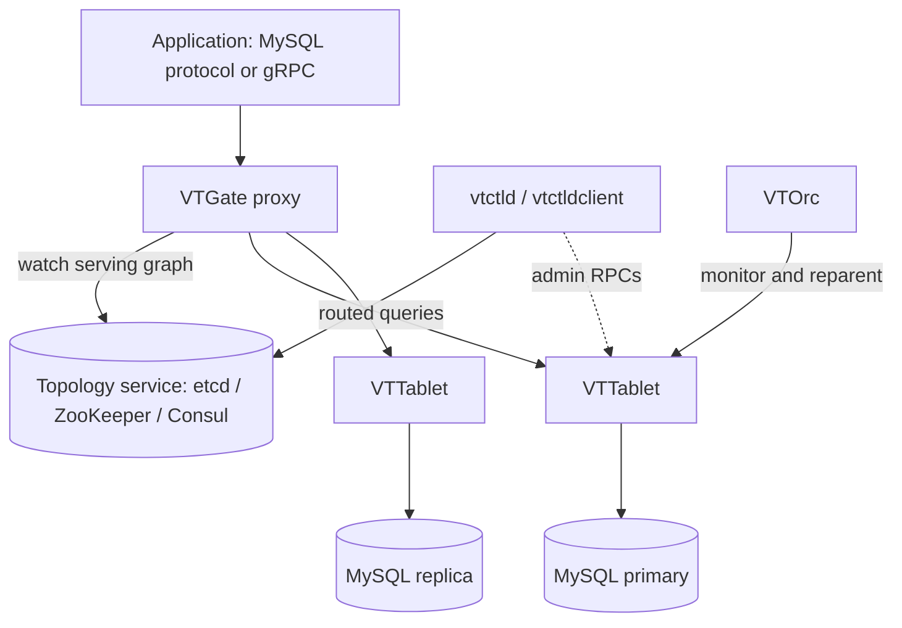

# Architecture

## Big picture

The top-level executables live in `go/cmd/` as separate binaries. An application talks only to VTGate, a stateless proxy. VTGate reads sharding metadata from a topology service and routes each query to one or more VTTablet sidecars, each of which fronts a single MySQL instance. A control plane (vtctld, VTOrc, VTAdmin) manages schema, resharding, and failover out of band.

## Components

### VTGate

A stateless proxy (`go/cmd/vtgate/`). It speaks the MySQL wire protocol and gRPC, accepts SQL, then parses, plans, and routes it to the right shards. It is the only endpoint the application sees. It watches the topology service to build a serving graph of which tablets serve which shards (`go/vt/srvtopo/`).

### VTTablet

A sidecar that runs next to each MySQL instance (`go/cmd/vttablet/`). It handles query execution, connection pooling, query consolidation, health checks, and backups.

### vtctld and vtctldclient

The administrative control plane (`go/cmd/vtctld/`, `go/cmd/vtctldclient/`). It serves RPCs for schema changes, resharding, MoveTables, and other operational tasks.

### VTOrc

The orchestrator (`go/cmd/vtorc/`). It watches replication topology and performs automatic failover (reparenting).

### VTAdmin

A management API plus web UI that spans multiple clusters (`go/cmd/vtadmin/`).

### Topology service

etcd, ZooKeeper, or Consul stores keyspace, shard, and tablet metadata (`go/vt/topo/`). VTGate watches it and builds the serving graph through `go/vt/srvtopo/`.

### vtcombo

All components packed into one process for tests and local use (`go/cmd/vtcombo/`).

The logical data model: a keyspace (a logical database) is split into shards, each a primary plus replica MySQL group. The sharding key derivation is defined by Vindexes (Vitess Indexes) in the VSchema.

## How a request flows

VTGate starts as a cobra command. Its `main()` in `go/cmd/vtgate/vtgate.go` calls into the CLI, and `run` (`go/cmd/vtgate/cli/cli.go:138`) opens the topology server (`cli.go:147`), builds the resilient serving-topology server (`cli.go:152`), calls `vtgate.Init(...)` (`cli.go:182`), then `servenv.RunDefault()` (`cli.go:192`).

A single SELECT then travels this path:

1. `Executor.Execute` (`go/vt/vtgate/executor.go:254`) opens a trace span, builds `LogStats`, and calls the internal `execute`. On the way out it adds a memory-overrun warning if the result is large (`executor.go:270`) and runs error transformation (`executor.go:291`).
2. `Executor.execute` (`go/vt/vtgate/executor.go:489`) is a thin bridge that hands `newExecute` a callback to run the plan (`executor.go:493`).
3. `Executor.newExecute` (`go/vt/vtgate/plan_execute.go:65`) is the body. It runs a `MaxBufferingRetries` loop (`plan_execute.go:90`) so that, during a failover buffer, it can wait for a newer VSchema (`plan_execute.go:106`) and replan. It builds or fetches a plan (`plan_execute.go:122`), handles transaction statements locally (`plan_execute.go:156`), injects needed bind variables (`plan_execute.go:165`), then executes (`plan_execute.go:175`).
4. At a leaf of the plan tree, `Route.TryExecute` (`go/vt/vtgate/engine/route.go:133`) resolves target shards via `findRoute` (`engine/route.go:134`, body in `go/vt/vtgate/engine/routing.go:138`) and runs them in parallel through `vcursor.ExecuteMultiShard(...)` (`route.go:185`). A scatter query with an `OrderBy` is merge-sorted (`route.go:205`) and finally truncated (`route.go:211`).

## Key design decisions

The defining decision is the Vindex abstraction. Instead of forcing the application to always include a shard key in its queries, Vitess declares column-to-shard mappings in the VSchema and lets the planner pick routing based on each Vindex's `Cost()` (`go/vt/vtgate/vindexes/vindex.go:52`, Opcode selection in `go/vt/vtgate/engine/routing.go:152`). This keeps scatter avoidance a matter of schema declaration plus planning, not query rewriting in the application.

Routing opcodes encode the trade-off directly: `Equal` and `EqualUnique` resolve to a single shard through a Vindex lookup, while `Scatter` fans out to every shard (`routing.go:152`). Transaction statements like begin and commit never reach a real shard; they are handled as session operations (`plan_execute.go:156`).

## Extension points

- **Vindex implementations** (`go/vt/vtgate/vindexes/`): the `Vindex` interface (`vindex.go:52`) is implemented by hash, lookup, consistent_lookup, numeric, cfc, and more. New sharding functions plug in here.
- **Topology backends** (`go/vt/topo/`): etcd, ZooKeeper, and Consul are interchangeable implementations of the topology store.
- **Backup storage**: S3, GCS, and Ceph are supported targets (for example `examples/local/ceph_backup_config.json`).
- **Kubernetes**: vitess-operator deploys Vitess on Kubernetes (`examples/operator/operator.yaml`).
