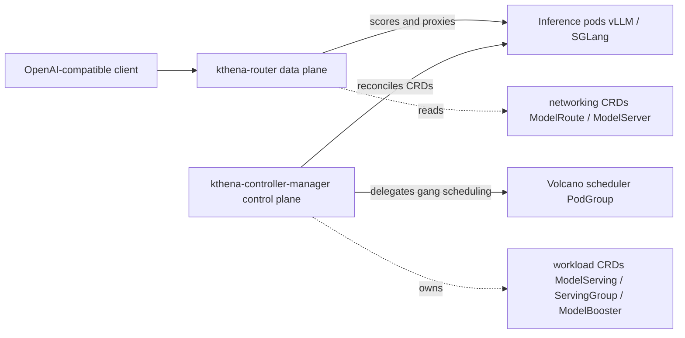

# Architecture

## Big picture

Kthena separates a control plane from a data plane, and each can be deployed and used on its own (`README.md:55`). The control plane reconciles custom resources into inference workloads and hands placement to the Volcano scheduler. The data plane terminates inference traffic and routes each request to a backend pod. There are two binaries: `cmd/kthena-router/main.go:40` for the data plane and `cmd/kthena-controller-manager/main.go:54` for the control plane.

## Components

### kthena-controller-manager (control plane)

Reconciles Kthena CRDs to deploy, scale, and upgrade inference replicas. The controllers that can be enabled are `modelserving`, `modelbooster`, and `autoscaler` (`cmd/kthena-controller-manager/main.go:81-82`). It does not implement gang scheduling itself; it delegates that to Volcano. It also runs a webhook server on secure port 8443, generates its own certificate, and updates the CABundle of its ValidatingWebhook and MutatingWebhook (`cmd/kthena-controller-manager/main.go:74`). The workload CRDs it owns live in `pkg/apis/workload/v1alpha1`.

### kthena-router (data plane)

The entry point for inference traffic. It classifies each request by model name, header, or URI, applies load balancing and traffic control, and dispatches to the right inference instance. It natively supports prefill-decode disaggregation routing. The README states the router is a reference implementation, used because the Gateway Inference Extension does not natively support prefill-decode distribution, and that it can be deployed behind a standard API gateway (`README.md:64`). The router reads the networking CRDs in `pkg/apis/networking/v1alpha1`: `ModelRoute` (match rules plus rate limiting) and `ModelServer` (the backend pod set, with `PDGroup`, `KVConnector`, and `TrafficPolicy`).

## How a request flows

A single inference request through the router (`pkg/kthena-router/router/router.go`):

1. The gin handler `Router.HandlerFunc()` (`router.go:210`) answers `GET /v1/models` directly via `ListModels` (`router.go:216-220`); everything else continues.
2. `ParseModelRequest` (`router.go:491`) reads the body and pulls the `model` field out of the OpenAI-compatible struct `OpenAIRequestBody` (`pkg/kthena-router/handlers/request.go:29`).
3. The prompt is tokenized to count input tokens, falling back to `len(promptStr)/4` on failure (`router.go:269-273`).
4. Rate limiting runs via `r.loadRateLimiter.RateLimit(modelName, promptStr)` (`router.go:285`); input tokens, output tokens, and request count are each checked, and overflow returns HTTP 429.
5. With fairness scheduling off, control goes to `doLoadbalance` (`router.go:322` to `:335`); with it on, to `handleFairnessScheduling` (`router.go:327` to `:1037`).
6. `doLoadbalance` (`router.go:335`) matches the `ModelRoute` first via `r.store.MatchModelServer` (`router.go:359`), gets pods and the `ModelServer` via `getPodsAndServer` (`router.go:369` to `:513`), builds a `framework.Context` (`router.go:451-457`), and scores pods with `r.scheduler.Schedule(ctx, pods)` (`router.go:459`).
7. The best pod is proxied via `proxyModelEndpoint` (`router.go:484` to `:682`). Without PD disaggregation it uses `proxy` (`router.go:614`); with a KVConnector it uses `proxyToPDDisaggregated` (`router.go:943`).
8. After proxying, `r.scheduler.RunPostHooks(ctx, i)` (`router.go:675`) updates on-flight counters.

## Key design decisions

The most distinctive choice is to avoid the LeaderWorkerSet (LWS) and dual-LWS layered patterns used by some peers. Instead, a single `ServingGroup` carries Prefill and Decode roles, and gang scheduling is delegated to the Volcano `scheduling.volcano.sh/v1beta1` PodGroup. The maintainers' rationale is that integrating with Volcano gang scheduling needs a different architecture, and the dual-LWS layering added complexity without a clear benefit for their use case ([pacoxu comparison](https://pacoxu.wordpress.com/2025/12/03/how-to-choose-the-inference-orchestration-solution-aibrix-or-kthena-or-dynamo/)). The default `ModelServingSpec.SchedulerName` is `volcano` (`pkg/apis/workload/v1alpha1/model_serving_types.go:47`).

A second decision is to estimate KV-cache and prefix-cache locality at the router's L7 scoring layer rather than inside the engine, so requests with shared prefixes land on the same pod (`pkg/kthena-router/scheduler/plugins/prefix_cache.go`).

## Extension points

- **Scheduler plugins**: the router scheduler runs pluggable score and filter plugins (`pkg/kthena-router/scheduler/plugins`), with defaults `least-request`, `least-latency`, and `prefix-cache` (`pkg/kthena-router/scheduler/scheduler_impl.go:68-72`).
- **KV-transfer connectors**: prefill-decode KV transfer is abstracted over connectors for NIXL, MoonCake, and SGLang (`pkg/kthena-router/connectors`).
- **CRDs**: workload CRDs (`ModelServing`, `ServingGroup`, `ModelBooster`, `AutoscalingPolicy`) and networking CRDs (`ModelRoute`, `ModelServer`) under `pkg/apis`.
- **Webhooks**: ValidatingWebhook and MutatingWebhook served by the controller manager (`cmd/kthena-controller-manager/main.go:74`).
