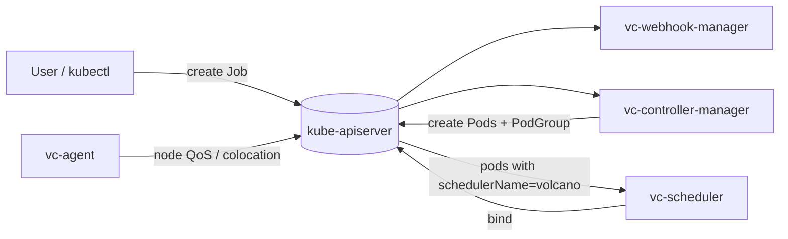

# Architecture

## Big picture

Volcano is not a single process. It is four long-running components plus a CLI, each owning one concern. The scheduler decides placement, the controller manager turns CRDs into pods and PodGroups, the webhook manager validates and mutates incoming objects, and the node agent handles colocation and QoS on each node. They share the `volcano.sh/apis` CRD types but run independently.

## Components

### vc-scheduler

The scheduler core lives in `pkg/scheduler/`. It runs as its own process, separate from `kube-scheduler`, and only acts on pods whose `schedulerName` points at it. It keeps its own informer-backed cache and its own binder rather than reusing the default scheduler's. Scheduling is periodic and session-based: each cycle takes a snapshot, runs an ordered list of actions over it, and commits the result. Entry point is `cmd/scheduler/main.go`, which blank-imports the default actions and plugins to register them (`cmd/scheduler/main.go:39`).

### vc-controller-manager

The controllers in `pkg/controllers/` reconcile Volcano CRDs. The `job` controller expands a VolcanoJob into pods and a PodGroup; the `podgroup` controller auto-creates a PodGroup for plain pods; other controllers cover `queue`, `jobflow`/`jobtemplate` (DAG of jobs), `cronjob`, `hypernode`, and garbage collection.

### vc-webhook-manager

The admission server in `pkg/webhooks/admission/` provides validating and mutating webhooks per resource: `jobs`, `pods`, `podgroups`, `queues`, `jobflows`, `cronjobs`, and `hypernodes`. This is where invalid job specs (for example `minAvailable` larger than the task count) are rejected before they reach the scheduler.

### vc-agent

The node agent (`cmd/agent`, with `cmd/network-qos`) is a per-node daemon for colocating online and offline workloads. It enforces QoS and network QoS so latency-sensitive services and batch jobs can share a node. This is a newer addition aimed at resource utilisation.

### vcctl

`cmd/cli` builds `vcctl`, the command-line tool for inspecting and managing Volcano jobs and queues.

## How a request flows

Trace one scheduling cycle of the default `allocate` action, the path that makes gang scheduling and fair-share real.

1. At startup the scheduler launches its loop: `go wait.Until(pc.runOnce, pc.schedulePeriod, stopCh)` (`pkg/scheduler/scheduler.go:115`).
2. `runOnce` opens a session and runs each configured action in order (`pkg/scheduler/scheduler.go:141` for `OpenSession`, the `action.Execute(ssn)` loop at `pkg/scheduler/scheduler.go:150`).
3. `framework.OpenSession` snapshots the cache into a `Session` and calls every plugin's `OnSessionOpen`, which registers ordering, predicate, and readiness functions onto the session (`pkg/scheduler/framework/framework.go:34`, plugin call at `:50`).
4. The default config enables actions `enqueue, allocate, backfill` and the gang/drf/proportion/predicates/nodeorder plugin tiers (`pkg/scheduler/util.go:38`).
5. The `allocate` action runs: `Execute` builds context (`pkg/scheduler/actions/allocate/allocate.go:122`), pops queues by `QueueOrderFn` and jobs by `JobOrderFn`, then places tasks (`allocateResources` at `:283`, per-task work at `:951`).
6. A successful placement is committed only if `ssn.JobReady(job)` holds (`pkg/scheduler/actions/allocate/allocate.go:314`). The gang plugin's `JobReady` enforces the min-member count, so a job that cannot meet its gang is never bound.
7. Commit replays the recorded operations and hands binds to an async worker (`pkg/scheduler/framework/statement.go:392`, then `cache.AddBindTask` at `statement.go:319`).
8. The async worker writes the bind to the API server (`pkg/scheduler/cache/cache.go:874` for the worker loop, `DefaultBinder.Bind` at `cache.go:231`).
9. `framework.CloseSession` calls every plugin's `OnSessionClose` and flushes dirty jobs back to the cache (`pkg/scheduler/framework/framework.go:63`).

## Key design decisions

- **Session plus statement, a dry-run transaction.** An action accumulates tentative `Allocate`/`Pipeline`/`Evict` operations in session memory only. It can replay them with `RecoverOperations` or throw them away with `Discard`, and only the best result is committed (`pkg/scheduler/actions/allocate/allocate.go:447`). This is what lets gang all-or-nothing and topology-aware placement coexist: the scheduler tries placements, scores them, and keeps the best.
- **Actions and plugins are separated.** Actions (`enqueue`, `allocate`, `preempt`, `reclaim`, `backfill`, and others) decide what happens when; plugins (`gang`, `drf`, `proportion`, `binpack`, `capacity`, `predicates`, `nodeorder`, and more) supply the comparison functions, predicates, and scores. Both are declared in a ConfigMap and hot-reloaded via `fsnotify` (`pkg/scheduler/scheduler.go:219`).
- **It coexists with kube-scheduler.** Volcano keeps its own cache and binder, and `Pipeline` reserves resources that are being released for a future cycle, which is how preemption stages placements.
- **Preempt and reclaim are off by default.** The default config only runs `enqueue, allocate, backfill` (`pkg/scheduler/util.go:38`). Priority-based eviction requires explicitly adding those actions to the ConfigMap.

## Extension points

- **Scheduler plugins**: nearly 30 built-in plugins register through `pkg/scheduler/plugins/factory.go`; custom plugins implement the plugin interface and register at init.
- **Scheduler actions**: registered via `pkg/scheduler/actions/factory.go` (for example `RegisterAction(allocate.New())` at `:37`).
- **CRDs**: `batch.volcano.sh Job`, `scheduling.volcano.sh PodGroup`/`Queue`, `flow.volcano.sh JobFlow`/`JobTemplate`, and `topology.volcano.sh HyperNode`, defined in the `volcano.sh/apis` module.
- **Admission webhooks**: per-resource validating and mutating handlers in `pkg/webhooks/admission/`.
