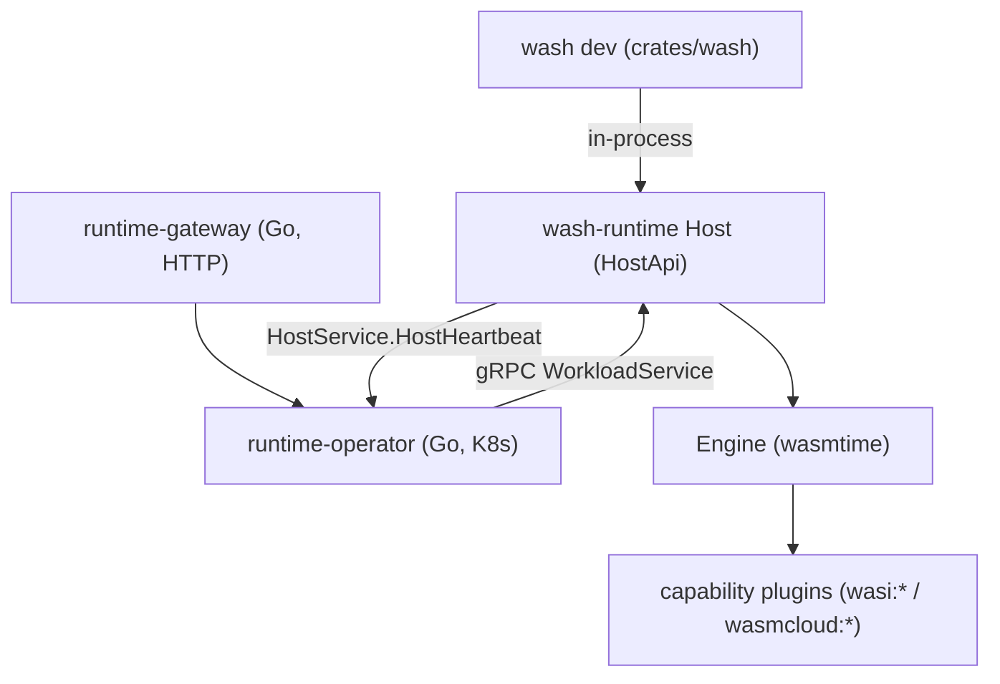

# Architecture

## Big picture

The v2 system has one runtime and two drivers. The runtime is `wash-runtime`, a Wasmtime-based host that compiles, links, and runs WebAssembly components. Its public surface is the `HostApi` trait (`crates/wash-runtime/src/host/mod.rs:74`), which defines `heartbeat`, `workload_start`, `workload_status`, and `workload_stop`. Locally, the `wash dev` command builds a `Host` and drives it directly. In production, a Go Kubernetes operator drives an equivalent host over gRPC, using the service definitions in `proto/wasmcloud/runtime/v2/`. The gRPC message types map one-to-one onto the Rust types in `crates/wash-runtime/src/types.rs`.

## Components

### wash CLI

`crates/wash` is the developer-facing CLI. Its top-level commands are the `WashCliCommand` enum (`crates/wash/src/main.rs:65`): `build`, `config`, `completion`, `dev`, `inspect`, `host`, `new`, `oci`, `update`, and `wit`. `wash dev` runs the hot-reload development loop; `wash host` lets the same binary act as a host process driven by the operator. Each command's `handle` is dispatched from the match in `crates/wash/src/main.rs:95-112`.

### wash-runtime

`crates/wash-runtime` is the embedded runtime. It re-exports Wasmtime (`crates/wash-runtime/src/lib.rs` exposes the runtime API) and wraps `wasmtime::Engine` in its own `Engine` (`crates/wash-runtime/src/engine/mod.rs`). The `Host` owns a map of running workloads, `Arc<RwLock<HashMap<String, HostWorkload>>>` (`crates/wash-runtime/src/host/mod.rs:197`). Capabilities are supplied as plugins under `crates/wash-runtime/src/plugin/`: `wasi_keyvalue`, `wasi_blobstore`, `wasi_config`, `wasi_logging`, `wasi_otel`, `wasi_webgpu`, `wasmcloud_messaging`, and `wasmcloud_postgres`.

### gRPC API

`proto/wasmcloud/runtime/v2/` defines the operator-to-host contract. `WorkloadService` has `WorkloadStart`, `WorkloadStatus`, and `WorkloadStop` (`proto/wasmcloud/runtime/v2/workload_service.proto:8-12`). `HostService` has a single `HostHeartbeat` RPC the host calls on the operator (`proto/wasmcloud/runtime/v2/host_service.proto:9-12`).

### Kubernetes operator and gateway

`runtime-operator/` is a Go controller-runtime operator (Go module `go.wasmcloud.dev/runtime-operator/v2`) that maps Wasm workloads onto pods and drives `wash host` over gRPC. `runtime-gateway/` is a Go HTTP proxy and reconciler. A `go.work` file binds the two Go modules together.

## How a request flows

Trace a `wash dev` hot reload, the representative local operation.

1. CLI dispatch: `crates/wash/src/main.rs:106` routes `WashCliCommand::Dev` to its `handle`, defined at `crates/wash/src/cli/dev.rs:36`.
2. The dev handler assembles a runtime: `Engine::builder()` at `crates/wash/src/cli/dev.rs:66`, the HTTP router `DevRouter::default()` at `:141`, and `HttpServer::new(...)` at `:184`, then builds a `Host`.
3. On a file change, `reload_component` (`crates/wash/src/cli/dev.rs:597`) stops the previous workload with `host.workload_stop(...)` and starts the new one with `host.workload_start(WorkloadStartRequest { workload_id: uuid::Uuid::new_v4()..., workload })` (`crates/wash/src/cli/dev.rs:603-612`). If the resulting state is not `Running`, it bails (`:614`).
4. Host start: `Host::workload_start` (`crates/wash-runtime/src/host/mod.rs:636`) inserts `HostWorkload::Starting` into the workloads map (`:644`), then calls `workload_start_inner` (`:647`).
5. Materialise: `workload_start_inner` (`crates/wash-runtime/src/host/mod.rs:543`) calls `engine.initialize_workload`, resolves imports against plugins, and executes the service if present.
6. Compile and verify: `Engine::initialize_workload` (`crates/wash-runtime/src/engine/mod.rs:294`) validates volumes and compiles the service and each component into Wasmtime components.
7. Resolve imports: `resolve_workload_imports` (`crates/wash-runtime/src/engine/workload.rs:690`) and `resolve_component_imports` (`:804`) inspect each component's WIT imports and bind the needed plugins into the linker.
8. Run: `execute_service` (`crates/wash-runtime/src/engine/workload.rs:518`) pre-instantiates and spawns the long-running instance as a task.
9. Finalise: back in `workload_start`, the map entry is updated to `HostWorkload::Running(...)` on success or `HostWorkload::Error(...)` on failure (`crates/wash-runtime/src/host/mod.rs:665-667`), and a `WorkloadStartResponse` is returned.

In production, step 3 becomes a gRPC `WorkloadService.WorkloadStart` call from the operator (`proto/wasmcloud/runtime/v2/workload_service.proto:9`). Steps 4 onward are the same code.

## Key design decisions

- Single runtime, two drivers. The same `wash-runtime` host backs both `wash dev` and the Kubernetes operator, so behaviour observed locally matches production placement. This is the explicit aim of the v2 roadmap ([roadmap](https://wasmcloud.com/docs/roadmap/)).
- gRPC and Kubernetes over NATS lattice. v2 moves the control plane to gRPC plus a Kubernetes operator (`proto/wasmcloud/runtime/v2/`). NATS stays only inside specific plugins.
- Zero-trust egress by default. An empty `allowed_hosts` list means deny all outbound requests (`crates/wash-runtime/src/types.rs:92`). Unrestricted egress requires an explicit `[AllowedHost::Any]`.
- Dual WASI bindings. Both WASI Preview 2 and Preview 3 bindings are always registered on the linker, with per-component dispatch (see [Internals](./internals)).

## Extension points

- Capability plugins under `crates/wash-runtime/src/plugin/` implement `wasi:*` and `wasmcloud:*` interfaces; a component's WIT imports decide which plugins get bound.
- WIT interfaces are the contract between components and the host; new capabilities are added by defining interfaces under `wit/` and a matching plugin.
- The gRPC `WorkloadService` / `HostService` contract (`proto/wasmcloud/runtime/v2/`) lets external orchestrators drive a host.
