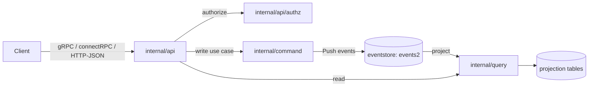

# Architecture

## Big picture

ZITADEL is built on CQRS and event sourcing. The write side (the command layer) appends immutable events to an event store, and the read side (the query layer) builds projections from those events (README.md:65). State changes never overwrite rows; they are recorded as events, which is what makes the audit trail complete and API-accessible. Everything runs in one Go binary fronted by an API layer that speaks gRPC, connectRPC, and HTTP/JSON from a single set of service definitions, and all of it is backed by PostgreSQL.

## Components

### Event store (`internal/eventstore/`)

The core of the write path. It exposes `Push` for writes and `Filter` / `FilterToReducer` for reads, plus `Search` for a field index that does not require a projection (internal/eventstore/eventstore.go:184). The PostgreSQL `events2` table is the source of truth. Every aggregate carries an `InstanceID` and a `ResourceOwner` (the owning organization), so tenant identity is part of the stored event (internal/eventstore/aggregate.go:79).

### Command side (`internal/command/`)

The write-side use cases. A domain operation is reduced into a write model, consistency is checked, and the resulting commands are pushed to the event store. This is where business invariants are enforced before anything is persisted.

### Query side (`internal/query/`)

The read side. It materializes projections from the event stream into SQL tables and serves reads from them. This separation lets reads be shaped for the consuming API without touching the write path.

### API layer (`internal/api/`)

Holds `grpc/`, `http/`, and `authz/`. The three transports (gRPC, connectRPC, HTTP/JSON) are generated from one service definition, so a resource is exposed identically across all three ([API introduction](https://zitadel.com/docs/apis/introduction)). `internal/api/authz/` does token verification and permission checks.

### Command-line entry (`cmd/`)

Cobra commands such as `start`, `setup`, `initialise`, `mirror`, and `key`. `cmd/zitadel.go` is the root command, reached from `main.go`.

### Next-generation backend (`backend/v3/`)

An in-progress restructuring with `storage/eventstore`, `storage/database`, `api/{user,org,session,instance}`, and `instrumentation/{logging,metrics,tracing}`. `main.go` already imports `backend/v3/instrumentation/logging`.

The multi-tenant hierarchy is Instance, Organization, Project, Application. The first two are written into every aggregate.

## How a request flows

Tracing an authenticated gRPC call end to end:

1. The unary interceptor `AuthorizationInterceptor` is the entry point (internal/api/grpc/server/middleware/auth_interceptor.go:16). It calls `verifier.CheckAuthMethod(info.FullMethod)` to read the proto auth option; if the method needs no token it passes through (auth_interceptor.go:23).
2. It reads the `Authorization` header and returns `codes.Unauthenticated` when empty (auth_interceptor.go:31). The organization is resolved from the `x-zitadel-orgid` header or from the request itself when it implements `OrganizationFromRequest` (auth_interceptor.go:45).
3. It calls `authz.CheckUserAuthorization(...)` (auth_interceptor.go:37), which verifies the token and builds `CtxData` (internal/api/authz/authorization.go:28). If the required permission is just `authenticated`, it stores `CtxData` and returns without resolving roles (authorization.go:34).
4. Otherwise `getUserPermissions(...)` resolves memberships into permission strings (internal/api/authz/permissions.go:25), and `checkUserPermissions(...)` decides allow or deny (authorization.go:47).
5. On success the interceptor runs `handler(ctxSetter(ctx), req)`, with `CtxData` and the resolved permissions injected into the context (auth_interceptor.go:42).

The Internals page walks the permission resolution in detail.

## Key design decisions

- **Append-only event store as the source of truth.** Mutations are events, not row updates, which is what yields a comprehensive rather than selective audit trail (README.md:65).
- **Tenant identity in the data, not the application.** `InstanceID` and `ResourceOwner` are required fields on every aggregate and are filled from context (internal/eventstore/aggregate.go:20). Isolation is structural.
- **Serialize through the database, not application locks.** `Push` relies on a PostgreSQL primary-key collision and a retry loop rather than coordinating writers in the app (internal/eventstore/eventstore.go:133). See Internals.
- **One service definition, three transports.** gRPC, connectRPC, and HTTP/JSON come from the same protos, so there is no second hand-written REST surface to drift ([API introduction](https://zitadel.com/docs/apis/introduction)).
- **No external session store.** Session state lives in the same event-sourced model, which is what lets ZITADEL scale horizontally without a separate cache tier (README.md:67).

## Extension points

- **Actions v2**: webhooks, custom code, and token enrichment hooks into authentication flows ([Features](https://github.com/zitadel/zitadel) and [API introduction](https://zitadel.com/docs/apis/introduction)).
- **APIs**: every resource is scriptable over gRPC, connectRPC, and HTTP/JSON.
- **Standards endpoints**: OIDC, OAuth 2.0, SAML 2.0, and a SCIM 2.0 server for provisioning.
- **Identity brokering**: pre-built upstream IdP templates, including LDAP as an upstream source.
